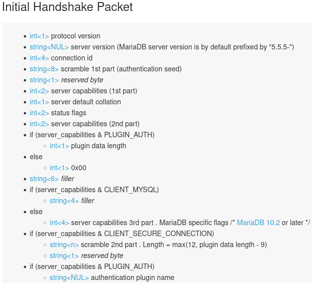

# Direct Connection in Backend package

## Code Explanation

### The first step:

> The first step is to send the initial handshake packet from MariaDB to Gaea.

There are some details about the initial handshake packet in [the official document](https://mariadb.com/kb/en/connection/), and please see the details below.

 

The actual packet demonstrates how this handshake works, and please see details below.

| packet                          | exmaple                                                      |
| ------------------------------- | ------------------------------------------------------------ |
| int<1> protocol version         | Protocol Version 10                                          |
| string<NUL> server version      | MariaDB version is <br /><br />[]uint8{<br />53, 46, 53, 46, 53,<br />45, 49, 48, 46, 53,<br />46, 49, 50, 45, 77,<br />97, 114, 105, 97, 68,<br />66, 45, 108, 111, 103<br />}<br /><br />Converting the array to ASCII, The result is "5.5.5-10.5.12-MariaDB-log". |
| int<4> connection id            | Connection ID is []uint8{16, 0, 0, 0}.<br /><br />After reversing the array, it becomes []uint8{0, 0, 0, 16} that equals to uint32(16). |
| string<8> scramble 1st part     | The first part of the scramble:<br /><br />MariaDB utilizes the scramble for secure password authentication.<br /><br />The scramble is 20 bytes of data; the first part occupies 8 bytes, []uint8{81, 64, 43, 85, 76, 90, 97, 91}. |
| string<1> reserved byte         | It occupies 1 byte, []uint8{0}.                              |
| int<2> server capabilities      | The first part of the capability occupies 2 bytes,  []uint8{254, 247}. |
| int<1> server default collation | The charset of MariaDB in the current exameple is 33.<br /><br />After checking<br />[character-sets-and-collations](https://mariadb.com/kb/en/supported-character-sets-and-collations/)<br />or<br />using a command "SHOW CHARACTER SET LIKE 'utf8'",<br />finding out that number 33 means "utf8_general_ci". |
| int<2> status flags             | The status of MariaDB in the current exameple is []uint8{2, 0}.<br/><br />Reversing from the status flags to []uint8{0, 2} and then converting them to binary, []uint16{2}.<br /><br />After referring to "Gaea/mysql/constants.go", the result means "Autocommit." |
| int<2> server capabilities      | The second part of the capability occupies 2 bytes,  []uint8{255, 129}. |

Calculate the whole capability

```
Gathering two capability parts and combining them, the result is []uint8{254, 247, 255, 129}.

After Converting the result to binary, the value becomes []uint8{0b10000001, 0b11111111, 0b11110111, 0b11111110}.

After that, refer to https://mariadb.com/kb/en/connection/ and ensure some details without difficulty.

For example, the first element of the capability is 0, which means the packet came from MariaDB to Gaea.
```

The next table follows on from the previous one.

| Item    | Value                                                        |
| ------- | ------------------------------------------------------------ |
| Packet  | if (server_capabilities & PLUGIN_AUTH)<br/>        int<1> plugin data length <br/>    else<br/>        int<1> 0x00 |
| Example | skip 1 byte                                                  |

The next table follows on from the previous one.

| Item    | Value            |
| ------- | ---------------- |
| Packet  | string<6> filler |
| Example | skip 6 bytes     |

The next table follows on from the previous one.

| Item    | Value                                                        |
| ------- | ------------------------------------------------------------ |
| Packet  | if (server_capabilities & CLIENT_MYSQL)<br/>        string<4> filler <br/>    else<br/>        int<4> server capabilities 3rd part .<br />        MariaDB specific flags /* MariaDB 10.2 or later */ |
| Example | skip 4 bytes                                                 |

The next table follows on from the previous one.

| Item    | Value                                                        |
| ------- | ------------------------------------------------------------ |
| Packet  | if (server_capabilities & CLIENT_SECURE_CONNECTION)<br/>        string<n> scramble 2nd part . Length = max(12, plugin data length - 9)<br/>        string<1> reserved byte |
| Example | The scramble is 20 bytes of data; the second part occupies 12(20-8=12) bytes, []uint8{34, 53, 36, 85, 93, 86, 117, 105, 49, 87, 65, 125}. |

The next table follows on from the previous one.

| Item    | Value                                                        |
| ------- | ------------------------------------------------------------ |
| Packet  | if (server_capabilities & PLUGIN_AUTH)<br/>        string<NUL> authentication plugin name |
| Example | Gaea discards the rest of the data in the packet because there is no use for "PLUGIN_AUTH". |

combine the whole data of the Scramble:

```
The first part of the scramble is []uint8{81, 64, 43, 85, 76, 90, 97, 91}
The second part of the scramble is []uint8{34, 53, 36, 85, 93, 86, 117, 105, 49, 87, 65, 125}

After combining them, the final result is []uint8{81, 64, 43, 85, 76, 90, 97, 91, 34, 53, 36, 85, 93, 86, 117, 105, 49, 87, 65, 125}.
```

### The second step:

> The second step is to calculate the auth base on the scramble, combined with two parts of the scramble.

There are some details about the auth formula in [the official document](https://dev.mysql.com/doc/internals/en/secure-password-authentication.html).

```
some formulas for the auth

SHA1( password ) XOR SHA1( "20-bytes random data from server" <concat> SHA1( SHA1( password ) ) )
    其中
    stage1 = SHA1( password )
    stage1Hash = SHA1( stage1 ) = SHA1( SHA1( password ) )
    scramble = SHA1( scramble <concat> SHA1( stage1Hash ) ) // the first new scramble
    scramble = stage1 XOR scramble // the second new scramble
```

假设

- The password for a secure login process in MariaDB is 12345.
- The auth base on the scramble, combined with two parts of the scramble, is []uint8{81, 64, 43, 85, 76, 90, 97, 91, 34, 53, 36, 85, 93, 86, 117, 105, 49, 87, 65, 125}.
  The result that converted from decimal to Hexadecimal is []uint8{51, 40, 2B, 55, 4c, 5a, 61, 5b, 22, 35, 24, 55, 5d, 56,  75,  69, 31, 57, 41,  7d}.
  It is the same as  51402B554c5A615b223524555d5675693157417d.

Regarding the stage1 formula, Linux Bash calculates the result and compares it.

```bash
# stage1 = SHA1( password )

# calculate stage1
$ echo -n 12345 | sha1sum | head -c 40 # convert password 12345 to stage1
8cb2237d0679ca88db6464eac60da96345513964 # stage1
```

As regards the stage1Hash formula, Linux Bash calculates the result and compares it.

```bash
# stage1Hash = SHA1( stage1 ) = SHA1( SHA1( password ) )

$ echo -n 12345 | sha1sum | xxd -r -p | sha1sum | head -c 40
00a51f3f48415c7d4e8908980d443c29c69b60c9 # stage1hash

$ echo -n 8cb2237d0679ca88db6464eac60da96345513964 | xxd -r -p | sha1sum | head -c 40
00a51f3f48415c7d4e8908980d443c29c69b60c9 # stage1hash
```

Linux Bash concatenates the scramble and stage1Hash into the string concat.

```bash
# scramble is 51402B554c5A615b223524555d5675693157417d, the first half part.
# stage1Hash is 00a51f3f48415c7d4e8908980d443c29c69b60c9, the second half part.

# calculate "20-bytes random data from server" <concatenate> SHA1( SHA1( password ) )
$ echo -n 51402B554c5A615b223524555d5675693157417d 00a51f3f48415c7d4e8908980d443c29c69b60c9 |  sed "s/ //g"
51402B554c5A615b223524555d5675693157417d00a51f3f48415c7d4e8908980d443c29c69b60c9 # concat
```

In terms of the first new scramble, Linux Bash calculates the result and compares it.

```bash
# scramble = SHA1( concat ) = SHA1( scramble <concatenate> SHA1( stage1Hash ) )

$ echo -n 51402B554c5A615b223524555d5675693157417d00a51f3f48415c7d4e8908980d443c29c69b60c9 | xxd -r -p | sha1sum | head -c 40
0ca0f764a59d1cdb10a87f0155d61aa54be1c71a # The first new scramble
```

In the case of the second new scramble, Linux Bash calculates the result and compares it.

```bash
# scramble = stage1 XOR scramble
$ stage1=0x8cb2237d0679ca88db6464eac60da96345513964 # stage1
$ scramble=0x0ca0f764a59d1cdb10a87f0155d61aa54be1c71a # The first new scramble
$ echo $(( $stage1^$scramble ))
-7792437067003134338 # insufficient precision

$ stage1=0x8cb2237d0679ca88db6464eac60da96345513964
$ scramble=0x0ca0f764a59d1cdb10a87f0155d61aa54be1c71a
$ printf "0x%X" $(( (($stage1>>40)) ^ (($scrambleFirst>>40)) ))
0xFFFFFFFFFF93DBB3 # insufficient precision

# Linux Bash divides stage1 and the first new scramble into four parts and individually makes four bitwise XOR operations.
$ printf "0x%X" $(( ((0x8cb2237d06)) ^ ((0x0ca0f764a5)) ))
$ printf "%X" $(( ((0x79ca88db64)) ^ ((0x9d1cdb10a8)) ))
$ printf "%X" $(( ((0x64eac60da9)) ^ ((0x7f0155d61a)) ))
$ printf "%X" $(( ((0x6345513964)) ^ ((0xa54be1c71a)) ))
0x8012D419A3E4D653CBCC1BEB93DBB3C60EB0FE7E # correct

# scramble is []uint8{ 80, 12,  D4, 19,  A3,  E4,  D6, 53,  CB,  CC, 1B,  EB,  93,  DB,  B3,  C6, 0E,  B0,  FE,  7E} // hexadecimal
# decimal
# scramble 为 []uint8{128, 18, 212, 25, 163, 228, 214, 83, 203, 204, 27, 235, 147, 219, 179, 198, 14, 176, 254, 126} // the same as the result in Gaea
```

The correct result, auth, is the same as Gaea's.

 


### The third step: The response to the first handshake.


### The fourth step: Finish the handshake


## Testing

> I will describe what I consider about in Unit Test below.

### Considering about Anonymous Function

There is a code below whose name is "Response after Handshake," containing an anonymous function.

The variables in the anonymous function inside the code will take the address of other variables and bring them inside.

I consider about it again and again. It seems correct.

```go
	// 交握第二步 Step2
	t.Run("测试数据库后端连线初始交握后的回应", func(t *testing.T) {
		var connForSengingMsgToMariadb = mysql.NewConn(mockGaea.GetConnWrite())
		dc.conn = connForSengingMsgToMariadb
		dc.conn.StartWriterBuffering()
        
		customFunc := func() {
			err := dc.writeHandshakeResponse41()
			require.Equal(t, err, nil)
			err = dc.conn.Flush()
			require.Equal(t, err, nil)
			err = mockGaea.GetConnWrite().Close()
			require.Equal(t, err, nil)
		}

		fmt.Println(mockGaea.CustomSend(customFunc).ArrivedMsg(mockMariaDB))
	})
```

## Check

When I use the Linux command to calculate Sha1sum or Use tools on other websites, the result is Hexadecimal.
However, the IDE tools show the result in Decimal.

### Linux command

I am using the Linux command to generate the Sha1shum.

 

### Website

I am using the tools on the website https://coding.tools/tw/sha1 to calculate the Sha1shum.

 

### Broken Point

I am using broken point to take a look at the Stage1 variable.

 

### Comparison

I am using the table below to compare the two results.

One comes from taking broken point, and the other comes from tools on the website.

Thus I  am sure the result is correct.

| Position |  Binary  | Decimal | Hexadecimal |
| :------: | :------: | :-----: | :---------: |
|    0     | 10001100 |   140   |     8c      |
|    1     | 10110010 |   178   |     b2      |
|    2     | 00100011 |   35    |     23      |
|    3     | 01111101 |   125   |     7d      |
|    4     | 00000110 |    6    |     06      |
|    5     | 01111001 |   121   |     79      |
|    6     | 11001010 |   202   |     ca      |
|    7     | 10001000 |   136   |     88      |
|    8     | 11011011 |   219   |     db      |
|    9     | 01100100 |   100   |     64      |
|    10    | 01100100 |   100   |     64      |
|    11    | 11101010 |   234   |     ea      |
|    12    | 11000110 |   198   |     c6      |
|    13    | 00001101 |   13    |     0d      |
|    14    | 10101001 |   169   |     a9      |
|    15    | 01100011 |   99    |     63      |
|    16    | 01000101 |   69    |     45      |
|    17    | 01010001 |   81    |     51      |
|    18    | 00111001 |   57    |     39      |
|    19    | 01100100 |   100   |     64      |
