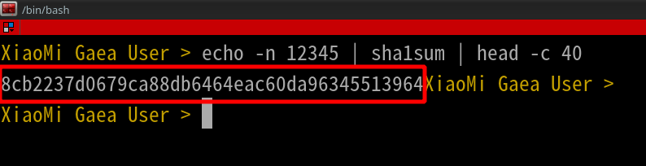
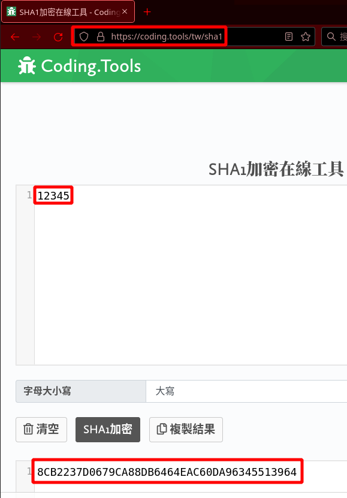
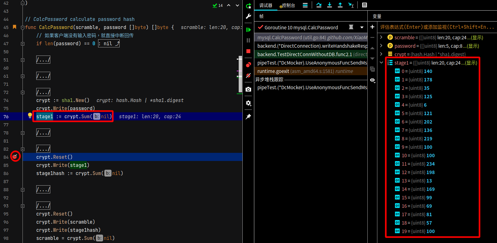

# Direct Connection in Backend package


## Code

### The first step: Initial handshake packet in MariaDB

Checking the official document (https://mariadb.com/kb/en/connection/) contains some details about the packet below.

 

I use an actual packet to demonstrate how this handshake works and arrange them into those tables below.

| packet                          | exmaple                                                      |
| ------------------------------- | ------------------------------------------------------------ |
| int<1> protocol version         | Protocol Version 10                                          |
| string<NUL> server version      | MariaDB version is <br /><br />[]uint8{<br />53, 46, 53, 46, 53,<br />45, 49, 48, 46, 53,<br />46, 49, 50, 45, 77,<br />97, 114, 105, 97, 68,<br />66, 45, 108, 111, 103<br />}<br /><br />I compare the array with ASCII table, it shows 5.5.5-10.5.12-MariaDB-log. |
| int<4> connection id            | Connection ID is []uint8{16, 0, 0, 0}.<br /><br />After reversing the array, it becomes []uint8{0, 0, 0, 16} that equals to uint32(16). |
| string<8> scramble 1st part     | The first part of Scramble:<br />Scramble contains 20 bytes of data totally，<br />The first part contains 8 bytes. That value is []uint8{81, 64, 43, 85, 76, 90, 97, 91}. |
| string<1> reserved byte         | The value is 0.                                              |
| int<2> server capabilities      | The first part of Capability. The value is []uint8{254, 247}. |
| int<1> server default collation | The charset of MariaDB is 33.<br /><br />After I check<br />the official document [character-sets-and-collations](https://mariadb.com/kb/en/supported-character-sets-and-collations/)<br />or<br />use a command (SHOW CHARACTER SET LIKE 'utf8';),<br />I find out that number 33 means utf8_general_ci. |
| int<2> status flags             | The value of status in MariaDB is []uint8{2, 0}.<br/><br />It is Revered to []uint8{0, 2} and then it is converted to binary  []uint16{2}.<br />I check the meaning from the code (Gaea/mysql/constants.go), it means Autocommit (ServerStatusAutocommit). |
| int<2> server capabilities      | The second part of Capability value is uint16[255, 129]      |

Calculate the whole capability

```
Gathering all of the Capability values and combining them, the result is []uint8{254, 247, 255, 129}. 

After Converting the result to binary, the value is []uint8{10000001, 11111111, 11110111, 11111110}.

After that, I can refer the value to the official document (https://mariadb.com/kb/en/connection/) easily.

For example, the first value of the Capability is 0, which means the packet came from MariaDB to Gaea.
```

The following table describes more information.

| Item    | Value                                                        |
| ------- | ------------------------------------------------------------ |
| Packet  | if (server_capabilities & PLUGIN_AUTH)<br/>        int<1> plugin data length <br/>    else<br/>        int<1> 0x00 |
| Example | skip 1 byte                                                  |

The following table describes more information.

| Item    | Value            |
| ------- | ---------------- |
| Packet  | string<6> filler |
| Example | skip 6 bytes     |

The following table describes more information.

| Item    | Value                                                        |
| ------- | ------------------------------------------------------------ |
| Packet  | if (server_capabilities & CLIENT_MYSQL)<br/>        string<4> filler <br/>    else<br/>        int<4> server capabilities 3rd part .<br />        MariaDB specific flags /* MariaDB 10.2 or later */ |
| Example | skip 4 bytes                                                 |

The following table describes more information.

| Item    | Value                                                        |
| ------- | ------------------------------------------------------------ |
| Packet  | if (server_capabilities & CLIENT_SECURE_CONNECTION)<br/>        string<n> scramble 2nd part . Length = max(12, plugin data length - 9)<br/>        string<1> reserved byte |
| Example | The Scramble contains 20 bytes of data totally.<br/>The first part contains 8 bytes.<br/>The rest will contain 12 bytes. (20-8=12)<br/><br/>After Reading the data from the packet, the value is []uint8{34, 53, 36, 85, 93, 86, 117, 105, 49, 87, 65, 125}. |

The following table describes more information.

| Item    | Value                                                        |
| ------- | ------------------------------------------------------------ |
| Packet  | if (server_capabilities & PLUGIN_AUTH)<br/>        string<NUL> authentication plugin name |
| Example | Discard the rest of the data in the packet                   |

combine the whole data of the Scramble:

```
The first part of the Scramble is []uint8{81, 64, 43, 85, 76, 90, 97, 91}
The second part of the Scramble is []uint8{34, 53, 36, 85, 93, 86, 117, 105, 49, 87, 65, 125}

After combining them, the value is []uint8{81, 64, 43, 85, 76, 90, 97, 91, 34, 53, 36, 85, 93, 86, 117, 105, 49, 87, 65, 125}.
```


### The second step: The response to the first handshake.


### The third step: Finish the handshake


## Testing

> I will describe what I consider about in Unit Test below.

### Considering about Anonymous Function

There is a code below whose name is "Response after Handshake," containing an anonymous function.

The variables in the anonymous function inside the code will take the address of other variables and bring them inside.

I consider about it again and again. It seems correct.

```go
	// 交握第二步 Step2
	t.Run("测试数据库后端连线初始交握后的回应", func(t *testing.T) {
		var connForSengingMsgToMariadb = mysql.NewConn(mockGaea.GetConnWrite())
		dc.conn = connForSengingMsgToMariadb
		dc.conn.StartWriterBuffering()
        
		customFunc := func() {
			err := dc.writeHandshakeResponse41()
			require.Equal(t, err, nil)
			err = dc.conn.Flush()
			require.Equal(t, err, nil)
			err = mockGaea.GetConnWrite().Close()
			require.Equal(t, err, nil)
		}

		fmt.Println(mockGaea.CustomSend(customFunc).ArrivedMsg(mockMariaDB))
	})
```

## Check

When I use the Linux command to calculate Sha1sum or Use tools on other websites, the result is Hexadecimal.
However, the IDE tools show the result in Decimal.

### Linux command

I am using the Linux command to generate the Sha1shum.

 

### Website

I am using the tools on the website https://coding.tools/tw/sha1 to calculate the Sha1shum.

 

### Broken Point

I am using broken point to take a look at the Stage1 variable.

 

### Comparison

I am using the table below to compare the two results.

One comes from taking broken point, and the other comes from tools on the website.

Thus I  am sure the result is correct.

| Position |  Binary  | Decimal | Hexadecimal |
| :------: | :------: | :-----: | :---------: |
|    0     | 10001100 |   140   |     8c      |
|    1     | 10110010 |   178   |     b2      |
|    2     | 00100011 |   35    |     23      |
|    3     | 01111101 |   125   |     7d      |
|    4     | 00000110 |    6    |     06      |
|    5     | 01111001 |   121   |     79      |
|    6     | 11001010 |   202   |     ca      |
|    7     | 10001000 |   136   |     88      |
|    8     | 11011011 |   219   |     db      |
|    9     | 01100100 |   100   |     64      |
|    10    | 01100100 |   100   |     64      |
|    11    | 11101010 |   234   |     ea      |
|    12    | 11000110 |   198   |     c6      |
|    13    | 00001101 |   13    |     0d      |
|    14    | 10101001 |   169   |     a9      |
|    15    | 01100011 |   99    |     63      |
|    16    | 01000101 |   69    |     45      |
|    17    | 01010001 |   81    |     51      |
|    18    | 00111001 |   57    |     39      |
|    19    | 01100100 |   100   |     64      |
