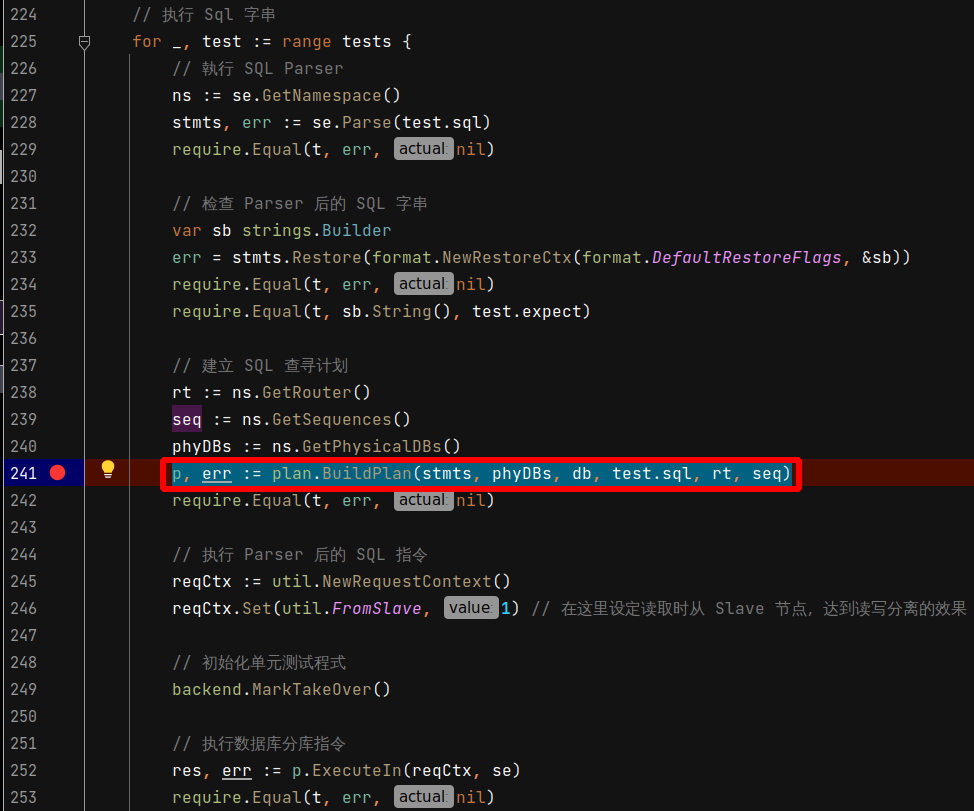
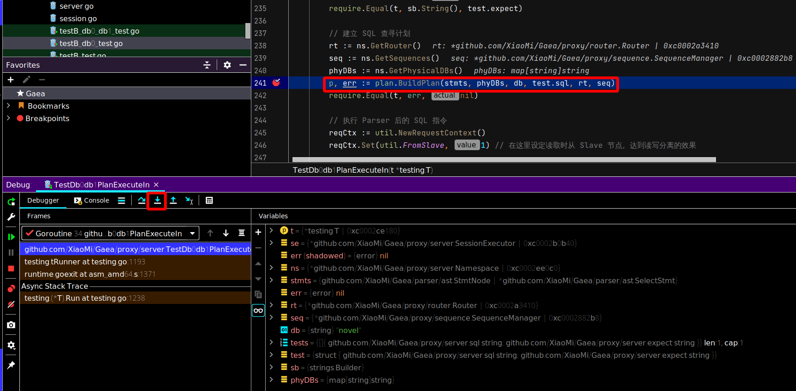
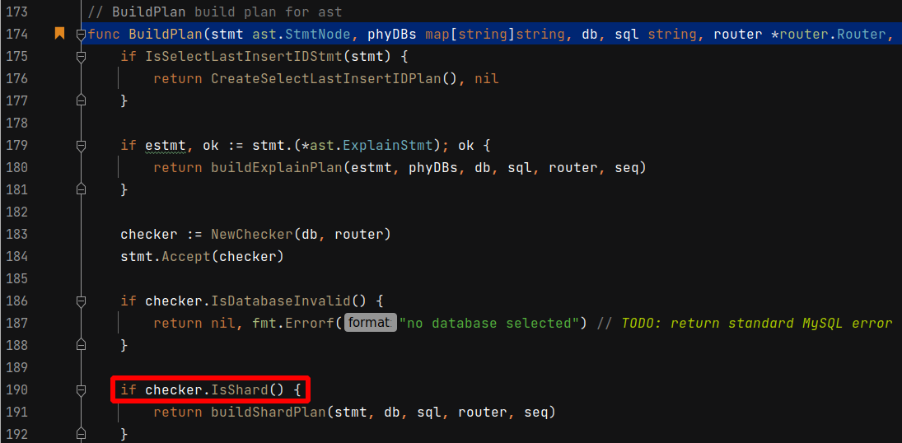
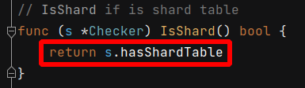
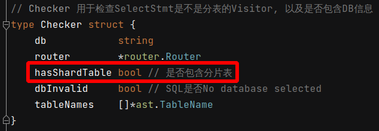
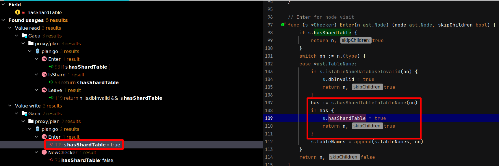
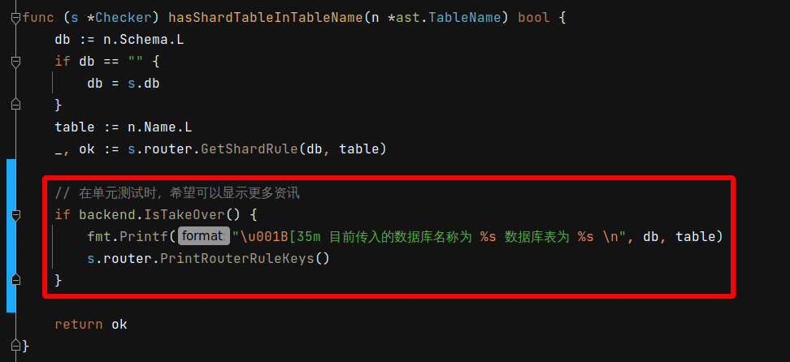
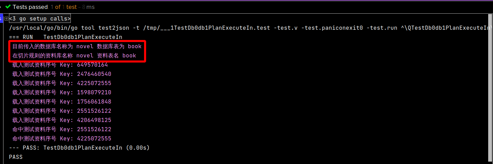

# 2021年09月07日 开发日志

> - 在开放过程中，发现切片规则可能不会被触发，发一些时间在除错
> - 有可能是我使用单元测试去触发时，测试过程有错误，但无论如何，到时再看看要不要增加保护措施

## 问题和解决方案

### [2021年09月07日 临时解决方案说明]

在程式码档案 Gaea/proxy/router/rule.go，有以下程式码

```go
func parseRule(cfg *models.Shard) (*BaseRule, error) {
	r := new(BaseRule)
	r.db = cfg.DB // <<<<<<<<<<<<<<<<<<<<<<<<<<<<<<<<<< 不会被强制改成小写
	r.table = strings.ToLower(cfg.Table) // <<<<<<<<<<< 都会被强制改成小写
    // 以下 (略)
```

由以上程式码，发现数据库名称用全小写

表名可以使用大小写混合，因为会被程式码全部强制改成小写

这样就很容易触发解发切片规则

### [如何追踪切片规则是否有被触发]

因为切片规则是由 Plan 产生的，所以中断点要设定在

p, err := plan.BuildPlan(stmts, phyDBs, db, test.sql, rt, seq) 这一行

 

由中断点进入 plan.BuildPlan 函式内部

 

决定是否为切片规则的关键在 checker.IsShard() 函式

 

checker.IsShard() 函式内有关键变数为 s.hasShardTable

 

点进去看，可以看出 Checker 资料内含 hasShardTable 变数

 

查看 hasShardTable 的使用状况，找出会改此变数改成 True 的地方，发现影响关键在

has := s.hasShardTableInTableName(nn)

 

在 hasShardTableInTableName 函式时，新增 PrintRouterRuleKeys 函式，在这里可以显示所有分片规则的 Key，方便除错

 

最后单元测试的执行状况，可以会看到以下讯息，方便进行除错

 目前传入的数据库名称为 novel 数据库表为 book 
 在切片规则的资料库名称 novel 资料表名 book

因为数据库和数据表和切片规则一致，都为 novel 和 book ，所以切片规则被触发

 
