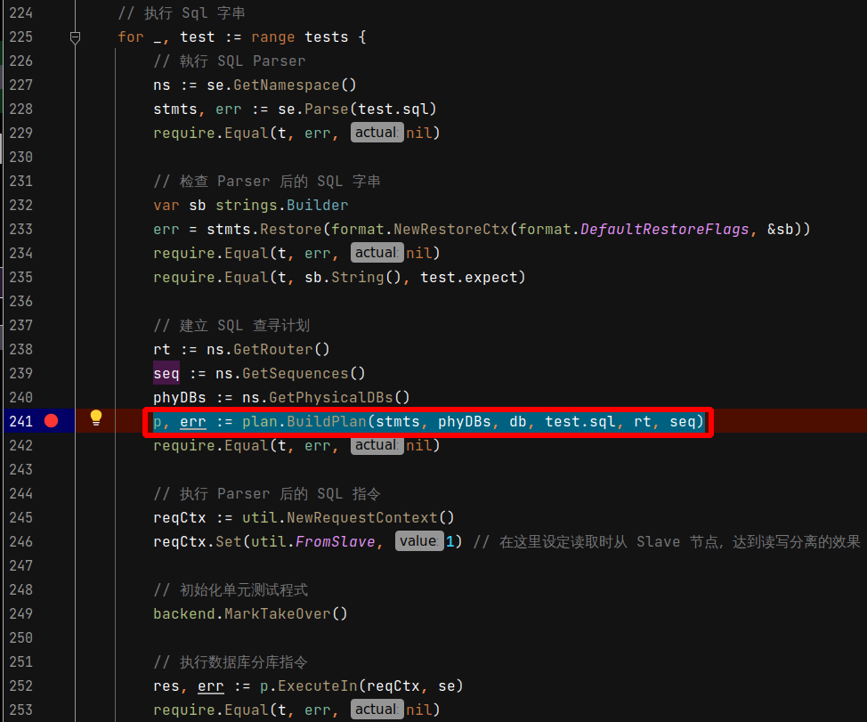
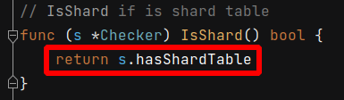
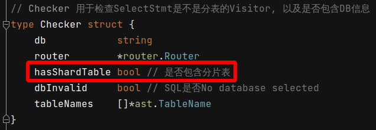

# 2021年09月07日 開發日誌

> - 在開放過程中，發現切片規則可能不會被觸發，發一些時間在除錯
> - 有可能是我使用單元測試去觸發時，測試過程有錯誤，但無論如何，到時再看看要不要增加保護措施

## 問題和解決方案

### [2021年09月07日 臨時解決方案說明]

在程式碼檔案 Gaea/proxy/router/rule.go，有以下程式碼

```go
func parseRule(cfg *models.Shard) (*BaseRule, error) {
	r := new(BaseRule)
	r.db = cfg.DB // <<<<<<<<<<<<<<<<<<<<<<<<<<<<<<<<<< 不會被強制改成小寫
	r.table = strings.ToLower(cfg.Table) // <<<<<<<<<<< 都會被強制改成小寫
    // 以下 (略)
```

由以上程式碼，發現數據庫名稱用全小寫

表名可以使用大小寫混合，因為會被程式碼全部強制改成小寫

這樣就很容易觸發解發切片規則

### [如何追蹤切片規則是否有被觸發]

因為切片規則是由 Plan 產生的，所以中斷點要設定在

p, err := plan.BuildPlan(stmts, phyDBs, db, test.sql, rt, seq) 這一行

 

由中斷點進入 plan.BuildPlan 函式內部

 

決定是否為切片規則的關鍵在 checker.IsShard() 函式

 

checker.IsShard() 函式內有關鍵變數為 s.hasShardTable

 

點進去看，可以看出 Checker 資料內含 hasShardTable 變數

 

查看 hasShardTable 的使用狀況，找出會改此變數改成 True 的地方，發現影響關鍵在

has := s.hasShardTableInTableName(nn)

 

在 hasShardTableInTableName 函式時，新增 PrintRouterRuleKeys 函式，在這裡可以顯示所有分片規則的 Key，方便除錯

 

最後單元測試的執行狀況，可以會看到以下訊息，方便進行除錯

 目前传入的数据库名称为 novel 数据库表为 book 
 在切片规则的资料库名称 novel 资料表名 book

因為數據庫和數據表和切片規則一致，都為 novel 和 book ，所以切片規則被觸發

 
