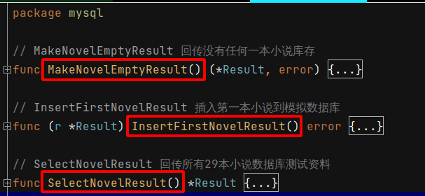
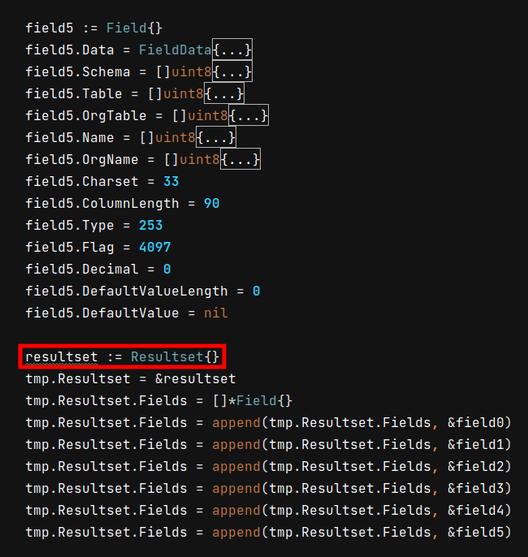

 # 2021年09月18日 开发日志

> - 为了开放方便，会模拟数据库回传，因为有一个状况，开发者同时会用 IDE 工具开启二个不同的专案，现在大家可能用 docker 容器 或 K8S 去模拟开发环境，但是像复杂的专案，模拟环境可能因为笔电硬体性能的限制，无法同时模拟多种开发环境，这时模拟数据库回传可以帮助开发者进行临时简易的开发环境
> - 又有另一个状况，可能开发者可能会出差或旅行，可能路上会发一些交通工具，这时会希望打开专案时，就能进行临时开发，这时模拟数据库回传会对开发者很方便，因为 docker 容器 或 K8S 去模拟开发环境也要花费时间去启动，对于在旅途的开发者不是很适合

## [问题和解决] 在模拟数据库回传时，发现错误

这时，有写三个函式在模拟数据库资料回传

| 项目 | 函式名称                 | 说明                                                   |
| ---- | ------------------------ | ------------------------------------------------------ |
| 1    | SelectNovelResult()      | 回传 29 本小说模拟资料                                 |
| 2    | MakeNovelEmptyResult()   | 模拟回传空数据库资料，此时数据库没有任何一本小说的数据 |
| 3    | InsertFirstNovelResult() | 模拟插入第一本小说的数据                               |

 

- 一开始使用 SelectNovelResult() 函式去模拟数据库回传，没有错误发生，因为是直接由真实的 MariaDB 数据库抄出来的数据，相对比较不会有问题
- 接下来自行编写 MakeNovelEmptyResult() 和 InsertFirstNovelResult() 就发现问题，一直会发生错误，最后再把 ResultSet 整个完整的数据从 SelectNovelResult() 复制到 MakeNovelEmptyResult() 后，之后就正常

 

结论是 ResultSet 数据要完整，为何会有这现象，原因待查
