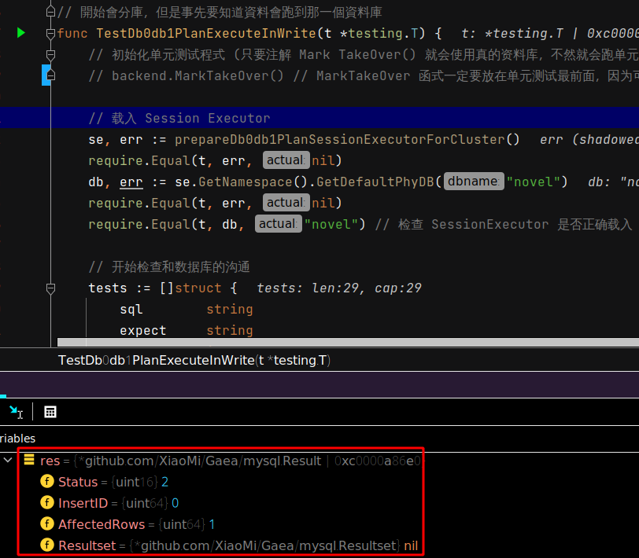
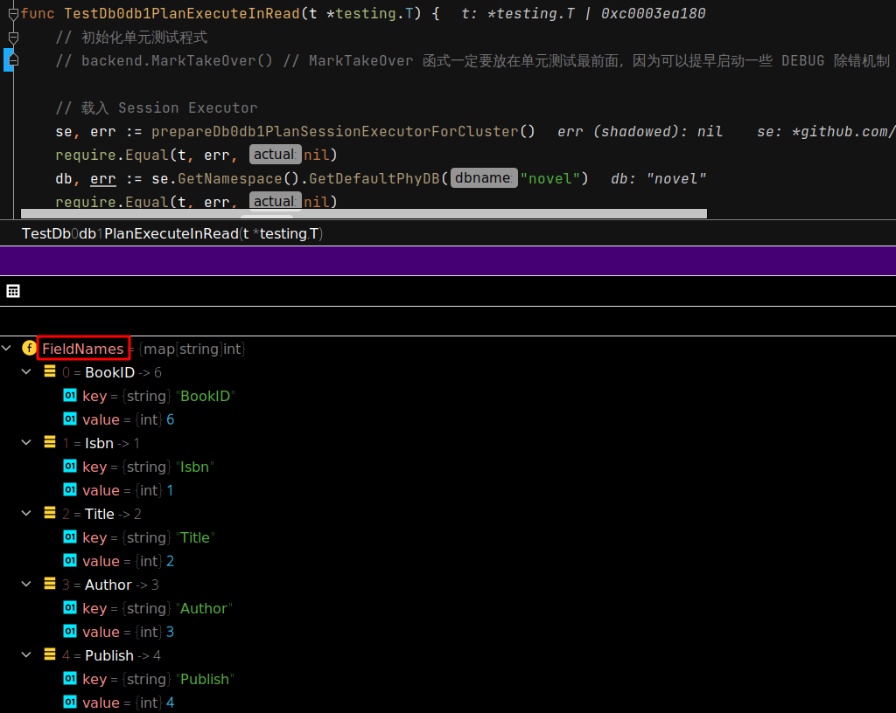
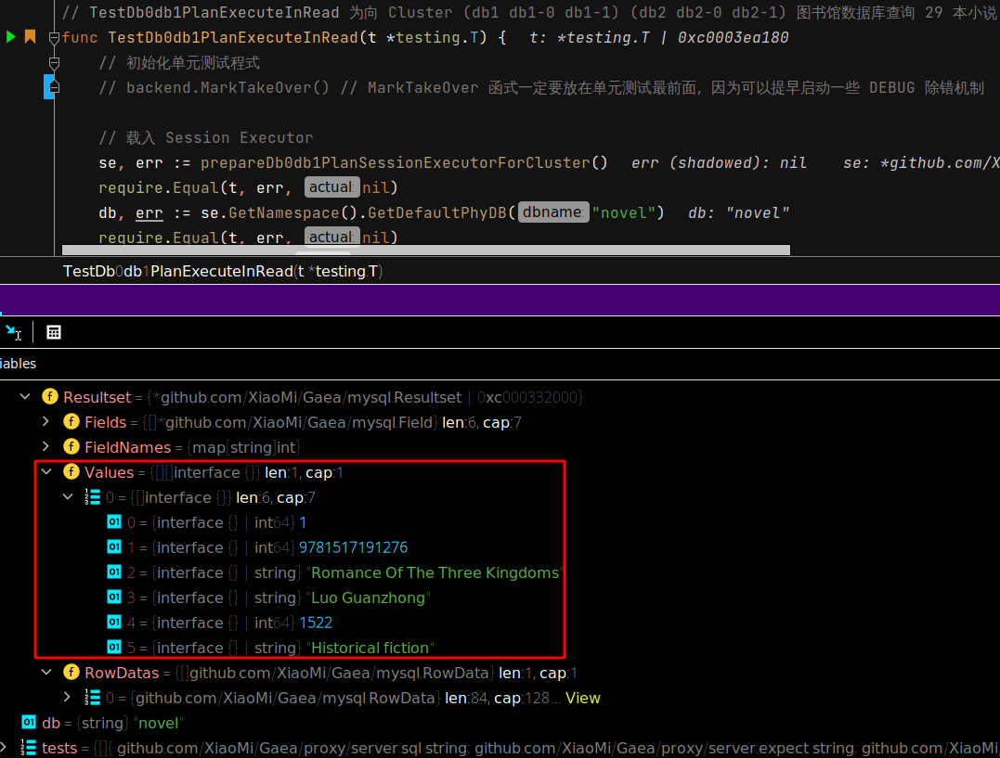
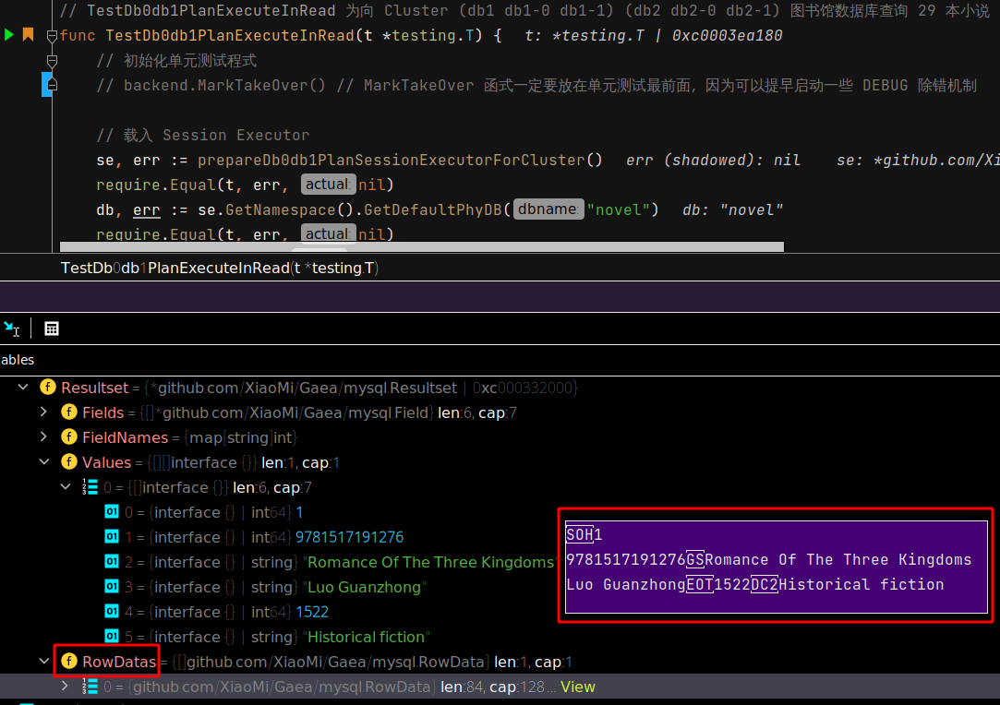

 # 2021年09月24日 开发日志

> - 目前数据库的资料是有模拟出来，单元测试初步可以正常运作，但是要先稍微整理程式码，并和真实数据库进行比对
> - 分支名称要修改，因为 原本是要用 test_separate_code 找寻开发的切入点，现在单元测试是可行的，所以分支要命名为 feature_unit_test_from_dc

## 记录真实数据库的回传

### 数据库写入

真实数据库和单元测试的切换，只要 注解 backend.MarkTakeOver() 此行就可以

| 状况                            | 程式的操作           |
| ------------------------------- | -------------------- |
| 注解 backend.MarkTakeOver()时   | 写入真实的数据库     |
| 没注解 backend.MarkTakeOver()时 | 使用单元测试进行模拟 |

如下图所示，此时单元测试会使用真实的数据库进行测试

数据库会发现塞入第一笔小说资料

数据库回传给程式的回应如下图

 

### 数据库读取

一样注解 backend.MarkTakeOver()时，就会开始向真实数据库进行查询

 

数据库回传给程式的回应如下图

- Fields 为数据库的栏位资料 
- FieldName 为每个记录每个栏位的名称 
- Values 为第一本小说的回传资料细节 
- RowDatas 为数据库回传的原始资料 
