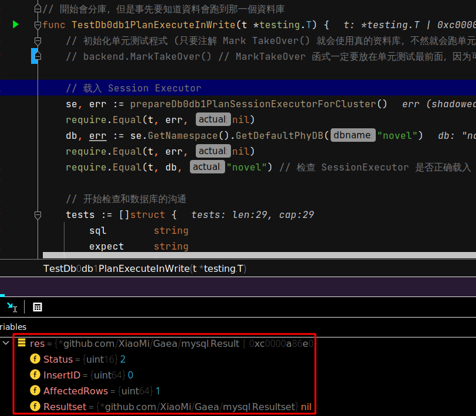
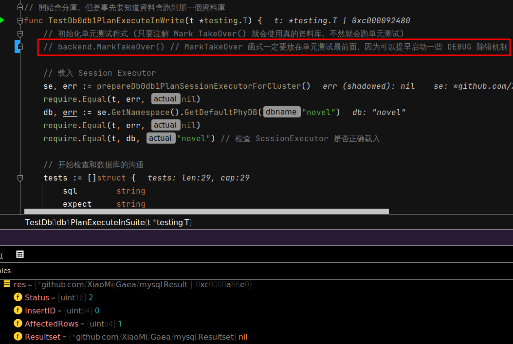
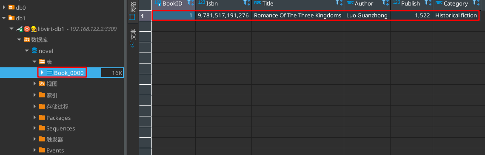
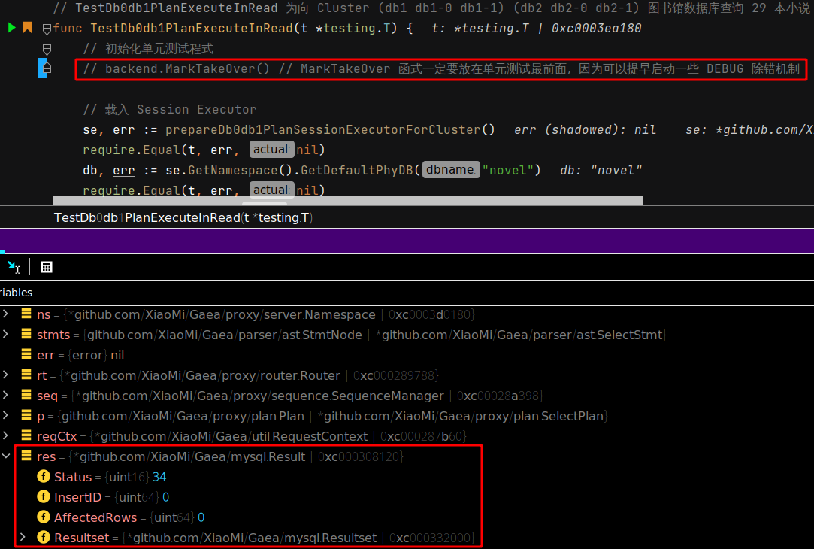
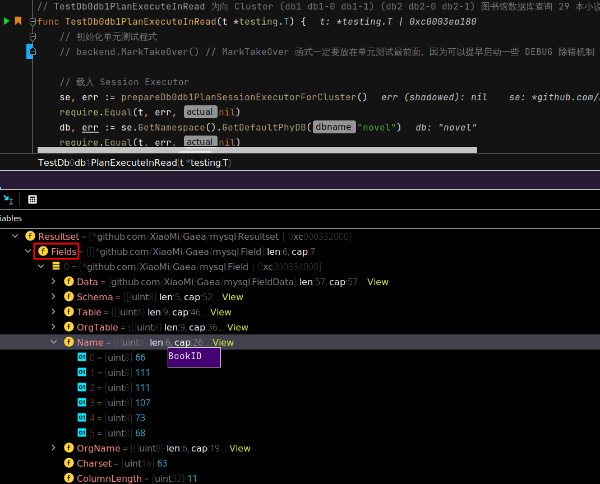
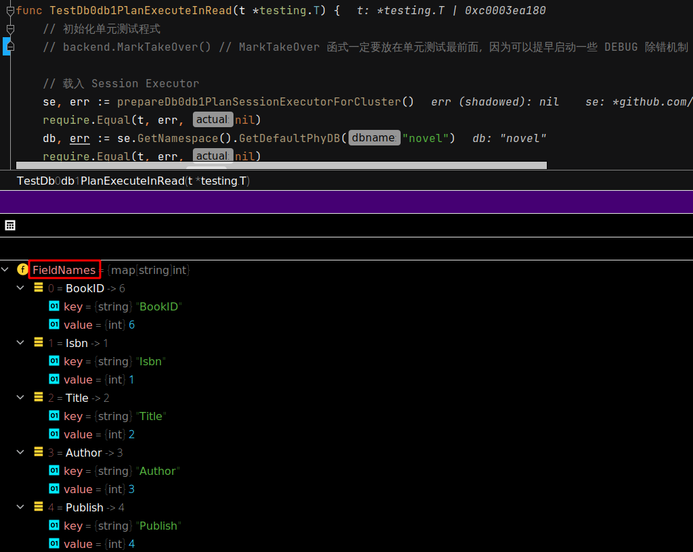
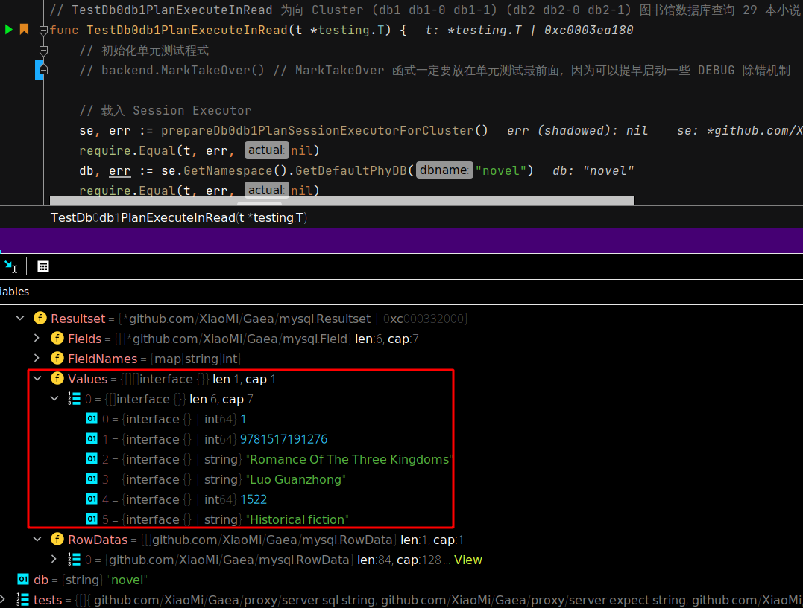

 # 2021年09月24日 開發日誌

> - 目前數據庫的資料是有模擬出來，單元測試初步可以正常運作，但是要先稍微整理程式碼，並和真實數據庫進行比對
> - 分支名稱要修改，因為 原本是要用 test_separate_code 找尋開發的切入點，現在單元測試是可行的，所以分支要命名為 feature_unit_test_from_dc

## 記錄真實數據庫的回傳

### 數據庫寫入

真實數據庫和單元測試的切換，只要 注解 backend.MarkTakeOver() 此行就可以

| 狀況                            | 程式的操作           |
| ------------------------------- | -------------------- |
| 注解 backend.MarkTakeOver()時   | 寫入真實的數據庫     |
| 沒注解 backend.MarkTakeOver()時 | 使用單元測試進行模擬 |

如下圖所示，此時單元測試會使用真實的數據庫進行測試

數據庫會發現塞入第一筆小說資料

數據庫回傳給程式的回應如下圖

 

### 數據庫讀取

一樣注解 backend.MarkTakeOver()時，就會開始向真實數據庫進行查詢

 

數據庫回傳給程式的回應如下圖

- Fields 為數據庫的欄位資料 
- FieldName 為每個記錄每個欄位的名稱 
- Values 為第一本小說的回傳資料細節 
- RowDatas 為數據庫回傳的原始資料 
