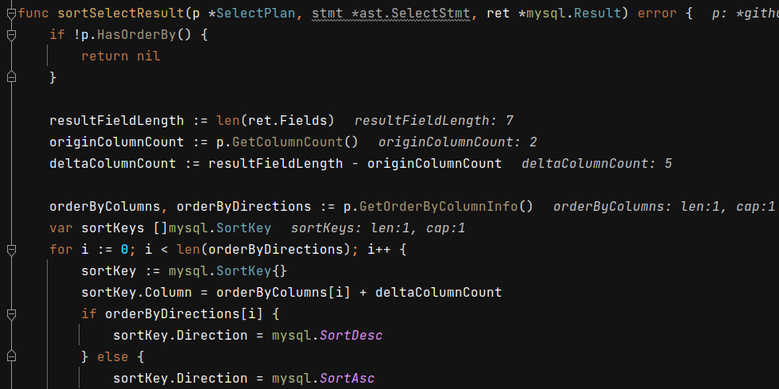
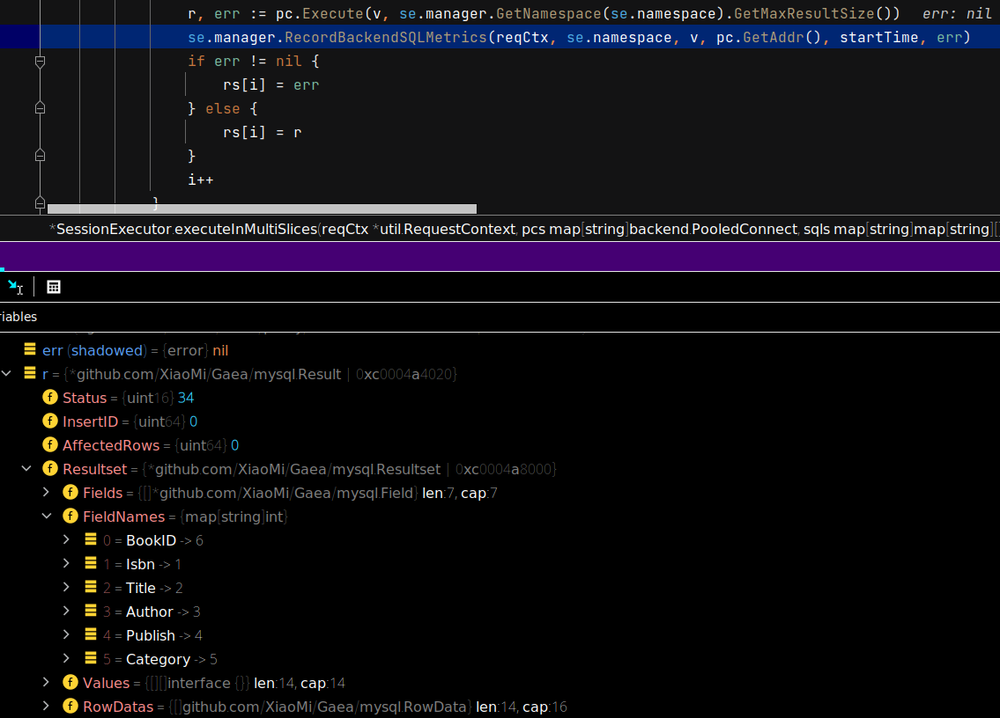

 # 2021年09月26日 开发日志

> - 突然发现数据库的回传结果无法进行排序，数据库会向 切片一 和 切片二 获得回传的资料，再进行 merge 合拼，合拼时发生排序错误 

## 1 事情缘由

原本是对 TestDb0db1PlanExecuteInRead 测试进行最后一步检查，结果没有通过测试，这代表程式有问题，如下图


在此测试里新增以下几行


结果发现发生以下错误，这代表程式无法正常排序

 

## 2 追踪实体数据库的回传资料

切片一的回传

```
Resultset = {*github.com/XiaoMi/Gaea/mysql.Resultset | 0xc000484050} 
 Fields = {[]*github.com/XiaoMi/Gaea/mysql.Field} len:7, cap:7
  0 = {*github.com/XiaoMi/Gaea/mysql.Field | 0xc0004a4000} 
   Data = {github.com/XiaoMi/Gaea/mysql.FieldData} len:57, cap:57
    0 = {uint8} 3
    1 = {uint8} 100
    2 = {uint8} 101
    3 = {uint8} 102
    4 = {uint8} 5
    5 = {uint8} 110
    6 = {uint8} 111
    7 = {uint8} 118
    8 = {uint8} 101
    9 = {uint8} 108
    10 = {uint8} 9
    11 = {uint8} 66
    12 = {uint8} 111
    13 = {uint8} 111
    14 = {uint8} 107
    15 = {uint8} 95
    16 = {uint8} 48
    17 = {uint8} 48
    18 = {uint8} 48
    19 = {uint8} 49
    20 = {uint8} 9
    21 = {uint8} 66
    22 = {uint8} 111
    23 = {uint8} 111
    24 = {uint8} 107
    25 = {uint8} 95
    26 = {uint8} 48
    27 = {uint8} 48
    28 = {uint8} 48
    29 = {uint8} 49
    30 = {uint8} 6
    31 = {uint8} 66
    32 = {uint8} 111
    33 = {uint8} 111
    34 = {uint8} 107
    35 = {uint8} 73
    36 = {uint8} 68
    37 = {uint8} 6
    38 = {uint8} 66
    39 = {uint8} 111
    40 = {uint8} 111
    41 = {uint8} 107
    42 = {uint8} 73
    43 = {uint8} 68
    44 = {uint8} 12
    45 = {uint8} 63
    46 = {uint8} 0
    47 = {uint8} 11
    48 = {uint8} 0
    49 = {uint8} 0
    50 = {uint8} 0
    51 = {uint8} 3
    52 = {uint8} 3
    53 = {uint8} 80
    54 = {uint8} 0
    55 = {uint8} 0
    56 = {uint8} 0
   Schema = {[]uint8} len:5, cap:52
    0 = {uint8} 110
    1 = {uint8} 111
    2 = {uint8} 118
    3 = {uint8} 101
    4 = {uint8} 108
   Table = {[]uint8} len:9, cap:46
    0 = {uint8} 66
    1 = {uint8} 111
    2 = {uint8} 111
    3 = {uint8} 107
    4 = {uint8} 95
    5 = {uint8} 48
    6 = {uint8} 48
    7 = {uint8} 48
    8 = {uint8} 49
   OrgTable = {[]uint8} len:9, cap:36
    0 = {uint8} 66
    1 = {uint8} 111
    2 = {uint8} 111
    3 = {uint8} 107
    4 = {uint8} 95
    5 = {uint8} 48
    6 = {uint8} 48
    7 = {uint8} 48
    8 = {uint8} 49
   Name = {[]uint8} len:6, cap:26
    0 = {uint8} 66
    1 = {uint8} 111
    2 = {uint8} 111
    3 = {uint8} 107
    4 = {uint8} 73
    5 = {uint8} 68
   OrgName = {[]uint8} len:6, cap:19
    0 = {uint8} 66
    1 = {uint8} 111
    2 = {uint8} 111
    3 = {uint8} 107
    4 = {uint8} 73
    5 = {uint8} 68
   Charset = {uint16} 63
   ColumnLength = {uint32} 11
   Type = {uint8} 3
   Flag = {uint16} 20483
   Decimal = {uint8} 0
   DefaultValueLength = {uint64} 0
   DefaultValue = {[]uint8} nil
  1 = {*github.com/XiaoMi/Gaea/mysql.Field | 0xc0004a40c0} 
   Data = {github.com/XiaoMi/Gaea/mysql.FieldData} len:53, cap:53
    0 = {uint8} 3
    1 = {uint8} 100
    2 = {uint8} 101
    3 = {uint8} 102
    4 = {uint8} 5
    5 = {uint8} 110
    6 = {uint8} 111
    7 = {uint8} 118
    8 = {uint8} 101
    9 = {uint8} 108
    10 = {uint8} 9
    11 = {uint8} 66
    12 = {uint8} 111
    13 = {uint8} 111
    14 = {uint8} 107
    15 = {uint8} 95
    16 = {uint8} 48
    17 = {uint8} 48
    18 = {uint8} 48
    19 = {uint8} 49
    20 = {uint8} 9
    21 = {uint8} 66
    22 = {uint8} 111
    23 = {uint8} 111
    24 = {uint8} 107
    25 = {uint8} 95
    26 = {uint8} 48
    27 = {uint8} 48
    28 = {uint8} 48
    29 = {uint8} 49
    30 = {uint8} 4
    31 = {uint8} 73
    32 = {uint8} 115
    33 = {uint8} 98
    34 = {uint8} 110
    35 = {uint8} 4
    36 = {uint8} 73
    37 = {uint8} 115
    38 = {uint8} 98
    39 = {uint8} 110
    40 = {uint8} 12
    41 = {uint8} 63
    42 = {uint8} 0
    43 = {uint8} 50
    44 = {uint8} 0
    45 = {uint8} 0
    46 = {uint8} 0
    47 = {uint8} 8
    48 = {uint8} 1
    49 = {uint8} 16
    50 = {uint8} 0
    51 = {uint8} 0
    52 = {uint8} 0
   Schema = {[]uint8} len:5, cap:48
    0 = {uint8} 110
    1 = {uint8} 111
    2 = {uint8} 118
    3 = {uint8} 101
    4 = {uint8} 108
   Table = {[]uint8} len:9, cap:42
    0 = {uint8} 66
    1 = {uint8} 111
    2 = {uint8} 111
    3 = {uint8} 107
    4 = {uint8} 95
    5 = {uint8} 48
    6 = {uint8} 48
    7 = {uint8} 48
    8 = {uint8} 49
   OrgTable = {[]uint8} len:9, cap:32
    0 = {uint8} 66
    1 = {uint8} 111
    2 = {uint8} 111
    3 = {uint8} 107
    4 = {uint8} 95
    5 = {uint8} 48
    6 = {uint8} 48
    7 = {uint8} 48
    8 = {uint8} 49
   Name = {[]uint8} len:4, cap:22
    0 = {uint8} 73
    1 = {uint8} 115
    2 = {uint8} 98
    3 = {uint8} 110
   OrgName = {[]uint8} len:4, cap:17
    0 = {uint8} 73
    1 = {uint8} 115
    2 = {uint8} 98
    3 = {uint8} 110
   Charset = {uint16} 63
   ColumnLength = {uint32} 50
   Type = {uint8} 8
   Flag = {uint16} 4097
   Decimal = {uint8} 0
   DefaultValueLength = {uint64} 0
   DefaultValue = {[]uint8} nil
  2 = {*github.com/XiaoMi/Gaea/mysql.Field | 0xc0004a4180} 
   Data = {github.com/XiaoMi/Gaea/mysql.FieldData} len:55, cap:55
    0 = {uint8} 3
    1 = {uint8} 100
    2 = {uint8} 101
    3 = {uint8} 102
    4 = {uint8} 5
    5 = {uint8} 110
    6 = {uint8} 111
    7 = {uint8} 118
    8 = {uint8} 101
    9 = {uint8} 108
    10 = {uint8} 9
    11 = {uint8} 66
    12 = {uint8} 111
    13 = {uint8} 111
    14 = {uint8} 107
    15 = {uint8} 95
    16 = {uint8} 48
    17 = {uint8} 48
    18 = {uint8} 48
    19 = {uint8} 49
    20 = {uint8} 9
    21 = {uint8} 66
    22 = {uint8} 111
    23 = {uint8} 111
    24 = {uint8} 107
    25 = {uint8} 95
    26 = {uint8} 48
    27 = {uint8} 48
    28 = {uint8} 48
    29 = {uint8} 49
    30 = {uint8} 5
    31 = {uint8} 84
    32 = {uint8} 105
    33 = {uint8} 116
    34 = {uint8} 108
    35 = {uint8} 101
    36 = {uint8} 5
    37 = {uint8} 84
    38 = {uint8} 105
    39 = {uint8} 116
    40 = {uint8} 108
    41 = {uint8} 101
    42 = {uint8} 12
    43 = {uint8} 33
    44 = {uint8} 0
    45 = {uint8} 44
    46 = {uint8} 1
    47 = {uint8} 0
    48 = {uint8} 0
    49 = {uint8} 253
    50 = {uint8} 1
    51 = {uint8} 16
    52 = {uint8} 0
    53 = {uint8} 0
    54 = {uint8} 0
   Schema = {[]uint8} len:5, cap:50
    0 = {uint8} 110
    1 = {uint8} 111
    2 = {uint8} 118
    3 = {uint8} 101
    4 = {uint8} 108
   Table = {[]uint8} len:9, cap:44
    0 = {uint8} 66
    1 = {uint8} 111
    2 = {uint8} 111
    3 = {uint8} 107
    4 = {uint8} 95
    5 = {uint8} 48
    6 = {uint8} 48
    7 = {uint8} 48
    8 = {uint8} 49
   OrgTable = {[]uint8} len:9, cap:34
    0 = {uint8} 66
    1 = {uint8} 111
    2 = {uint8} 111
    3 = {uint8} 107
    4 = {uint8} 95
    5 = {uint8} 48
    6 = {uint8} 48
    7 = {uint8} 48
    8 = {uint8} 49
   Name = {[]uint8} len:5, cap:24
    0 = {uint8} 84
    1 = {uint8} 105
    2 = {uint8} 116
    3 = {uint8} 108
    4 = {uint8} 101
   OrgName = {[]uint8} len:5, cap:18
    0 = {uint8} 84
    1 = {uint8} 105
    2 = {uint8} 116
    3 = {uint8} 108
    4 = {uint8} 101
   Charset = {uint16} 33
   ColumnLength = {uint32} 300
   Type = {uint8} 253
   Flag = {uint16} 4097
   Decimal = {uint8} 0
   DefaultValueLength = {uint64} 0
   DefaultValue = {[]uint8} nil
  3 = {*github.com/XiaoMi/Gaea/mysql.Field | 0xc0004a4240} 
   Data = {github.com/XiaoMi/Gaea/mysql.FieldData} len:57, cap:57
    0 = {uint8} 3
    1 = {uint8} 100
    2 = {uint8} 101
    3 = {uint8} 102
    4 = {uint8} 5
    5 = {uint8} 110
    6 = {uint8} 111
    7 = {uint8} 118
    8 = {uint8} 101
    9 = {uint8} 108
    10 = {uint8} 9
    11 = {uint8} 66
    12 = {uint8} 111
    13 = {uint8} 111
    14 = {uint8} 107
    15 = {uint8} 95
    16 = {uint8} 48
    17 = {uint8} 48
    18 = {uint8} 48
    19 = {uint8} 49
    20 = {uint8} 9
    21 = {uint8} 66
    22 = {uint8} 111
    23 = {uint8} 111
    24 = {uint8} 107
    25 = {uint8} 95
    26 = {uint8} 48
    27 = {uint8} 48
    28 = {uint8} 48
    29 = {uint8} 49
    30 = {uint8} 6
    31 = {uint8} 65
    32 = {uint8} 117
    33 = {uint8} 116
    34 = {uint8} 104
    35 = {uint8} 111
    36 = {uint8} 114
    37 = {uint8} 6
    38 = {uint8} 65
    39 = {uint8} 117
    40 = {uint8} 116
    41 = {uint8} 104
    42 = {uint8} 111
    43 = {uint8} 114
    44 = {uint8} 12
    45 = {uint8} 33
    46 = {uint8} 0
    47 = {uint8} 90
    48 = {uint8} 0
    49 = {uint8} 0
    50 = {uint8} 0
    51 = {uint8} 253
    52 = {uint8} 0
    53 = {uint8} 0
    54 = {uint8} 0
    55 = {uint8} 0
    56 = {uint8} 0
   Schema = {[]uint8} len:5, cap:52
    0 = {uint8} 110
    1 = {uint8} 111
    2 = {uint8} 118
    3 = {uint8} 101
    4 = {uint8} 108
   Table = {[]uint8} len:9, cap:46
    0 = {uint8} 66
    1 = {uint8} 111
    2 = {uint8} 111
    3 = {uint8} 107
    4 = {uint8} 95
    5 = {uint8} 48
    6 = {uint8} 48
    7 = {uint8} 48
    8 = {uint8} 49
   OrgTable = {[]uint8} len:9, cap:36
    0 = {uint8} 66
    1 = {uint8} 111
    2 = {uint8} 111
    3 = {uint8} 107
    4 = {uint8} 95
    5 = {uint8} 48
    6 = {uint8} 48
    7 = {uint8} 48
    8 = {uint8} 49
   Name = {[]uint8} len:6, cap:26
    0 = {uint8} 65
    1 = {uint8} 117
    2 = {uint8} 116
    3 = {uint8} 104
    4 = {uint8} 111
    5 = {uint8} 114
   OrgName = {[]uint8} len:6, cap:19
    0 = {uint8} 65
    1 = {uint8} 117
    2 = {uint8} 116
    3 = {uint8} 104
    4 = {uint8} 111
    5 = {uint8} 114
   Charset = {uint16} 33
   ColumnLength = {uint32} 90
   Type = {uint8} 253
   Flag = {uint16} 0
   Decimal = {uint8} 0
   DefaultValueLength = {uint64} 0
   DefaultValue = {[]uint8} nil
  4 = {*github.com/XiaoMi/Gaea/mysql.Field | 0xc0004a4300} 
   Data = {github.com/XiaoMi/Gaea/mysql.FieldData} len:59, cap:59
    0 = {uint8} 3
    1 = {uint8} 100
    2 = {uint8} 101
    3 = {uint8} 102
    4 = {uint8} 5
    5 = {uint8} 110
    6 = {uint8} 111
    7 = {uint8} 118
    8 = {uint8} 101
    9 = {uint8} 108
    10 = {uint8} 9
    11 = {uint8} 66
    12 = {uint8} 111
    13 = {uint8} 111
    14 = {uint8} 107
    15 = {uint8} 95
    16 = {uint8} 48
    17 = {uint8} 48
    18 = {uint8} 48
    19 = {uint8} 49
    20 = {uint8} 9
    21 = {uint8} 66
    22 = {uint8} 111
    23 = {uint8} 111
    24 = {uint8} 107
    25 = {uint8} 95
    26 = {uint8} 48
    27 = {uint8} 48
    28 = {uint8} 48
    29 = {uint8} 49
    30 = {uint8} 7
    31 = {uint8} 80
    32 = {uint8} 117
    33 = {uint8} 98
    34 = {uint8} 108
    35 = {uint8} 105
    36 = {uint8} 115
    37 = {uint8} 104
    38 = {uint8} 7
    39 = {uint8} 80
    40 = {uint8} 117
    41 = {uint8} 98
    42 = {uint8} 108
    43 = {uint8} 105
    44 = {uint8} 115
    45 = {uint8} 104
    46 = {uint8} 12
    47 = {uint8} 63
    48 = {uint8} 0
    49 = {uint8} 4
    50 = {uint8} 0
    51 = {uint8} 0
    52 = {uint8} 0
    53 = {uint8} 3
    54 = {uint8} 0
    55 = {uint8} 0
    56 = {uint8} 0
    57 = {uint8} 0
    58 = {uint8} 0
   Schema = {[]uint8} len:5, cap:54
    0 = {uint8} 110
    1 = {uint8} 111
    2 = {uint8} 118
    3 = {uint8} 101
    4 = {uint8} 108
   Table = {[]uint8} len:9, cap:48
    0 = {uint8} 66
    1 = {uint8} 111
    2 = {uint8} 111
    3 = {uint8} 107
    4 = {uint8} 95
    5 = {uint8} 48
    6 = {uint8} 48
    7 = {uint8} 48
    8 = {uint8} 49
   OrgTable = {[]uint8} len:9, cap:38
    0 = {uint8} 66
    1 = {uint8} 111
    2 = {uint8} 111
    3 = {uint8} 107
    4 = {uint8} 95
    5 = {uint8} 48
    6 = {uint8} 48
    7 = {uint8} 48
    8 = {uint8} 49
   Name = {[]uint8} len:7, cap:28
    0 = {uint8} 80
    1 = {uint8} 117
    2 = {uint8} 98
    3 = {uint8} 108
    4 = {uint8} 105
    5 = {uint8} 115
    6 = {uint8} 104
   OrgName = {[]uint8} len:7, cap:20
    0 = {uint8} 80
    1 = {uint8} 117
    2 = {uint8} 98
    3 = {uint8} 108
    4 = {uint8} 105
    5 = {uint8} 115
    6 = {uint8} 104
   Charset = {uint16} 63
   ColumnLength = {uint32} 4
   Type = {uint8} 3
   Flag = {uint16} 0
   Decimal = {uint8} 0
   DefaultValueLength = {uint64} 0
   DefaultValue = {[]uint8} nil
  5 = {*github.com/XiaoMi/Gaea/mysql.Field | 0xc0004a43c0} 
   Data = {github.com/XiaoMi/Gaea/mysql.FieldData} len:61, cap:61
    0 = {uint8} 3
    1 = {uint8} 100
    2 = {uint8} 101
    3 = {uint8} 102
    4 = {uint8} 5
    5 = {uint8} 110
    6 = {uint8} 111
    7 = {uint8} 118
    8 = {uint8} 101
    9 = {uint8} 108
    10 = {uint8} 9
    11 = {uint8} 66
    12 = {uint8} 111
    13 = {uint8} 111
    14 = {uint8} 107
    15 = {uint8} 95
    16 = {uint8} 48
    17 = {uint8} 48
    18 = {uint8} 48
    19 = {uint8} 49
    20 = {uint8} 9
    21 = {uint8} 66
    22 = {uint8} 111
    23 = {uint8} 111
    24 = {uint8} 107
    25 = {uint8} 95
    26 = {uint8} 48
    27 = {uint8} 48
    28 = {uint8} 48
    29 = {uint8} 49
    30 = {uint8} 8
    31 = {uint8} 67
    32 = {uint8} 97
    33 = {uint8} 116
    34 = {uint8} 101
    35 = {uint8} 103
    36 = {uint8} 111
    37 = {uint8} 114
    38 = {uint8} 121
    39 = {uint8} 8
    40 = {uint8} 67
    41 = {uint8} 97
    42 = {uint8} 116
    43 = {uint8} 101
    44 = {uint8} 103
    45 = {uint8} 111
    46 = {uint8} 114
    47 = {uint8} 121
    48 = {uint8} 12
    49 = {uint8} 33
    50 = {uint8} 0
    51 = {uint8} 90
    52 = {uint8} 0
    53 = {uint8} 0
    54 = {uint8} 0
    55 = {uint8} 253
    56 = {uint8} 1
    57 = {uint8} 16
    58 = {uint8} 0
    59 = {uint8} 0
    60 = {uint8} 0
   Schema = {[]uint8} len:5, cap:56
    0 = {uint8} 110
    1 = {uint8} 111
    2 = {uint8} 118
    3 = {uint8} 101
    4 = {uint8} 108
   Table = {[]uint8} len:9, cap:50
    0 = {uint8} 66
    1 = {uint8} 111
    2 = {uint8} 111
    3 = {uint8} 107
    4 = {uint8} 95
    5 = {uint8} 48
    6 = {uint8} 48
    7 = {uint8} 48
    8 = {uint8} 49
   OrgTable = {[]uint8} len:9, cap:40
    0 = {uint8} 66
    1 = {uint8} 111
    2 = {uint8} 111
    3 = {uint8} 107
    4 = {uint8} 95
    5 = {uint8} 48
    6 = {uint8} 48
    7 = {uint8} 48
    8 = {uint8} 49
   Name = {[]uint8} len:8, cap:30
    0 = {uint8} 67
    1 = {uint8} 97
    2 = {uint8} 116
    3 = {uint8} 101
    4 = {uint8} 103
    5 = {uint8} 111
    6 = {uint8} 114
    7 = {uint8} 121
   OrgName = {[]uint8} len:8, cap:21
    0 = {uint8} 67
    1 = {uint8} 97
    2 = {uint8} 116
    3 = {uint8} 101
    4 = {uint8} 103
    5 = {uint8} 111
    6 = {uint8} 114
    7 = {uint8} 121
   Charset = {uint16} 33
   ColumnLength = {uint32} 90
   Type = {uint8} 253
   Flag = {uint16} 4097
   Decimal = {uint8} 0
   DefaultValueLength = {uint64} 0
   DefaultValue = {[]uint8} nil
  6 = {*github.com/XiaoMi/Gaea/mysql.Field | 0xc0004a4480} 
   Data = {github.com/XiaoMi/Gaea/mysql.FieldData} len:57, cap:57
    0 = {uint8} 3
    1 = {uint8} 100
    2 = {uint8} 101
    3 = {uint8} 102
    4 = {uint8} 5
    5 = {uint8} 110
    6 = {uint8} 111
    7 = {uint8} 118
    8 = {uint8} 101
    9 = {uint8} 108
    10 = {uint8} 9
    11 = {uint8} 66
    12 = {uint8} 111
    13 = {uint8} 111
    14 = {uint8} 107
    15 = {uint8} 95
    16 = {uint8} 48
    17 = {uint8} 48
    18 = {uint8} 48
    19 = {uint8} 49
    20 = {uint8} 9
    21 = {uint8} 66
    22 = {uint8} 111
    23 = {uint8} 111
    24 = {uint8} 107
    25 = {uint8} 95
    26 = {uint8} 48
    27 = {uint8} 48
    28 = {uint8} 48
    29 = {uint8} 49
    30 = {uint8} 6
    31 = {uint8} 66
    32 = {uint8} 111
    33 = {uint8} 111
    34 = {uint8} 107
    35 = {uint8} 73
    36 = {uint8} 68
    37 = {uint8} 6
    38 = {uint8} 66
    39 = {uint8} 111
    40 = {uint8} 111
    41 = {uint8} 107
    42 = {uint8} 73
    43 = {uint8} 68
    44 = {uint8} 12
    45 = {uint8} 63
    46 = {uint8} 0
    47 = {uint8} 11
    48 = {uint8} 0
    49 = {uint8} 0
    50 = {uint8} 0
    51 = {uint8} 3
    52 = {uint8} 3
    53 = {uint8} 80
    54 = {uint8} 0
    55 = {uint8} 0
    56 = {uint8} 0
   Schema = {[]uint8} len:5, cap:52
    0 = {uint8} 110
    1 = {uint8} 111
    2 = {uint8} 118
    3 = {uint8} 101
    4 = {uint8} 108
   Table = {[]uint8} len:9, cap:46
    0 = {uint8} 66
    1 = {uint8} 111
    2 = {uint8} 111
    3 = {uint8} 107
    4 = {uint8} 95
    5 = {uint8} 48
    6 = {uint8} 48
    7 = {uint8} 48
    8 = {uint8} 49
   OrgTable = {[]uint8} len:9, cap:36
    0 = {uint8} 66
    1 = {uint8} 111
    2 = {uint8} 111
    3 = {uint8} 107
    4 = {uint8} 95
    5 = {uint8} 48
    6 = {uint8} 48
    7 = {uint8} 48
    8 = {uint8} 49
   Name = {[]uint8} len:6, cap:26
    0 = {uint8} 66
    1 = {uint8} 111
    2 = {uint8} 111
    3 = {uint8} 107
    4 = {uint8} 73
    5 = {uint8} 68
   OrgName = {[]uint8} len:6, cap:19
    0 = {uint8} 66
    1 = {uint8} 111
    2 = {uint8} 111
    3 = {uint8} 107
    4 = {uint8} 73
    5 = {uint8} 68
   Charset = {uint16} 63
   ColumnLength = {uint32} 11
   Type = {uint8} 3
   Flag = {uint16} 20483
   Decimal = {uint8} 0
   DefaultValueLength = {uint64} 0
   DefaultValue = {[]uint8} nil
```

切片二的回传

 ```
 1 = {*github.com/XiaoMi/Gaea/mysql.Field | 0xc000414300} 
  Data = {github.com/XiaoMi/Gaea/mysql.FieldData} len:53, cap:53
   0 = {uint8} 3
   1 = {uint8} 100
   2 = {uint8} 101
   3 = {uint8} 102
   4 = {uint8} 5
   5 = {uint8} 110
   6 = {uint8} 111
   7 = {uint8} 118
   8 = {uint8} 101
   9 = {uint8} 108
   10 = {uint8} 9
   11 = {uint8} 66
   12 = {uint8} 111
   13 = {uint8} 111
   14 = {uint8} 107
   15 = {uint8} 95
   16 = {uint8} 48
   17 = {uint8} 48
   18 = {uint8} 48
   19 = {uint8} 48
   20 = {uint8} 9
   21 = {uint8} 66
   22 = {uint8} 111
   23 = {uint8} 111
   24 = {uint8} 107
   25 = {uint8} 95
   26 = {uint8} 48
   27 = {uint8} 48
   28 = {uint8} 48
   29 = {uint8} 48
   30 = {uint8} 4
   31 = {uint8} 73
   32 = {uint8} 115
   33 = {uint8} 98
   34 = {uint8} 110
   35 = {uint8} 4
   36 = {uint8} 73
   37 = {uint8} 115
   38 = {uint8} 98
   39 = {uint8} 110
   40 = {uint8} 12
   41 = {uint8} 63
   42 = {uint8} 0
   43 = {uint8} 50
   44 = {uint8} 0
   45 = {uint8} 0
   46 = {uint8} 0
   47 = {uint8} 8
   48 = {uint8} 1
   49 = {uint8} 16
   50 = {uint8} 0
   51 = {uint8} 0
   52 = {uint8} 0
  Schema = {[]uint8} len:5, cap:48
   0 = {uint8} 110
   1 = {uint8} 111
   2 = {uint8} 118
   3 = {uint8} 101
   4 = {uint8} 108
  Table = {[]uint8} len:9, cap:42
   0 = {uint8} 66
   1 = {uint8} 111
   2 = {uint8} 111
   3 = {uint8} 107
   4 = {uint8} 95
   5 = {uint8} 48
   6 = {uint8} 48
   7 = {uint8} 48
   8 = {uint8} 48
  OrgTable = {[]uint8} len:9, cap:32
   0 = {uint8} 66
   1 = {uint8} 111
   2 = {uint8} 111
   3 = {uint8} 107
   4 = {uint8} 95
   5 = {uint8} 48
   6 = {uint8} 48
   7 = {uint8} 48
   8 = {uint8} 48
  Name = {[]uint8} len:4, cap:22
   0 = {uint8} 73
   1 = {uint8} 115
   2 = {uint8} 98
   3 = {uint8} 110
  OrgName = {[]uint8} len:4, cap:17
   0 = {uint8} 73
   1 = {uint8} 115
   2 = {uint8} 98
   3 = {uint8} 110
  Charset = {uint16} 63
  ColumnLength = {uint32} 50
  Type = {uint8} 8
  Flag = {uint16} 4097
  Decimal = {uint8} 0
  DefaultValueLength = {uint64} 0
  DefaultValue = {[]uint8} nil
 2 = {*github.com/XiaoMi/Gaea/mysql.Field | 0xc0004143c0} 
  Data = {github.com/XiaoMi/Gaea/mysql.FieldData} len:55, cap:55
   0 = {uint8} 3
   1 = {uint8} 100
   2 = {uint8} 101
   3 = {uint8} 102
   4 = {uint8} 5
   5 = {uint8} 110
   6 = {uint8} 111
   7 = {uint8} 118
   8 = {uint8} 101
   9 = {uint8} 108
   10 = {uint8} 9
   11 = {uint8} 66
   12 = {uint8} 111
   13 = {uint8} 111
   14 = {uint8} 107
   15 = {uint8} 95
   16 = {uint8} 48
   17 = {uint8} 48
   18 = {uint8} 48
   19 = {uint8} 48
   20 = {uint8} 9
   21 = {uint8} 66
   22 = {uint8} 111
   23 = {uint8} 111
   24 = {uint8} 107
   25 = {uint8} 95
   26 = {uint8} 48
   27 = {uint8} 48
   28 = {uint8} 48
   29 = {uint8} 48
   30 = {uint8} 5
   31 = {uint8} 84
   32 = {uint8} 105
   33 = {uint8} 116
   34 = {uint8} 108
   35 = {uint8} 101
   36 = {uint8} 5
   37 = {uint8} 84
   38 = {uint8} 105
   39 = {uint8} 116
   40 = {uint8} 108
   41 = {uint8} 101
   42 = {uint8} 12
   43 = {uint8} 33
   44 = {uint8} 0
   45 = {uint8} 44
   46 = {uint8} 1
   47 = {uint8} 0
   48 = {uint8} 0
   49 = {uint8} 253
   50 = {uint8} 1
   51 = {uint8} 16
   52 = {uint8} 0
   53 = {uint8} 0
   54 = {uint8} 0
  Schema = {[]uint8} len:5, cap:50
   0 = {uint8} 110
   1 = {uint8} 111
   2 = {uint8} 118
   3 = {uint8} 101
   4 = {uint8} 108
  Table = {[]uint8} len:9, cap:44
   0 = {uint8} 66
   1 = {uint8} 111
   2 = {uint8} 111
   3 = {uint8} 107
   4 = {uint8} 95
   5 = {uint8} 48
   6 = {uint8} 48
   7 = {uint8} 48
   8 = {uint8} 48
  OrgTable = {[]uint8} len:9, cap:34
   0 = {uint8} 66
   1 = {uint8} 111
   2 = {uint8} 111
   3 = {uint8} 107
   4 = {uint8} 95
   5 = {uint8} 48
   6 = {uint8} 48
   7 = {uint8} 48
   8 = {uint8} 48
  Name = {[]uint8} len:5, cap:24
   0 = {uint8} 84
   1 = {uint8} 105
   2 = {uint8} 116
   3 = {uint8} 108
   4 = {uint8} 101
  OrgName = {[]uint8} len:5, cap:18
   0 = {uint8} 84
   1 = {uint8} 105
   2 = {uint8} 116
   3 = {uint8} 108
   4 = {uint8} 101
  Charset = {uint16} 33
  ColumnLength = {uint32} 300
  Type = {uint8} 253
  Flag = {uint16} 4097
  Decimal = {uint8} 0
  DefaultValueLength = {uint64} 0
  DefaultValue = {[]uint8} nil
 3 = {*github.com/XiaoMi/Gaea/mysql.Field | 0xc000414480} 
  Data = {github.com/XiaoMi/Gaea/mysql.FieldData} len:57, cap:57
   0 = {uint8} 3
   1 = {uint8} 100
   2 = {uint8} 101
   3 = {uint8} 102
   4 = {uint8} 5
   5 = {uint8} 110
   6 = {uint8} 111
   7 = {uint8} 118
   8 = {uint8} 101
   9 = {uint8} 108
   10 = {uint8} 9
   11 = {uint8} 66
   12 = {uint8} 111
   13 = {uint8} 111
   14 = {uint8} 107
   15 = {uint8} 95
   16 = {uint8} 48
   17 = {uint8} 48
   18 = {uint8} 48
   19 = {uint8} 48
   20 = {uint8} 9
   21 = {uint8} 66
   22 = {uint8} 111
   23 = {uint8} 111
   24 = {uint8} 107
   25 = {uint8} 95
   26 = {uint8} 48
   27 = {uint8} 48
   28 = {uint8} 48
   29 = {uint8} 48
   30 = {uint8} 6
   31 = {uint8} 65
   32 = {uint8} 117
   33 = {uint8} 116
   34 = {uint8} 104
   35 = {uint8} 111
   36 = {uint8} 114
   37 = {uint8} 6
   38 = {uint8} 65
   39 = {uint8} 117
   40 = {uint8} 116
   41 = {uint8} 104
   42 = {uint8} 111
   43 = {uint8} 114
   44 = {uint8} 12
   45 = {uint8} 33
   46 = {uint8} 0
   47 = {uint8} 90
   48 = {uint8} 0
   49 = {uint8} 0
   50 = {uint8} 0
   51 = {uint8} 253
   52 = {uint8} 0
   53 = {uint8} 0
   54 = {uint8} 0
   55 = {uint8} 0
   56 = {uint8} 0
  Schema = {[]uint8} len:5, cap:52
   0 = {uint8} 110
   1 = {uint8} 111
   2 = {uint8} 118
   3 = {uint8} 101
   4 = {uint8} 108
  Table = {[]uint8} len:9, cap:46
   0 = {uint8} 66
   1 = {uint8} 111
   2 = {uint8} 111
   3 = {uint8} 107
   4 = {uint8} 95
   5 = {uint8} 48
   6 = {uint8} 48
   7 = {uint8} 48
   8 = {uint8} 48
  OrgTable = {[]uint8} len:9, cap:36
   0 = {uint8} 66
   1 = {uint8} 111
   2 = {uint8} 111
   3 = {uint8} 107
   4 = {uint8} 95
   5 = {uint8} 48
   6 = {uint8} 48
   7 = {uint8} 48
   8 = {uint8} 48
  Name = {[]uint8} len:6, cap:26
   0 = {uint8} 65
   1 = {uint8} 117
   2 = {uint8} 116
   3 = {uint8} 104
   4 = {uint8} 111
   5 = {uint8} 114
  OrgName = {[]uint8} len:6, cap:19
   0 = {uint8} 65
   1 = {uint8} 117
   2 = {uint8} 116
   3 = {uint8} 104
   4 = {uint8} 111
   5 = {uint8} 114
  Charset = {uint16} 33
  ColumnLength = {uint32} 90
  Type = {uint8} 253
  Flag = {uint16} 0
  Decimal = {uint8} 0
  DefaultValueLength = {uint64} 0
  DefaultValue = {[]uint8} nil
 4 = {*github.com/XiaoMi/Gaea/mysql.Field | 0xc000414540} 
  Data = {github.com/XiaoMi/Gaea/mysql.FieldData} len:59, cap:59
   0 = {uint8} 3
   1 = {uint8} 100
   2 = {uint8} 101
   3 = {uint8} 102
   4 = {uint8} 5
   5 = {uint8} 110
   6 = {uint8} 111
   7 = {uint8} 118
   8 = {uint8} 101
   9 = {uint8} 108
   10 = {uint8} 9
   11 = {uint8} 66
   12 = {uint8} 111
   13 = {uint8} 111
   14 = {uint8} 107
   15 = {uint8} 95
   16 = {uint8} 48
   17 = {uint8} 48
   18 = {uint8} 48
   19 = {uint8} 48
   20 = {uint8} 9
   21 = {uint8} 66
   22 = {uint8} 111
   23 = {uint8} 111
   24 = {uint8} 107
   25 = {uint8} 95
   26 = {uint8} 48
   27 = {uint8} 48
   28 = {uint8} 48
   29 = {uint8} 48
   30 = {uint8} 7
   31 = {uint8} 80
   32 = {uint8} 117
   33 = {uint8} 98
   34 = {uint8} 108
   35 = {uint8} 105
   36 = {uint8} 115
   37 = {uint8} 104
   38 = {uint8} 7
   39 = {uint8} 80
   40 = {uint8} 117
   41 = {uint8} 98
   42 = {uint8} 108
   43 = {uint8} 105
   44 = {uint8} 115
   45 = {uint8} 104
   46 = {uint8} 12
   47 = {uint8} 63
   48 = {uint8} 0
   49 = {uint8} 4
   50 = {uint8} 0
   51 = {uint8} 0
   52 = {uint8} 0
   53 = {uint8} 3
   54 = {uint8} 0
   55 = {uint8} 0
   56 = {uint8} 0
   57 = {uint8} 0
   58 = {uint8} 0
  Schema = {[]uint8} len:5, cap:54
   0 = {uint8} 110
   1 = {uint8} 111
   2 = {uint8} 118
   3 = {uint8} 101
   4 = {uint8} 108
  Table = {[]uint8} len:9, cap:48
   0 = {uint8} 66
   1 = {uint8} 111
   2 = {uint8} 111
   3 = {uint8} 107
   4 = {uint8} 95
   5 = {uint8} 48
   6 = {uint8} 48
   7 = {uint8} 48
   8 = {uint8} 48
  OrgTable = {[]uint8} len:9, cap:38
   0 = {uint8} 66
   1 = {uint8} 111
   2 = {uint8} 111
   3 = {uint8} 107
   4 = {uint8} 95
   5 = {uint8} 48
   6 = {uint8} 48
   7 = {uint8} 48
   8 = {uint8} 48
  Name = {[]uint8} len:7, cap:28
   0 = {uint8} 80
   1 = {uint8} 117
   2 = {uint8} 98
   3 = {uint8} 108
   4 = {uint8} 105
   5 = {uint8} 115
   6 = {uint8} 104
  OrgName = {[]uint8} len:7, cap:20
   0 = {uint8} 80
   1 = {uint8} 117
   2 = {uint8} 98
   3 = {uint8} 108
   4 = {uint8} 105
   5 = {uint8} 115
   6 = {uint8} 104
  Charset = {uint16} 63
  ColumnLength = {uint32} 4
  Type = {uint8} 3
  Flag = {uint16} 0
  Decimal = {uint8} 0
  DefaultValueLength = {uint64} 0
  DefaultValue = {[]uint8} nil
 5 = {*github.com/XiaoMi/Gaea/mysql.Field | 0xc000414600} 
  Data = {github.com/XiaoMi/Gaea/mysql.FieldData} len:61, cap:61
   0 = {uint8} 3
   1 = {uint8} 100
   2 = {uint8} 101
   3 = {uint8} 102
   4 = {uint8} 5
   5 = {uint8} 110
   6 = {uint8} 111
   7 = {uint8} 118
   8 = {uint8} 101
   9 = {uint8} 108
   10 = {uint8} 9
   11 = {uint8} 66
   12 = {uint8} 111
   13 = {uint8} 111
   14 = {uint8} 107
   15 = {uint8} 95
   16 = {uint8} 48
   17 = {uint8} 48
   18 = {uint8} 48
   19 = {uint8} 48
   20 = {uint8} 9
   21 = {uint8} 66
   22 = {uint8} 111
   23 = {uint8} 111
   24 = {uint8} 107
   25 = {uint8} 95
   26 = {uint8} 48
   27 = {uint8} 48
   28 = {uint8} 48
   29 = {uint8} 48
   30 = {uint8} 8
   31 = {uint8} 67
   32 = {uint8} 97
   33 = {uint8} 116
   34 = {uint8} 101
   35 = {uint8} 103
   36 = {uint8} 111
   37 = {uint8} 114
   38 = {uint8} 121
   39 = {uint8} 8
   40 = {uint8} 67
   41 = {uint8} 97
   42 = {uint8} 116
   43 = {uint8} 101
   44 = {uint8} 103
   45 = {uint8} 111
   46 = {uint8} 114
   47 = {uint8} 121
   48 = {uint8} 12
   49 = {uint8} 33
   50 = {uint8} 0
   51 = {uint8} 90
   52 = {uint8} 0
   53 = {uint8} 0
   54 = {uint8} 0
   55 = {uint8} 253
   56 = {uint8} 1
   57 = {uint8} 16
   58 = {uint8} 0
   59 = {uint8} 0
   60 = {uint8} 0
  Schema = {[]uint8} len:5, cap:56
   0 = {uint8} 110
   1 = {uint8} 111
   2 = {uint8} 118
   3 = {uint8} 101
   4 = {uint8} 108
  Table = {[]uint8} len:9, cap:50
   0 = {uint8} 66
   1 = {uint8} 111
   2 = {uint8} 111
   3 = {uint8} 107
   4 = {uint8} 95
   5 = {uint8} 48
   6 = {uint8} 48
   7 = {uint8} 48
   8 = {uint8} 48
  OrgTable = {[]uint8} len:9, cap:40
   0 = {uint8} 66
   1 = {uint8} 111
   2 = {uint8} 111
   3 = {uint8} 107
   4 = {uint8} 95
   5 = {uint8} 48
   6 = {uint8} 48
   7 = {uint8} 48
   8 = {uint8} 48
  Name = {[]uint8} len:8, cap:30
   0 = {uint8} 67
   1 = {uint8} 97
   2 = {uint8} 116
   3 = {uint8} 101
   4 = {uint8} 103
   5 = {uint8} 111
   6 = {uint8} 114
   7 = {uint8} 121
  OrgName = {[]uint8} len:8, cap:21
   0 = {uint8} 67
   1 = {uint8} 97
   2 = {uint8} 116
   3 = {uint8} 101
   4 = {uint8} 103
   5 = {uint8} 111
   6 = {uint8} 114
   7 = {uint8} 121
  Charset = {uint16} 33
  ColumnLength = {uint32} 90
  Type = {uint8} 253
  Flag = {uint16} 4097
  Decimal = {uint8} 0
  DefaultValueLength = {uint64} 0
  DefaultValue = {[]uint8} nil
 6 = {*github.com/XiaoMi/Gaea/mysql.Field | 0xc0004146c0} 
  Data = {github.com/XiaoMi/Gaea/mysql.FieldData} len:57, cap:57
   0 = {uint8} 3
   1 = {uint8} 100
   2 = {uint8} 101
   3 = {uint8} 102
   4 = {uint8} 5
   5 = {uint8} 110
   6 = {uint8} 111
   7 = {uint8} 118
   8 = {uint8} 101
   9 = {uint8} 108
   10 = {uint8} 9
   11 = {uint8} 66
   12 = {uint8} 111
   13 = {uint8} 111
   14 = {uint8} 107
   15 = {uint8} 95
   16 = {uint8} 48
   17 = {uint8} 48
   18 = {uint8} 48
   19 = {uint8} 48
   20 = {uint8} 9
   21 = {uint8} 66
   22 = {uint8} 111
   23 = {uint8} 111
   24 = {uint8} 107
   25 = {uint8} 95
   26 = {uint8} 48
   27 = {uint8} 48
   28 = {uint8} 48
   29 = {uint8} 48
   30 = {uint8} 6
   31 = {uint8} 66
   32 = {uint8} 111
   33 = {uint8} 111
   34 = {uint8} 107
   35 = {uint8} 73
   36 = {uint8} 68
   37 = {uint8} 6
   38 = {uint8} 66
   39 = {uint8} 111
   40 = {uint8} 111
   41 = {uint8} 107
   42 = {uint8} 73
   43 = {uint8} 68
   44 = {uint8} 12
   45 = {uint8} 63
   46 = {uint8} 0
   47 = {uint8} 11
   48 = {uint8} 0
   49 = {uint8} 0
   50 = {uint8} 0
   51 = {uint8} 3
   52 = {uint8} 3
   53 = {uint8} 80
   54 = {uint8} 0
   55 = {uint8} 0
   56 = {uint8} 0
  Schema = {[]uint8} len:5, cap:52
   0 = {uint8} 110
   1 = {uint8} 111
   2 = {uint8} 118
   3 = {uint8} 101
   4 = {uint8} 108
  Table = {[]uint8} len:9, cap:46
   0 = {uint8} 66
   1 = {uint8} 111
   2 = {uint8} 111
   3 = {uint8} 107
   4 = {uint8} 95
   5 = {uint8} 48
   6 = {uint8} 48
   7 = {uint8} 48
   8 = {uint8} 48
  OrgTable = {[]uint8} len:9, cap:36
   0 = {uint8} 66
   1 = {uint8} 111
   2 = {uint8} 111
   3 = {uint8} 107
   4 = {uint8} 95
   5 = {uint8} 48
   6 = {uint8} 48
   7 = {uint8} 48
   8 = {uint8} 48
  Name = {[]uint8} len:6, cap:26
   0 = {uint8} 66
   1 = {uint8} 111
   2 = {uint8} 111
   3 = {uint8} 107
   4 = {uint8} 73
   5 = {uint8} 68
  OrgName = {[]uint8} len:6, cap:19
   0 = {uint8} 66
   1 = {uint8} 111
   2 = {uint8} 111
   3 = {uint8} 107
   4 = {uint8} 73
   5 = {uint8} 68
 ```

 

 

 
