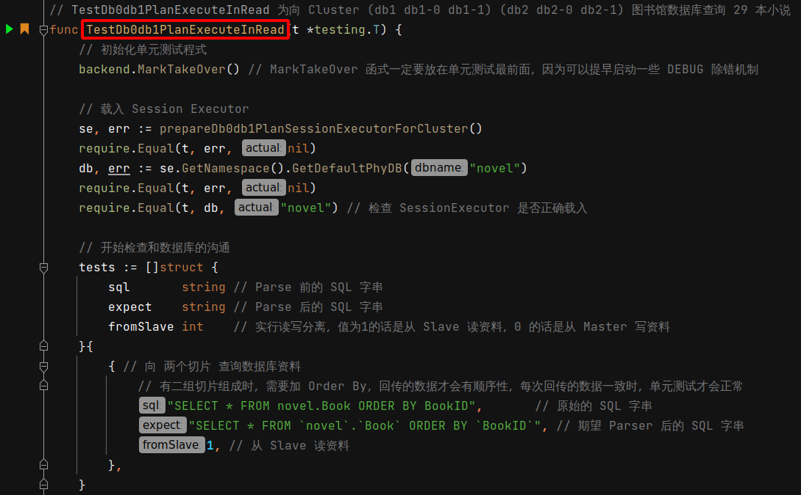
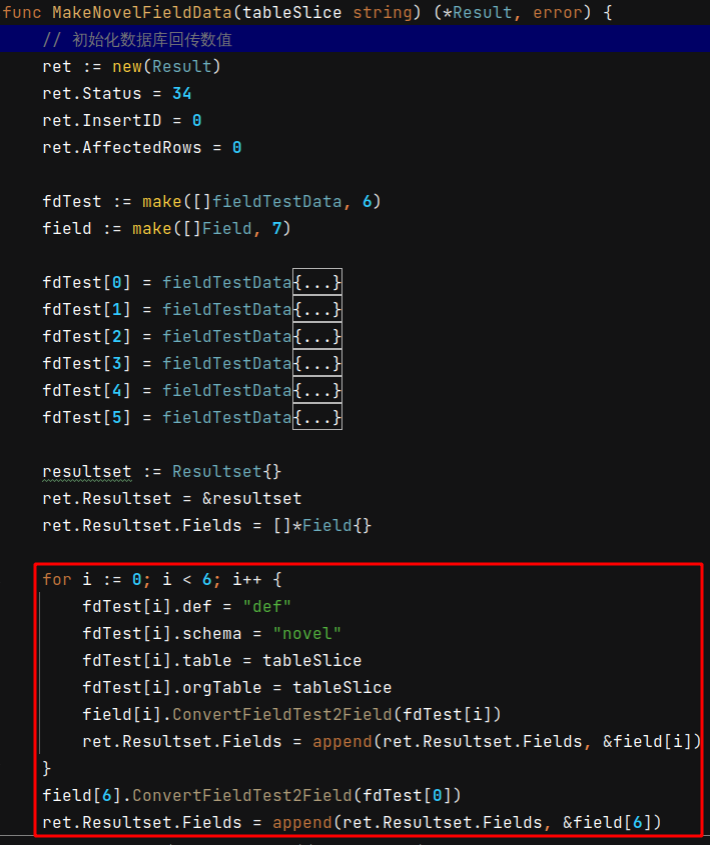

 # 2021年09月26日 开发日志

> - 突然发现数据库的回传结果无法进行排序，数据库会向 切片一 和 切片二 获得回传的资料，再进行 merge 合拼，合拼时发生排序错误 

## 1 事情缘由

原本是对 TestDb0db1PlanExecuteInRead 测试进行最后一步检查，结果没有通过测试，这代表程式有问题，如下图

在此测试里新增以下几行，这些测试会去检查模拟的数据库回传资料是否排序正常

结果发现发生以下错误，这代表程式无法正常排序

 

## 2 排序错误的原因

- 先观察实体数据库的回传，栏位 BookID 为主键，但序号不是第 1，而是第 6
- 至于何 栏位 BookID 的序号为 6 ，原因待查

 

## 3 修正方式

- 修正方式为产生正确的 Field 资料，并依照以下序号
  BookID 序号为 6
  Isbn 序号为 1
  Title 序号为 2
  Author 序号为 3
  Publish 序号为 4
  Category 序号为 5
- 产生 Field 模拟资料，会先组成 Field 阵列，再被包进 mysql.Result 资料进行回传
- 数据库栏位共有 6 个，Field 阵列的长度为 7 ，因为 栏位 BookID 分别为第 1 和第 7 的元素
- Field 模拟阵列分布如下
  Field[0] 元素为 BookID 栏位 Field 资料
  Field[1] 元素为 Isbn 栏位 Field 资料
  Field[2] 元素为 Title 栏位 Field 资料
  Field[3] 元素为 Author 栏位 Field 资料
  Field[4] 元素为 Publish 栏位 Field 资料
  Field[5] 元素为 Category 栏位 Field 资料
  Field[6] 元素为 BookID 栏位 Field 资料

 
