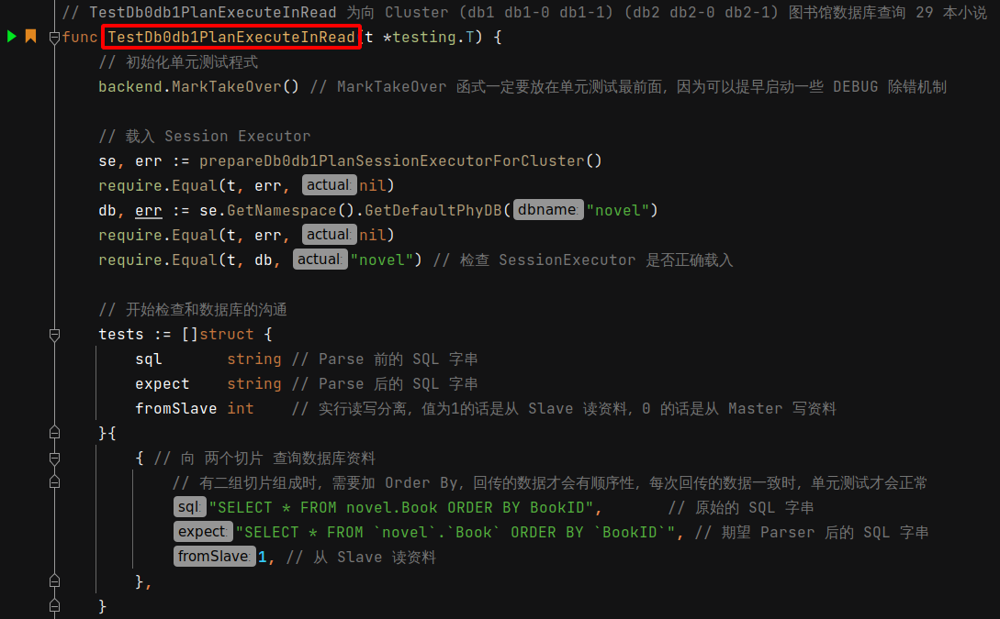
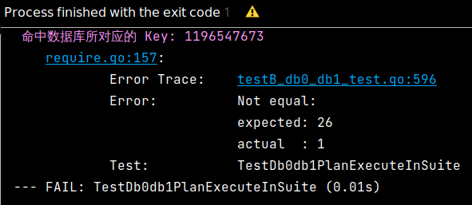
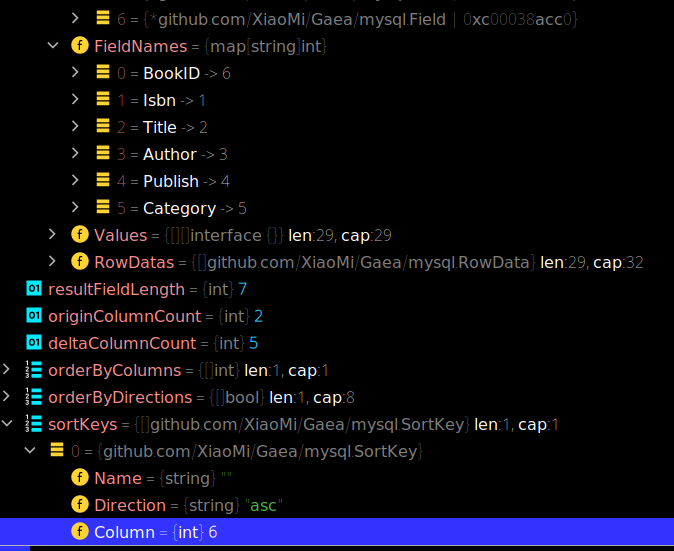
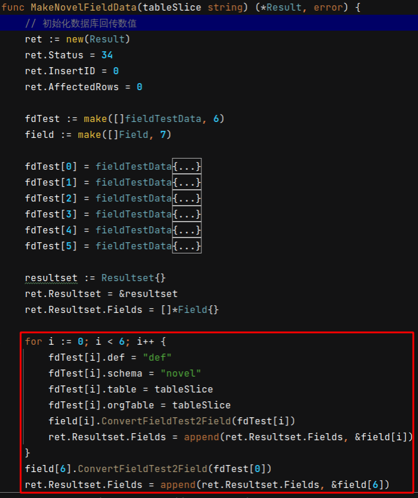

 # 2021年09月26日 開發日誌

> - 突然發現數據庫的回傳結果無法進行排序，數據庫會向 切片一 和 切片二 獲得回傳的資料，再進行 merge 合拼，合拼時發生排序錯誤 

## 1 事情緣由

原本是對 TestDb0db1PlanExecuteInRead 測試進行最後一步檢查，結果沒有通過測試，這代表程式有問題，如下圖

在此測試裡新增以下幾行，這些測試會去檢查模擬的數據庫回傳資料是否排序正常

結果發現發生以下錯誤，這代表程式無法正常排序

 

## 2 排序錯誤的原因

- 先觀察實體數據庫的回傳，欄位 BookID 為主鍵，但序號不是第 1，而是第 6
- 至於何 欄位 BookID 的序號為 6 ，原因待查

 

## 3 修正方式

- 修正方式為産生正確的 Field 資料，並依照以下序號
  BookID 序號為 6
  Isbn 序號為 1
  Title 序號為 2
  Author 序號為 3
  Publish 序號為 4
  Category 序號為 5
- 産生 Field 模擬資料，會先組成 Field 陣列，再被包進 mysql.Result 資料進行回傳
- 數據庫欄位共有 6 個，Field 陣列的長度為 7 ，因為 欄位 BookID 分別為第 1 和第 7 的元素
- Field 模擬陣列分佈如下
  Field[0] 元素為 BookID 欄位 Field 資料
  Field[1] 元素為 Isbn 欄位 Field 資料
  Field[2] 元素為 Title 欄位 Field 資料
  Field[3] 元素為 Author 欄位 Field 資料
  Field[4] 元素為 Publish 欄位 Field 資料
  Field[5] 元素為 Category 欄位 Field 資料
  Field[6] 元素為 BookID 欄位 Field 資料

 
