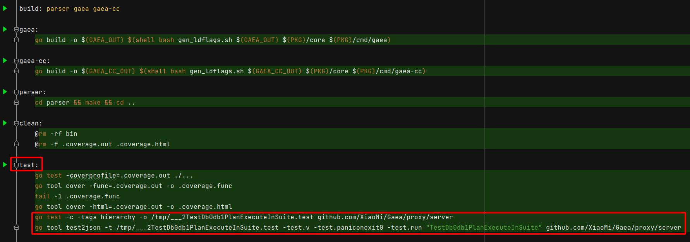

 # 2021年10月10日 开发日志

> - 目前写的测试是有阶层性的，比如一个故事是有章节和段落，但是当执行 make 指令时，并不一定会按造我所编写的情节去执行
> - 在进行模拟测试时，使用 JetBrain 系列产品时，可以方便上色，让终端机显示更多讯息
>   但是使用 Make Tool 时，这些过多的讯息会使测试结果输出变得很杂乱，以上都是需要调整的部份
> - 做到让基准测试也有阶层关系

## 1 处理阶层式单元测试相关问题

> 在平时写单元测试时，会让单元测试有阶层关系，这时如果在使用 make 指令去进行测试，会发生执行时，不依照阶层顺序去执行，会发生错误

### 问题

阶层关系如下

- 会先执行 TestDb0db1PlanExecuteInWrite(t) 再执行 TestDb0db1PlanExecuteInRead(t)
- 执行会依照优先顺序，一定要先执行 TestDb0db1PlanExecuteInWrite(t)  函式，再执行 TestDb0db1PlanExecuteInRead(t) 函式，不然测试会发生错误
- 在执行 make 进行测试时，可能会单独执行 TestDb0db1PlanExecuteInWrite(t) 函式 或 TestDb0db1PlanExecuteInRead(t) 函式，或者是不依照顺序执行，这时就会发生错误

 

### 解决

在有阶层性测试的档案最前面加上关键字 +build hierarchy，这样 make 指令就不会执行这一份测试，因为没有标签 -tag hierarchy

 

- 最后在 mkae 档案的 test 项目新增以下两行，单独去执行阶层测试
- 这两行最前面要有 tab，不然会出错

```bash
	go test -c -tags hierarchy -o /tmp/___2TestDb0db1PlanExecuteInSuite.test github.com/XiaoMi/Gaea/proxy/server

	go tool test2json -t /tmp/___2TestDb0db1PlanExecuteInSuite.test -test.v -test.paniconexit0 -test.run "TestDb0db1PlanExecuteInSuite" github.com/XiaoMi/Gaea/proxy/server
```

 

## 2 处理单元测试结果显示的问题


## 3 处理阶层式基准测试相关问题


