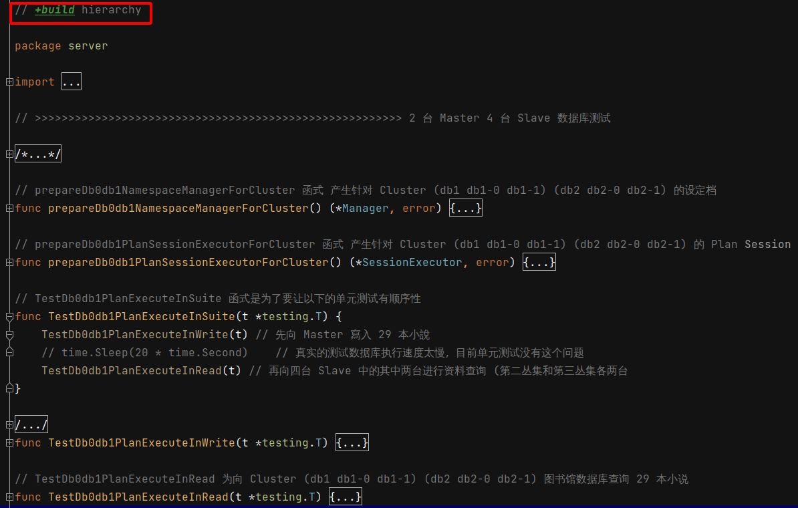

 # 2021年10月10日 开发日志

> - 目前写的测试是有阶层性的，比如一个故事是有章节和段落，但是当执行 make 指令时，并不一定会按造我所编写的情节去执行
> - 在进行模拟测试时，使用 JetBrain 系列产品时，可以方便上色，让终端机显示更多讯息
>   但是使用 Make Tool 时，这些过多的讯息会使测试结果输出变得很杂乱，以上都是需要调整的部份
> - 做到让基准测试也有阶层关系

## 1 处理阶层式单元测试相关问题

> 在平时写单元测试时，会让单元测试有阶层关系，这时如果在使用 make 指令去进行测试，会发生执行时，不依照阶层顺序去执行，会发生错误

### 问题

阶层关系如下

- 会先执行 TestDb0db1PlanExecuteInWrite(t) 再执行 TestDb0db1PlanExecuteInRead(t)
- 执行会依照优先顺序，一定要先执行 TestDb0db1PlanExecuteInWrite(t)  函式，再执行 TestDb0db1PlanExecuteInRead(t) 函式，不然测试会发生错误
- 在执行 make 进行测试时，可能会单独执行 TestDb0db1PlanExecuteInWrite(t) 函式 或 TestDb0db1PlanExecuteInRead(t) 函式，或者是不依照顺序执行，这时就会发生错误

 

### 解决

在有阶层性测试的档案最前面加上关键字 +build hierarchy，这样 make 指令就不会执行这一份测试，因为没有标签 -tag hierarchy

 

- 最后在 mkae 档案的 test 项目新增以下两行，单独去执行阶层测试
- 这两行最前面要有 tab，不然会出错

```bash
	go test -c -tags hierarchy -o /tmp/___2TestDb0db1PlanExecuteInSuite.test github.com/XiaoMi/Gaea/proxy/server

	go tool test2json -t /tmp/___2TestDb0db1PlanExecuteInSuite.test -test.v -test.paniconexit0 -test.run "TestDb0db1PlanExecuteInSuite" github.com/XiaoMi/Gaea/proxy/server
```

 

## 2 处理单元测试结果显示的问题

在阶层性单元测试时，会想有能显示彩色的输出讯息，如下图

 

- 但是以上的彩色讯息，如果在执行 Make 指令时，会变得很杂乱，所以要想辨法在执行 Make 时要想辨法关闭这些讯息
- 目前作法为环境变数 加上 if 辨断式作为临时的解决辨法，如果环境变数 IDE_TOOL 为 jetbrains，就不会印出彩色讯息，否则不会，还会在寻找更好的方法

 

## 3 处理阶层式基准测试相关问题

> 在基准测试做到也有阶层性测试的效果

先建立二个基准测试的函式名分别为

Benchmark_RequestContext_Set_RWLock 和 Benchmark_RequestContext_Set_Lock

 

在 JetBrains 的产品上的 Run/Debug 填入的 Pattern 为 Benchmark_RequestContext_Set_(.*?) 后

将会把上述两个基准测试一起触发


执行基准测试时，将会有阶层的效果，并可以对基准测试的结果进行比较

使用 RWLock 的效能和 Lock 比较起来，会提升 ( 43.89 - 27.07 ) / 43.89 * 100 = 38.32 % 的效态


