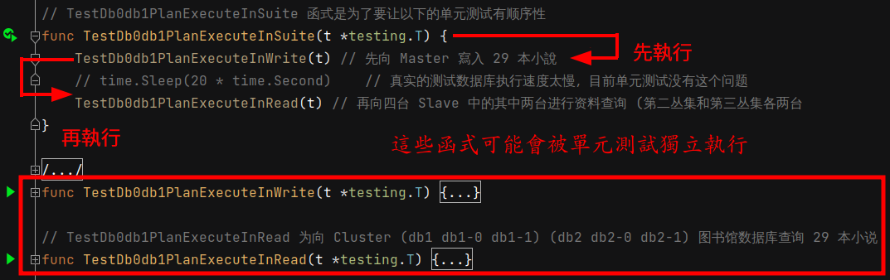
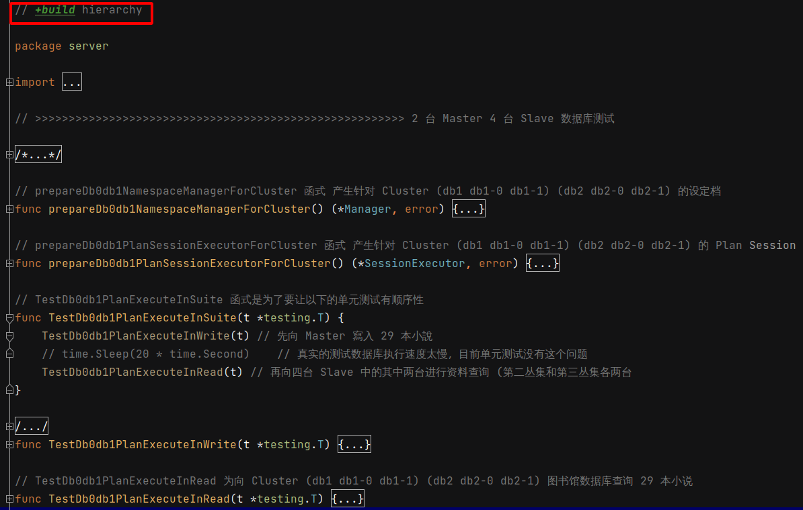
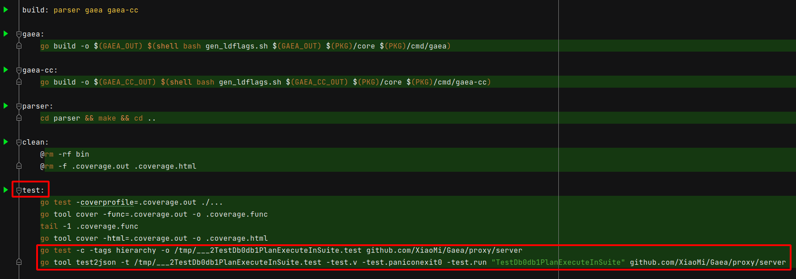

 # 2021年10月10日 開發日誌

> - 目前寫的測試是有階層性的，比如一個故事是有章節和段落，但是當執行 make 指令時，並不一定會按造我所編寫的情節去執行
> - 在進行模擬測試時，使用 JetBrain 系列產品時，可以方便上色，讓終端機顯示更多訊息
>   但是使用 Make Tool 時，這些過多的訊息會使測試結果輸出變得很雜亂，以上都是需要調整的部份
> - 做到讓基準測試也有階層關係

## 1 處理階層式單元測試相關問題

> 在平時寫單元測試時，會讓單元測試有階層關係，這時如果在使用 make 指令去進行測試，會發生執行時，不依照階層順序去執行，會發生錯誤

### 問題

階層關係如下

- 會先執行 TestDb0db1PlanExecuteInWrite(t) 再執行 TestDb0db1PlanExecuteInRead(t)
- 執行會依照優先順序，一定要先執行 TestDb0db1PlanExecuteInWrite(t)  函式，再執行 TestDb0db1PlanExecuteInRead(t) 函式，不然測試會發生錯誤
- 在執行 make 進行測試時，可能會單獨執行 TestDb0db1PlanExecuteInWrite(t) 函式 或 TestDb0db1PlanExecuteInRead(t) 函式，或者是不依照順序執行，這時就會發生錯誤

 

### 解決

在有階層性測試的檔案最前面加上關鍵字 +build hierarchy，這樣 make 指令就不會執行這一份測試，因為沒有標籤 -tag hierarchy

 

- 最後在 mkae 檔案的 test 項目新增以下兩行，單獨去執行階層測試
- 這兩行最前面要有 tab，不然會出錯

```bash
	go test -c -tags hierarchy -o /tmp/___2TestDb0db1PlanExecuteInSuite.test github.com/XiaoMi/Gaea/proxy/server

	go tool test2json -t /tmp/___2TestDb0db1PlanExecuteInSuite.test -test.v -test.paniconexit0 -test.run "TestDb0db1PlanExecuteInSuite" github.com/XiaoMi/Gaea/proxy/server
```

 

## 2 處理單元測試結果顯示的問題


## 3 處理階層式基準測試相關問題


