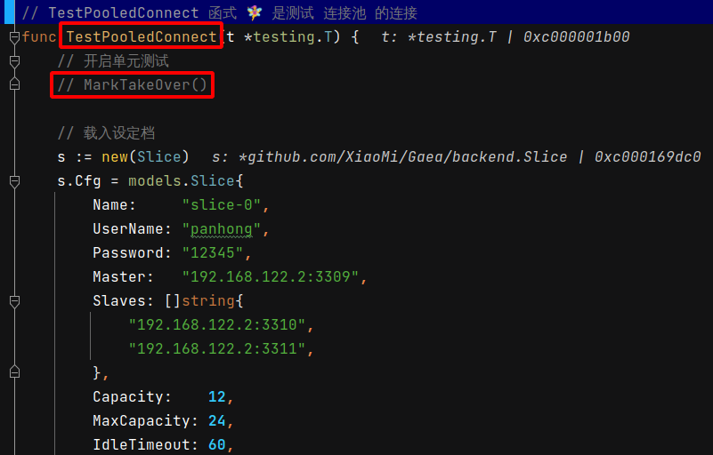
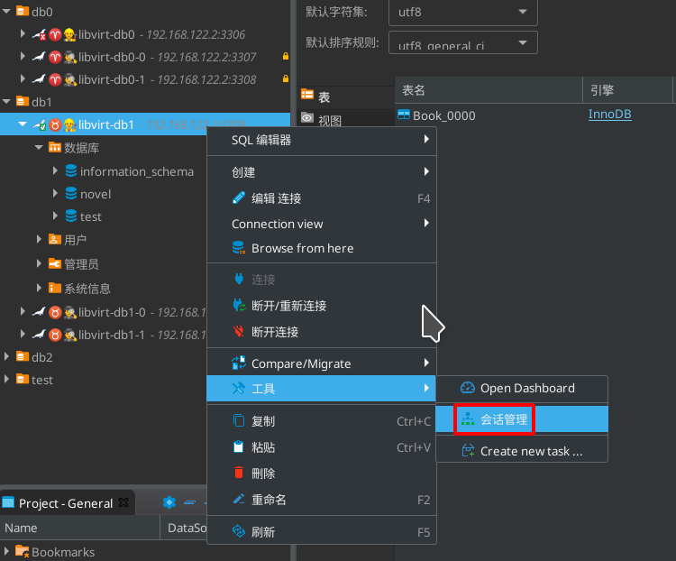
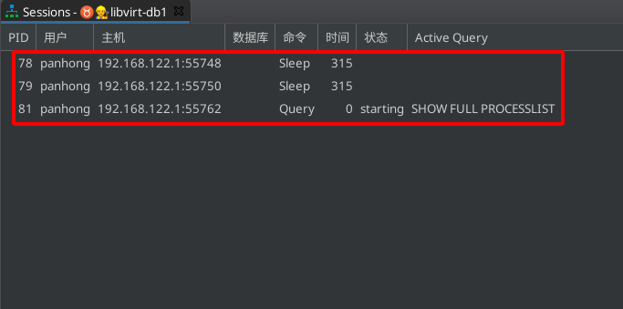
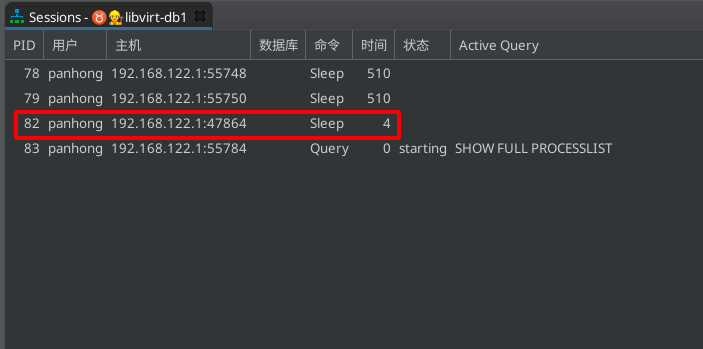
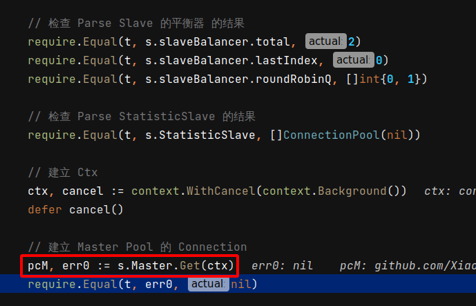

 # 2021年10月16日 开发日志

> - 目前单元测试可以从数据库的直连 DC 开始摸拟，但还需要调整到较易维护的阶段，另外开始进行细部模拟
> - 10月15日 之后开始 单元测试 中的 连结池部份切出来模拟

## 1 之后单元测试考虑要调整的方向

| 项目 | 内容                       | 说明                                                         |
| ---- | -------------------------- | ------------------------------------------------------------ |
| 1    | 环境变数去判断载入模拟资料 | 目前是由数据库的埠号去判断要载入的模拟资料 后来想想这样很方便，再考虑 |
| 2    |                            |                                                              |
| 3    |                            |                                                              |

## 2 观察连接池是在何时建立连线的

> - 之前在编写单元测试时，当数据库中间件要对数据库进行连线时，就立刻进行切断连线
> - 现在要观察在建立连接池时是何时建立数据库连线的
> - 之后开始想辨法也同时了解直连 DC 的基本动作

### 1 使用 DBeaver 去观察数据库连线的建立

 

 

 

 

 
