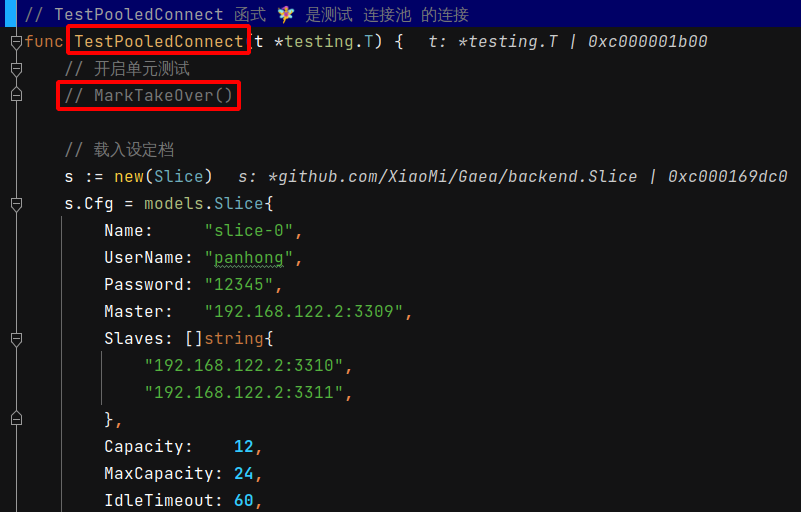
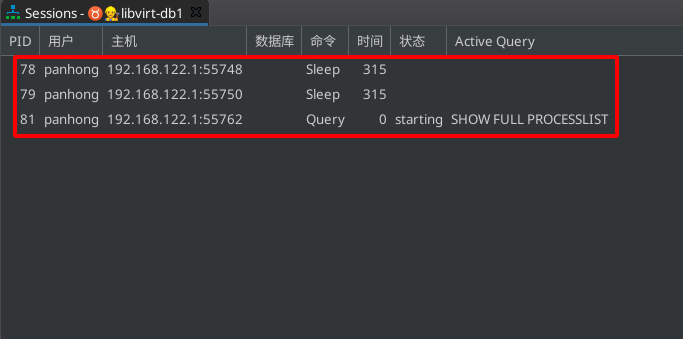
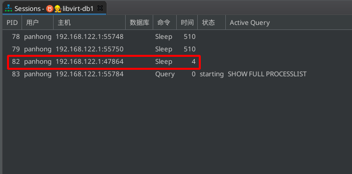

 # 2021年10月16日 開發日誌

> - 目前單元測試可以從數據庫的直連 DC 開始摸擬，但還需要調整到較易維護的階段，另外開始進行細部模擬
> - 10月15日 之後開始 單元測試 中的 連結池部份切出來模擬

## 1 之後單元測試考慮要調整的方向

| 項目 | 內容                       | 說明                                                         |
| ---- | -------------------------- | ------------------------------------------------------------ |
| 1    | 環境變數去判斷載入模擬資料 | 目前是由數據庫的埠號去判斷要載入的模擬資料 後來想想這樣很方便，再考慮 |
| 2    |                            |                                                              |
| 3    |                            |                                                              |

## 2 觀察連接池是在何時建立連線的

> - 之前在編寫單元測試時，當數據庫中間件要對數據庫進行連線時，就立刻進行切斷連線
> - 現在要觀察在建立連接池時是何時建立數據庫連線的
> - 之後開始想辨法也同時了解直連 DC 的基本動作

### 1 使用 DBeaver 去觀察數據庫連線的建立

 

 

 

 

 
