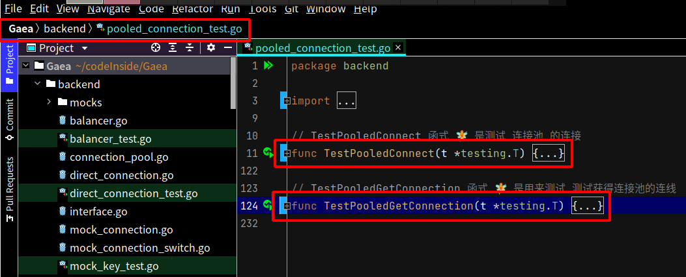
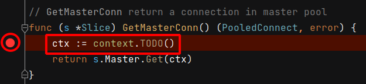
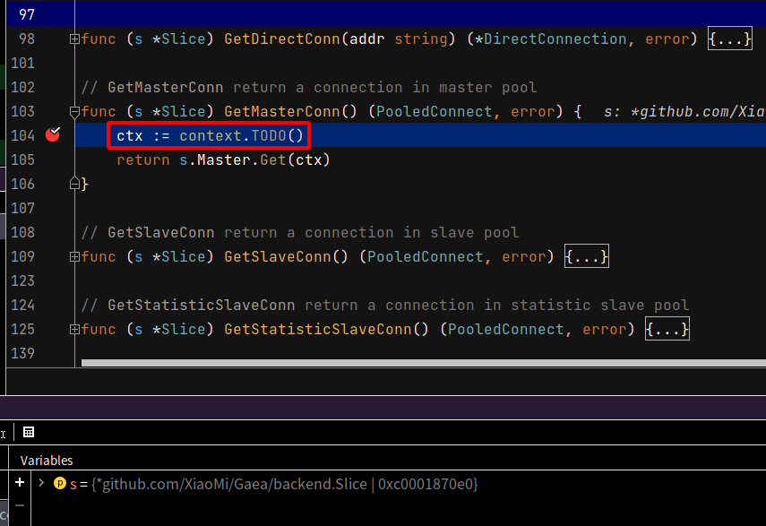
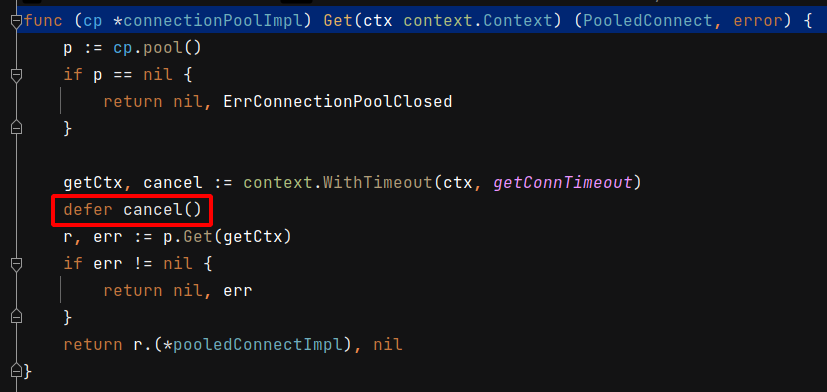

 # 2021年10月31日 开发日志

> - 写 Golang 程式时，重视放出资料，同时也要能有效的回收资源 

## 1  观察 Gaea 是如何回收资源

在档案 Gaea/backend/pooled_connection_test.go 的单元测试里，TestPooledConnect 和 TestPooledGetConnection 两个测试里，可以观察出 Gaea 是要如何收回资源

 

在函式 func (s *Slice) GetMasterConn() (PooledConnect, error) 里下中断点

 

执行 TestPooledConnect 和 TestPooledGetConnection 任何一个函式到中断点后先暂停，
目前是在 ctx := context.TODO() 中先暂存

 

先进入 s.Master.Get(ctx) ，再进入函式 func (cp *connectionPoolImpl) Get(ctx context.Context)，
会发现会有 defer cancel() 这一行，目前认为这是在防止 GoRoutine Leak 的问题，对整个程式是好处

 

