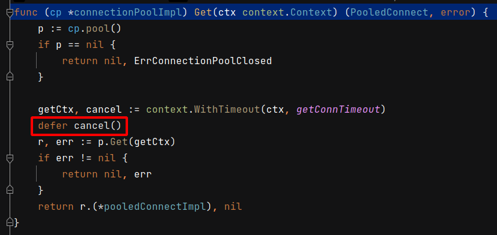

 # 2021年10月31日 開發日誌

> - 寫 Golang 程式時，重視放出資料，同時也要能有效的回收資源 

## 1  觀察 Gaea 是如何回收資源

在檔案 Gaea/backend/pooled_connection_test.go 的單元測試裡，TestPooledConnect 和 TestPooledGetConnection 兩個測試裡，可以觀察出 Gaea 是要如何收回資源

 

在函式 func (s *Slice) GetMasterConn() (PooledConnect, error) 裡下中斷點

 

執行 TestPooledConnect 和 TestPooledGetConnection 任何一個函式到中斷點後先暫停，
目前是在 ctx := context.TODO() 中先暫存

 

先進入 s.Master.Get(ctx) ，再進入函式 func (cp *connectionPoolImpl) Get(ctx context.Context)，
會發現會有 defer cancel() 這一行，目前認為這是在防止 GoRoutine Leak 的問題，對整個程式是好處

 

