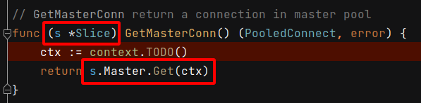
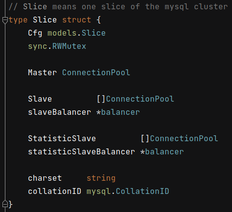
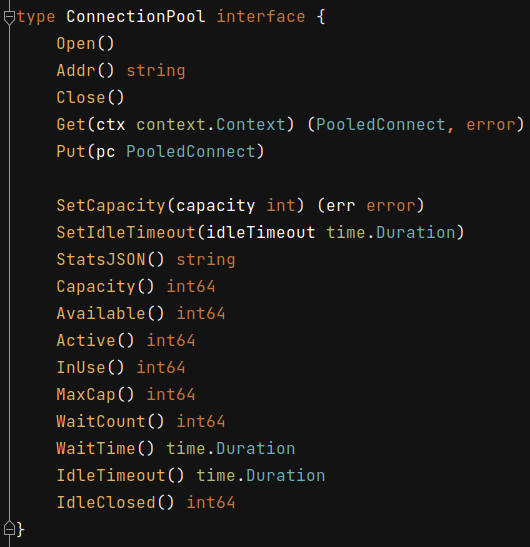

 # 2021年11月02日 开发日志

> - 考虑新的测试切面，每一个人写的单元测试都不同，因为单元测试是在对程式切部剖面，每一个人切的剖面都不同。
>   每一个人对同一件事的切入点会不同，观点也会不同

## 1 由切片 Slice 资料切剖面进行测试

由 func (s *Slice) GetMasterConn() (PooledConnect, error) 进入，去查询 Slice 的资料和 Get 函式的内容

 

在 Slice 资料合拼
主数据库 Master ConnectionPool 和 
从数据库 Slave []ConnectionPool，
并上锁 sync.RWMutex

 

Get 函式的内容如下，为 interface 的实作介面，其实可以在这里做单元测试的剖面，但是这会和我所切的剖面位置不同，我是由数据库直连 Direct Connection 直接切剖面

 

由 Slice 这里去切剖面，其实是最适合的，

但是如果由数据库直连 Direct Connection 去切剖面，是切到整个程式码最深层，最里面
