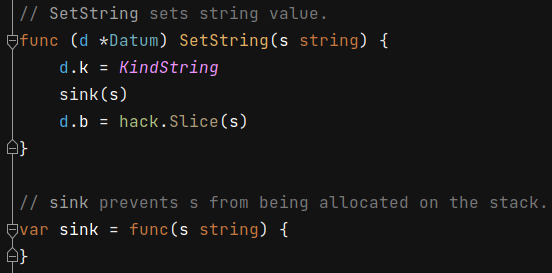

 # 2021年11月09日 开发日志

> - 在 Gaea 程式码里，有看到程式码，看似是防止资料由 Stack 逃脱到记忆体上

## 1 sink 函式

在 Gaea/parser/tidb-types/datum.go 档案里，有 sink 函式

 

当 SetString 函式把执行到一半时，会呼叫 sink 函式，s 字串变数会 sink 函式的参数，s 字串变数就会被强制锁在 栈 Stack 里面，不会挑脱到 堆里

可能是在考量如果 s 字串变数过长，就会被 Golang 分配到 堆 Heap ，但是经由 sink 函式可以强迫 s 字串变数 留在 栈上

当退出函式时，s 字串变数也会跟著被清除，GC 就不需要去做任何后续处理，以增加效能

## 2 观念证明

