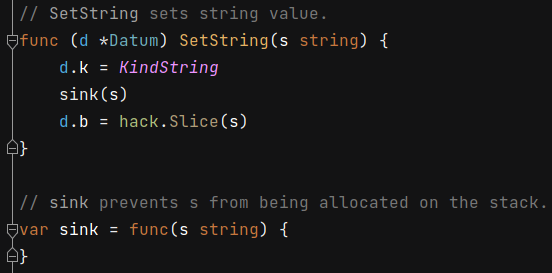

 # 2021年11月09日 開發日誌

> - 在 Gaea 程式碼裡，有看到程式碼，看似是防止資料由 Stack 逃脫到記憶體上

## 1 sink 函式

在 Gaea/parser/tidb-types/datum.go 檔案裡，有 sink 函式

 

當 SetString 函式把執行到一半時，會呼叫 sink 函式，s 字串變數會 sink 函式的參數，這時編譯器會發現有另一個函式再調用 s 字串變數，就會把他放在 堆 heap 上，讓所有的函式可以共享 s 字串變數

再來會使用黑科技把 字串強制轉成 切片，增加效能，但是因為是黑科技，缺少原本 Golang Slice 所提供的檢查機制
https://www.gushiciku.cn/pl/pDSl/zh-tw

這樣當函式結束後，s 字串變數如果在 Stack 內就會消失，由黑科技所產生 Slice 內部所指向的 s 字串變數也會消失，由黑科技所產生 Slice 也會跟著出錯

## 2 觀念證明

