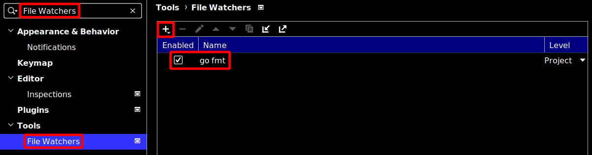
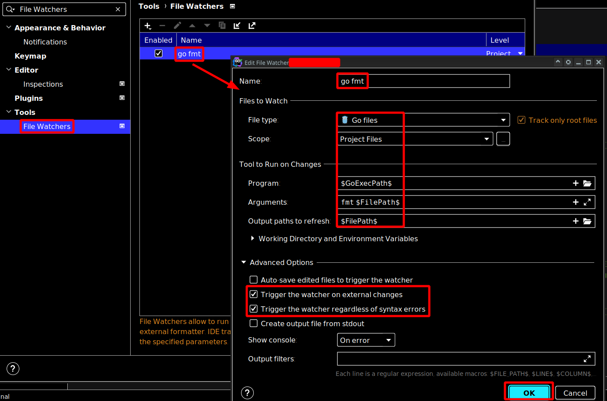

 

# 使用 GoFmt 去格式化程式码文件

> 使用 GoFmt 工具去格式化整理程式码

## 1 在 JetBrain GoLand IDE 新增 File Watcher

先在设定里新增 File Watcher

## 2 在 JetBrain GoLand IDE 设定 GoFmt File Watcher

连续点击 File Watchers 对 GoFmt 进行设定

