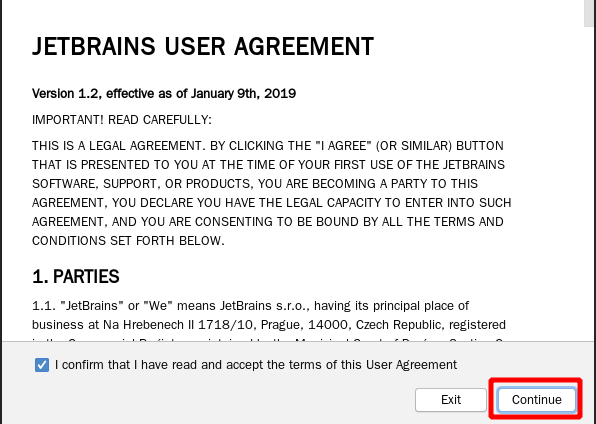
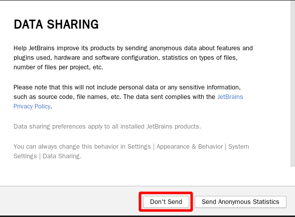
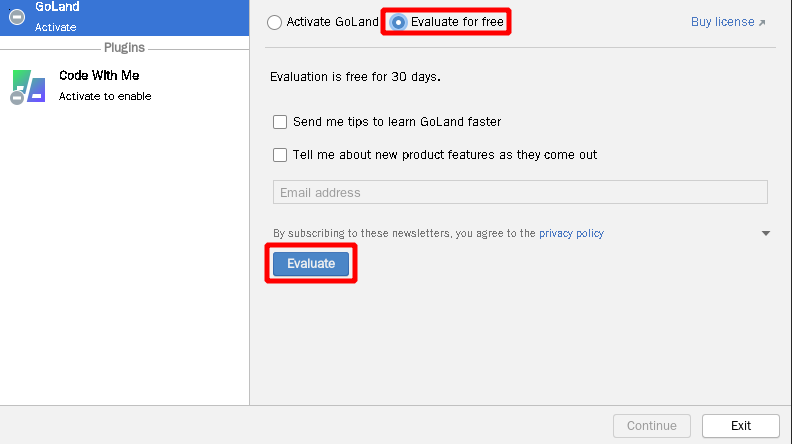
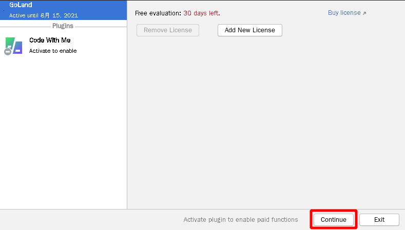
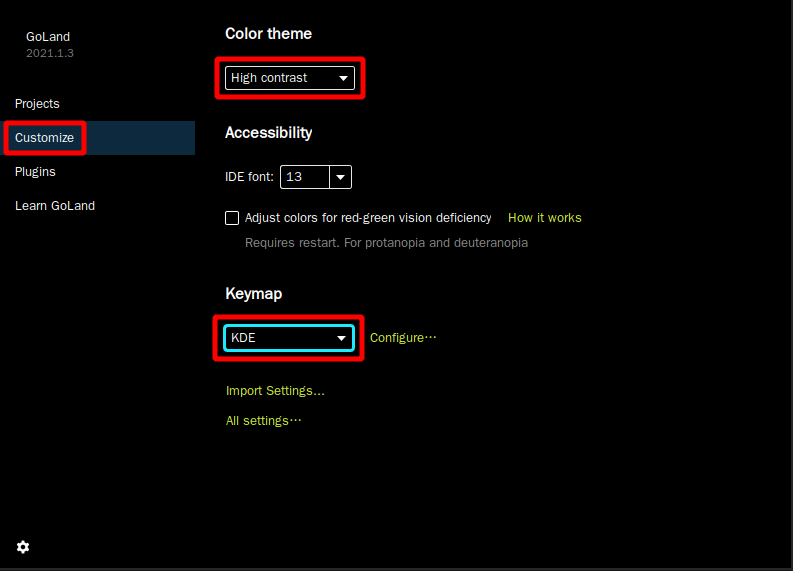
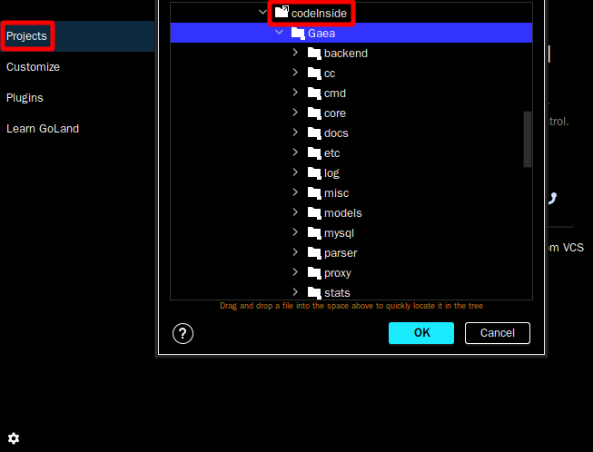
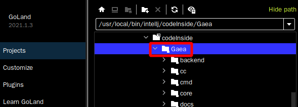
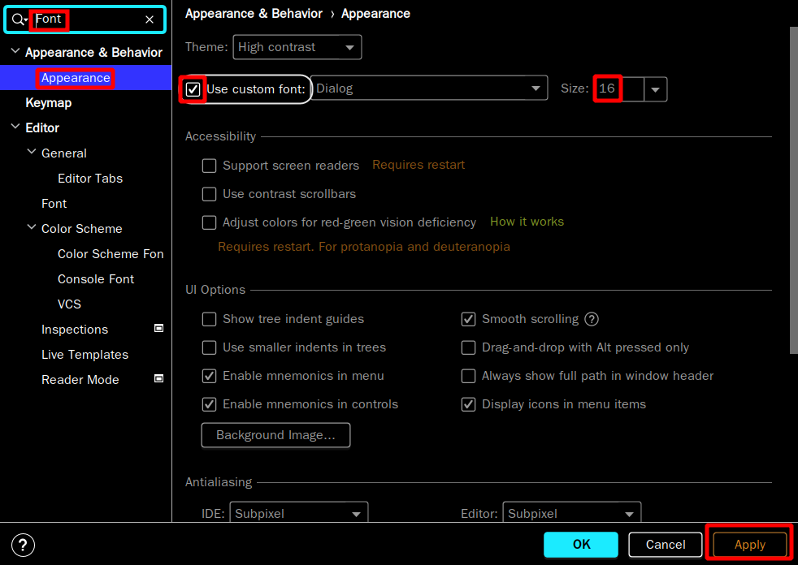
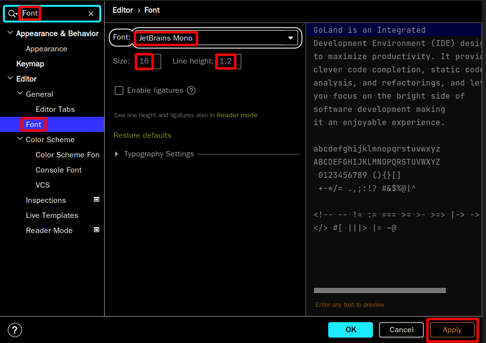
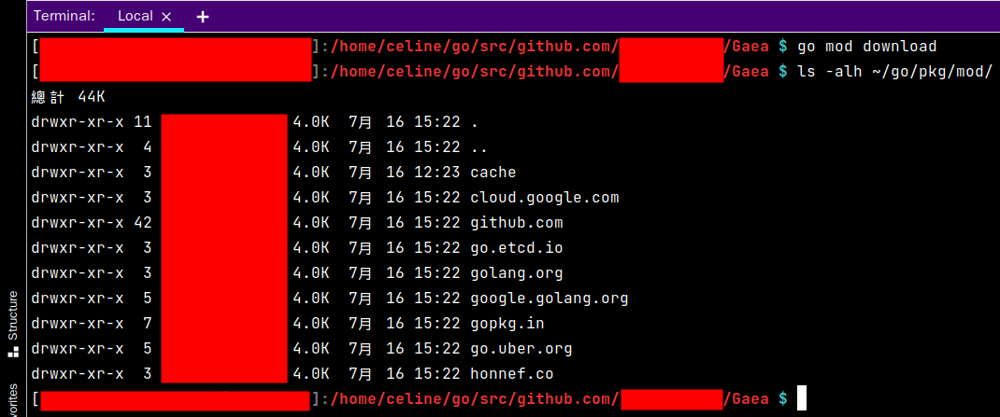

# 使用 Intellj IDE 开发工具进行开发

> 因为已经开始在修改 Gaea 的主要程式，现在的状况要用 Intellj IDE 去进行开发，会比较方便

## 1 确认  JetBrain GoLand IDE 设定值

先确认设定值

| 项目 | 名称               | 数质                                                |
| ---- | ------------------ | --------------------------------------------------- |
| 1    | Gaea 程式目录      | /home/panhong/go/src/github.com/panhongrainbow/Gaea |
| 2    | Intellj 开发版本   | goland-2021-1-3                                     |
| 3    | 开发和程式结合名称 | goland-2021-1-3-gaea                                |
| 4    | 特别权限 Privilege | true                                                |
| 5    | Xwindow 位置       | :0                                                  |
| 6    | 执行用户帐号       | 第一个新建帐号                                      |

## 2 启动 JetBrain GoLand IDE

> 内容包含 JetBrain GoLand IDE 启动和故障排除 

| 项目 | 状况名称                   | 对应文件                                                     |
| ---- | -------------------------- | ------------------------------------------------------------ |
| 1    | 第一次启动 GoLand          | [JetBrain GoLand IDE 启动方式](panhongrainbow/run-goland-gaea.md) |
| 2    | 遇到 GoLand 的无法保存设定 | [JetBrain GoLand IDE 权限设定](panhongrainbow/run-goland-gaea.md) |
| 3    |                            |                                                              |
| 4    |                            |                                                              |
| 5    |                            |                                                              |

[JetBrain GoLand 权限设定](panhongrainbow/run-goland-gaea.md)

## 3 初始化 JetBrain GoLand IDE

先勾选同意合同

 

不要传送个人相关资讯

 

先进行评估，再决定是否购买

 

先试用 30 天

 

先设定介面

　

在 Code Inside 资料夹内，可以找到 Gaea 计划资料夹

 

直接开启 Gaea 计划资料夹

　

修改 JetBrain GoLand IDE 的介面字型

typora-user-images/image-20210716145906046.png" alt="image-20210716145906046" style="zoom:80%;" /> 

修改 JetBrain GoLand IDE 的程式码内容字型

## 4 初始化 Go 语言相关设定

> 以下的操作可能会影响程式程，所以另外说明

设定 Go Model，处理相依性

