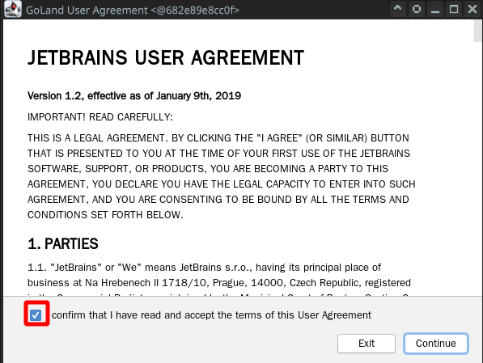

# 使用 Intellj IDE 开发工具进行开发

> 因为已经开始在修改 Gaea 的主要程式，现在的状况要用 Intellj IDE 去进行开发，会比较方便

## 1 确认  JetBrain GoLand IDE 设定值

先确认设定值

| 项目 | 名称               | 数质                                                |
| ---- | ------------------ | --------------------------------------------------- |
| 1    | Gaea 程式目录      | /home/panhong/go/src/github.com/panhongrainbow/Gaea |
| 2    | Intellj 开发版本   | goland-2021-1-3                                     |
| 3    | 开发和程式结合名称 | goland-2021-1-3-gaea                                |
| 4    | 特别权限 Privilege | true                                                |
| 5    | Xwindow 位置       | :0                                                  |
| 6    | 执行用户帐号       | 第一个新建帐号                                      |

## 2 启动 JetBrain GoLand IDE

[JetBrain GoLand 启动文件](panhongrainbow/run-goland-gaea.md)

## 3 初始化设定

同意合同

 
