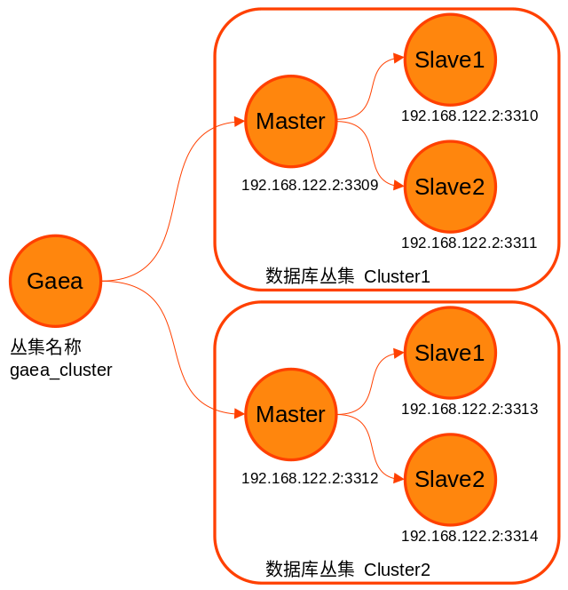
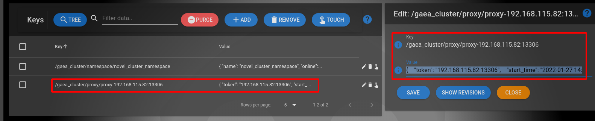
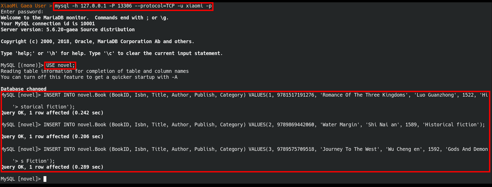
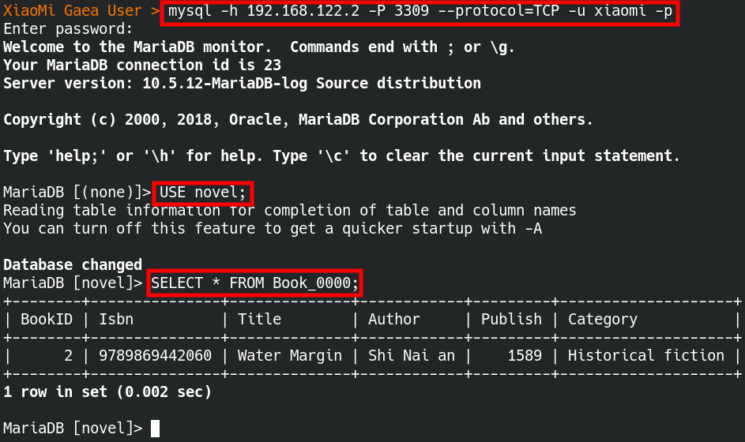
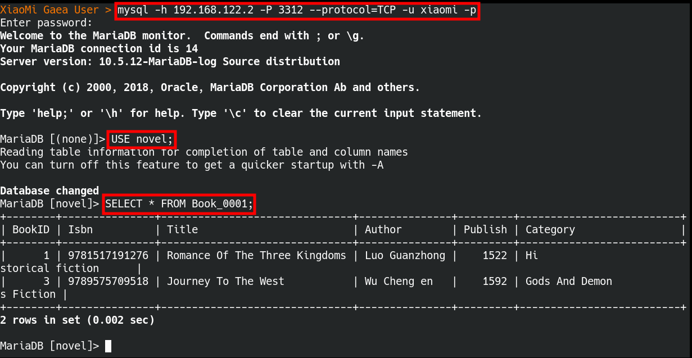
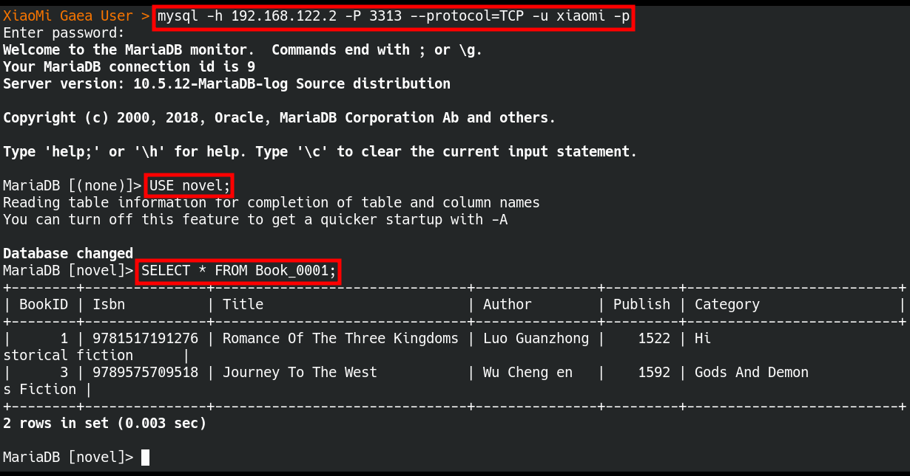
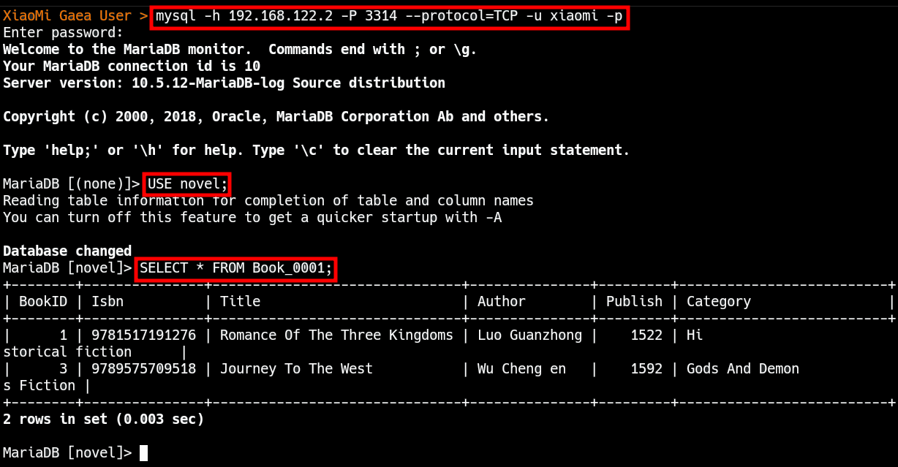
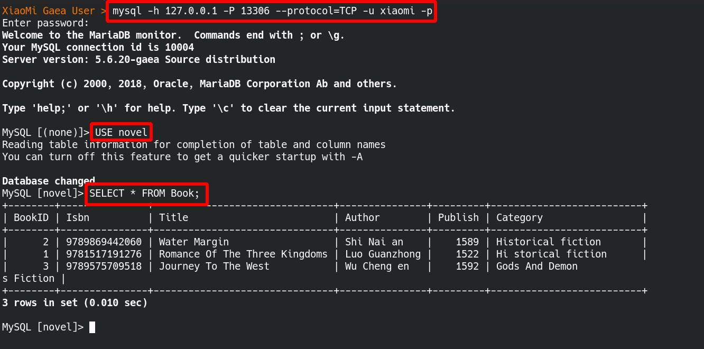

# Gaea 數據庫中間件連線說明

> - 整個 Gaea 設定值讀取和寫入的邏輯由 Gaea/models/store.go 進行處理
> - 這份文檔主要在說明 如何在設定文檔上，設定對數據庫中間件 Gaea 連線相關設定值後，立即進行連線
>   目前支援的設定方式
>   1. 文檔 File
>   2. 網路 Etcd V2 API
>   3. 網路 Etcd V3 API
>

## 1 測試環境說明

###  1 測試環境架構

叢集名稱為 gaea_cluster，內含兩個數據庫 Cluster

1. 數據庫叢集一 Cluster1，1台 Master 和 2 台 Slave，數據庫名稱為 novel ，數據表為 Book_0000
2. 數據庫叢集二 Cluster2，1台 Master 和 2 台 Slave，數據庫名稱為 novel ，數據表為 Book_0001

以下為架構圖

 

### 2 測試環境的數據庫 Schema

表名不管是 Book_0000 或者是 Book_0001，都使用相同的 Schema

```sql
-- 創建數據表 Book_0000
CREATE TABLE `novel`.`Book_0000` (
  `BookID` int(11) NOT NULL,
  `Isbn` bigint(50) NOT NULL,
  `Title` varchar(100) NOT NULL,
  `Author` varchar(30) DEFAULT NULL,
  `Publish` int(4) DEFAULT NULL,
  `Category` varchar(30) NOT NULL,
  PRIMARY KEY (`BookID`)
) ENGINE=InnoDB DEFAULT CHARSET=utf8;

-- 創建數據表 Book_0001
CREATE TABLE `novel`.`Book_0001` (
  `BookID` int(11) NOT NULL,
  `Isbn` bigint(50) NOT NULL,
  `Title` varchar(100) NOT NULL,
  `Author` varchar(30) DEFAULT NULL,
  `Publish` int(4) DEFAULT NULL,
  `Category` varchar(30) NOT NULL,
  PRIMARY KEY (`BookID`)
) ENGINE=InnoDB DEFAULT CHARSET=utf8;
```

## 2 設定值的內容

> 不管是要把設定值儲存在文檔還是在網路內，設定值會參考以下內容進行設定

### 1 叢集名稱設定內容

| 名稱項目           | 設定值                  | 說明                                   |
| ------------------ | ----------------------- | -------------------------------------- |
| 叢集名稱 Cluster   | gaea_cluster            | 一個 Cluster 可以包含多個 Namespace    |
| 命名空間 Namespace | novel_cluster_namespace | 屬於叢集 gaea_cluster 內的一個命名空間 |

### 2 數據庫集群設定內容

| 數據庫集群編號 |    Mater 服務器    |   Slave 服務器一   |   Slave 服務器二   |  帳號  | 密碼  |
| :------------: | :----------------: | :----------------: | :----------------: | :----: | :---: |
|  數據庫集群1   | 192.168.122.2:3309 | 192.168.122.2:3310 | 192.168.122.2:3311 | xiaomi | 12345 |
|  數據庫集群2   | 192.168.122.2:3312 | 192.168.122.2:3313 | 192.168.122.2:3314 | xiaomi | 12345 |

### 3 切片設定值內容

| 數據庫集群編號 | 對應的切片名稱 | 數據表名稱 | 是否預設 |
| :------------: | :------------: | :--------: | :------: |
|  數據庫集群1   |    slice-0     | Book_0000  |    是    |
|  數據庫集群2   |    slice-1     | Book_0001  |    否    |

### 4 分片演算法設定值

| 演算法設定項目 | 演算法設定值          | 說明                                                         |
| -------------- | --------------------- | ------------------------------------------------------------ |
| 用戶名稱       | hash                  | Kingshard Hash 分片演算法                                    |
| 分表依據的鍵值 | BookID                | 會以 BookID 的數值作為分表的依據                             |
| 數據表數量     | [1,1]                 | 陣列 [1,1] 分別指出每一個切片的數據表數量，比如<br />slice-0 有 1 張 數據表，<br />slice-1 有 1 張 數據表 |
| 切片列表陣列   | ["slice-0","slice-1"] | 此命名空間裡，有兩個切片，分別為 slice-0 和 slice-1          |

### 5 命名空間操作用戶設定值

| 用戶設定項目 | 用戶設定值                              | 說明                                                         |
| ------------ | --------------------------------------- | ------------------------------------------------------------ |
| 用戶名稱     | xiaomi                                  |                                                              |
| 用戶密碼     | 12345                                   |                                                              |
| 命名空間名稱 | novel_cluster_namespace                 |                                                              |
| 用戶讀寫標記 | rw_flag 為 2 ，該用戶可進行 讀寫 操作   | rw_flag 為 1，只能進行 唯讀 操作<br />rw_flag 為 2，可進行 讀寫 操作 |
| 讀寫分離標記 | rw_split 為 1，該用戶進行 讀寫分離 操作 | rw_split 為 0，進行 非讀寫分離 操作<br />rw_split 為 1，進行 讀寫分離 操作 |

### 6 命名空間 JSON 格式設定值

命名空間 JSON 格式設定值 內容如下，這份設定值可以儲存在 設定文檔 裡或 網路 中，設定值都一模一樣

```json
{
  "name": "novel_cluster_namespace",
  "online": true,
  "read_only": false,
  "allowed_dbs": {
    "novel": true
  },
  "slow_sql_time": "1000",
  "black_sql": [
    ""
  ],
  "allowed_ip": null,
  "slices": [
    {
      "name": "slice-0",
      "user_name": "xiaomi",
      "password": "12345",
      "master": "192.168.122.2:3309",
      "slaves": ["192.168.122.2:3310", "192.168.122.2:3311"],
      "statistic_slaves": null,
      "capacity": 12,
      "max_capacity": 24,
      "idle_timeout": 60
    },
	{
      "name": "slice-1",
      "user_name": "xiaomi",
      "password": "12345",
      "master": "192.168.122.2:3312",
      "slaves": ["192.168.122.2:3313", "192.168.122.2:3314"],
      "statistic_slaves": null,
      "capacity": 12,
      "max_capacity": 24,
      "idle_timeout": 60
    }
  ],
  "shard_rules": [
	{
      "db": "novel",
      "table": "Book",
      "type": "hash",
      "key": "BookID",
      "locations": [
        1,
        1
      ],
      "slices": [
        "slice-0",
        "slice-1"
      ]
    }
  ],
  "users": [
    {
      "user_name": "xiaomi",
      "password": "12345",
      "namespace": "novel_cluster_namespace",
      "rw_flag": 2,
      "rw_split": 1,
      "other_property": 0
    }
  ],
  "default_slice": "slice-0",
  "global_sequences": null
}
```

## 3 命名空間設定值儲存方式

> 目前支援設定檔的讀取方式為，整個邏輯由 Gaea/models/store.go 控制
>
> 1. 方法一：使用文檔 File 去儲存設定值
> 2. 方法二：使用網路 Etcd V2 API 去儲存設定值
> 3. 方法三：使用網路 Etcd V3 API 去儲存設定值

### 1 使用文檔 File 儲存

> 當準備使用文檔 File 去儲存設定值時，需要修改改兩個設定文檔
>
> 1. 初始化設定文檔，位於 Gaea/etc/gaea.ini
> 2. 命名空間設定文檔，集中於目錄 Gaea/etc/file/namespace/

修正初始化設定文檔 Gaea/etc/gaea.ini，指定以下內容

1. 使用設定文檔 File 去儲存設定值
2. 叢集名稱為 gaea_cluster

把設定文檔 Gaea/etc/gaea.ini 修正成以下內容

```ini
; 這裡的重點在把 config_type 值改成 file，并修改丛集名称!!!!!

; config type, etcd/file, you can test gaea with file type, you shoud use etcd in production
config_type=file
; file config path, 具体配置放到file_config_path的namespace目录下，该下级目录为固定目录
file_config_path=./etc/file

; 在这里指定丛集名称为 gaea_cluster
cluster_name=gaea_cluster

; 以下略過，因為重點要把前面的 config_type 設定值改成 file
```

- 在目錄 Gaea/etc/file/namespace 下新增一個命名空間設定檔，檔名為 novel_cluster_namespace.json，內容為 小說數據庫叢集 的相關設定

- 在命名空間設定文檔內 novel_cluster_namespace.json 內指定命名空間名稱為 novel_cluster_namespace

把設定文檔 Gaea/etc/file/namespace/novel_cluster_namespace.json 填入 命名空間 Json 格式設定值，如以下內容所示

```json
{
  "name": "novel_cluster_namespace",
  "online": true,
  "read_only": false,
  "allowed_dbs": {
    "novel": true
  },
  "slow_sql_time": "1000",
  "black_sql": [
    ""
  ],
  "allowed_ip": null,
  "slices": [
以下略
```

### 2 使用網路 Etcd 儲存

> 這次直接用 Gui 工具把設定值寫入 Etcd 容器

修正初始化設定文檔 Gaea/etc/gaea.ini，指定以下內容

1. 使用 Etcd 服務器去儲存設定值
2. 叢集名稱為 gaea_cluster
3. 指定 Etcd 的網路位置為 http://127.0.0.1:2379

把設定文檔 Gaea/etc/gaea.ini 修正成以下內容

```ini
; 這裡的重點在把 config_type 值改成 file，并修改丛集名称!!!!!

; config type, etcd/file/etcdv3, you can test gaea with file type, you shoud use etcd/etcdv3 in production
; 请指定设定方式为 file 或 etcd 或 etcdv3
config_type=etcdv3
; file config path, 具体配置放到file_config_path的namespace目录下，该下级目录为固定目录
file_config_path=./etc/file

; 在这里指定丛集名称为 gaea_cluster
cluster_name=gaea_cluster

; 在这里指定 Etcd 服务器的网路位置
coordinator_addr=http://127.0.0.1:2379

; 以下略過，因為重點要把前面的 config_type 設定值改成 file
```

在 Etcd 服務器內寫入以下內容

- key 為 /gaea_cluster/namespace/novel_cluster_namespace
- value 為 之前提到的命名空間 Json 格式設定值

 

## 4 啟動數據庫中間件 Gaea

> 啟動的方式有分兩種
>
> 1. 在終端機去下指令啟動 Gaea
> 2. 使用 IDE 工具啟動 Gaea

### 1 建立執行文檔的目錄

```bash
# 建立執行檔集中目錄
$ mkdir -p Gaea/bin/
```

### 2 在終端機去下指令啟動 Gaea

先在終端機進行編譯，後執行

```bash
# GoRoot 和 GoPath 設定值
# GOROOT 位於 /usr/local/go #gosetup
# GOPATH 位於 /home/panhong/go #gosetup

# 到 Gaea 的專案目錄
$ cd /home/panhong/go/src/github.com/panhongrainbow/Gaea

# 對 Gaea 主程式進行編譯
$ /usr/local/go/bin/go build -o /home/panhong/go/src/github.com/panhongrainbow/Gaea/bin/gaea github.com/XiaoMi/Gaea/cmd/gaea #gosetup

# 執行數據庫中間件 Gaea
$ /home/panhong/go/src/github.com/panhongrainbow/Gaea/bin/gaea
```

執行畫面如下


### 3 使用 IDE 工具啟動 Gaea

在 IDE 工具內，填入以下內容

| 項目 | 配置       | 參數                                            |
| ---- | ---------- | ----------------------------------------------- |
| １   | 名稱       | gaea                                            |
| ２   | 運行種類   | 軟體包                                          |
| ３   | 軟體包路徑 | github.com/XiaoMi/Gaea/cmd/gaea                 |
| ４   | 輸出目錄   | /home/panhong/go/src/github.com/xiaomi/Gaea/bin |
| ５   | 建構後運行 | 打勾                                            |
| ６   | 工作目錄   | /home/panhong/go/src/github.com/xiaomi/Gaea     |

配置如下圖

 

運行狀況如下圖

 

### 4 啟動後服務發現

數據庫中間件 Gaea 啟動後，會在服務器 Etcd 裡新增一個 key /gaea_cluster/proxy/proxy-127.0.0.1:13306

其 value 內容如下

```json
{
  "token": "127.0.0.1:13306",
  "start_time": "2022-01-24 11:22:03.46517227 +0800 CST m=+0.066173904",
  "ip": "127.0.0.1",
  "proto_type": "tcp4",
  "proxy_port": "13306",
  "admin_port": "13307",
  "pid": 10628,
  "pwd": "/home/panhong/go/src/github.com/panhongrainbow/Gaea",
  "sys": "Linux debian5 5.10.0-10-amd64 #1 SMP Debian 5.10.84-1 (2021-12-08) x86_64 GNU/Linux"
}
```

執行狀況如下圖

 

## 5 登入數據庫中間件 Gaea

數據庫中間件 Gaea 啟動後，直接進行登入

```bash
# 登入 Gaea 指令如下
$ mysql -h 127.0.0.1 -P 13306 --protocol=TCP -u xiaomi -p
```

 

## 6 測試數據庫中間件 Gaea 的讀寫

> 登入數據庫中間件 Gaea ，執行以下 SQL 語句

登入數據庫中間件 Gaea，使用數據庫 novel

```bash
# 登入數據庫中間件 Gaea
$ mysql -h 127.0.0.1 -P 13306 --protocol=TCP -u xiaomi -p
# Enter password: 
# Welcome to the MariaDB monitor.  Commands end with ; or \g.
# Your MySQL connection id is 10001
# Server version: 5.6.20-gaea Source distribution

# Copyright (c) 2000, 2018, Oracle, MariaDB Corporation Ab and others.

# Type 'help;' or '\h' for help. Type '\c' to clear the current input statement.

# 使用數據庫
$ MySQL [(none)]> USE novel
# Reading table information for completion of table and column names
# You can turn off this feature to get a quicker startup with -A

# Database changed
# MySQL [novel]>
```

執行以下 SQL 語句

```sql
-- 第一本小說 三國演義
INSERT INTO novel.Book (BookID, Isbn, Title, Author, Publish, Category) VALUES(1, 9781517191276, 'Romance Of The Three Kingdoms', 'Luo Guanzhong', 1522, 'Hi
storical fiction'); 

-- 第二本小說 水滸傳
INSERT INTO novel.Book (BookID, Isbn, Title, Author, Publish, Category) VALUES(2, 9789869442060, 'Water Margin', 'Shi Nai an', 1589, 'Historical fiction'); 

-- 第三本小說 西遊記
INSERT INTO novel.Book (BookID, Isbn, Title, Author, Publish, Category) VALUES(3, 9789575709518, 'Journey To The West', 'Wu Cheng en', 1592, 'Gods And Demon
s Fiction'); 
```

登入數據庫中間件 Gaea，執行三筆寫入小說資料的 SQL 語句



登入第一組叢集，查詢 Master 數據庫的寫入資料，三筆小說資料被分配到一筆



登入第一組叢集，查詢第一台 Slave 數據庫的寫入資料，三筆小說資料被分配到一筆


登入第一組叢集，查詢第二台 Slave 數據庫的寫入資料，三筆小說資料被分配到一筆


登入第二組叢集，查詢 Master 數據庫的寫入資料，三筆小說資料被分配到兩筆



登入第二組叢集，查詢第一台 Slave 數據庫的寫入資料，三筆小說資料被分配到兩筆



登入第二組叢集，查詢第二台 Slave 數據庫的寫入資料，三筆小說資料被分配到兩筆



最後直接在數據庫中間件 Gaea 查詢全部三筆的小說資料

 
