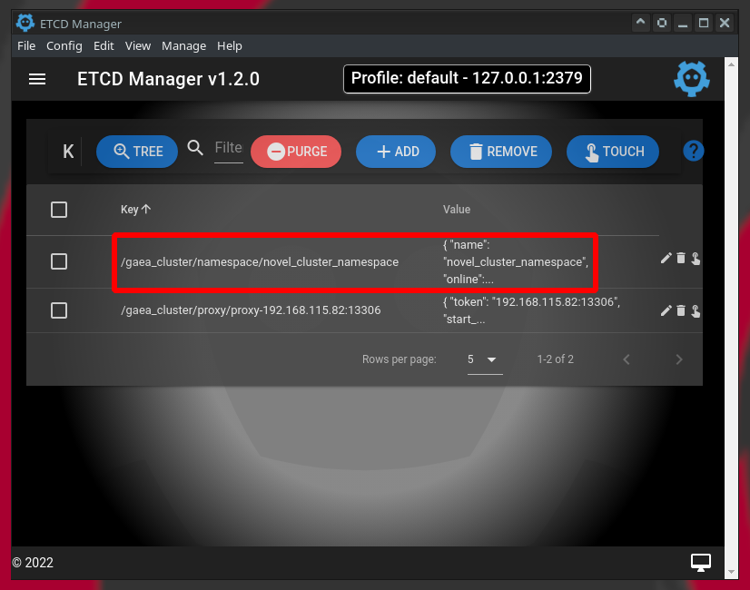

# Gaea 數據庫中間件連線啟動說明

> 此為 store.md 的輔助說明文件，當 store.go 把讀取設定文檔的接口制定後，數據庫中間件就可以讀取設定值正常啟動

## 1 讀取環境說明

先略過，因為要畫架構圖

## 2 設定值的內容

> 不管是要把設定值儲存在文檔還是在網路內，設定值會參考以下內容進行設定

### 1 叢集名稱設定內容

| 名稱項目           | 設定值                  | 說明                                   |
| ------------------ | ----------------------- | -------------------------------------- |
| 叢集名稱 Cluster   | gaea_cluster            | 一個 Cluster 可以包含多個 Namespace    |
| 命名空間 Namespace | novel_cluster_namespace | 屬於叢集 gaea_cluster 內的一個命名空間 |

### 2 數據庫集群設定內容

| 數據庫集群編號 |    Mater 服務器    |   Slave 服務器一   |   Slave 服務器二   |  帳號  | 密碼  |
| :------------: | :----------------: | :----------------: | :----------------: | :----: | :---: |
|  數據庫集群1   | 192.168.122.2:3309 | 192.168.122.2:3310 | 192.168.122.2:3311 | xiaomi | 12345 |
|  數據庫集群2   | 192.168.122.2:3312 | 192.168.122.2:3313 | 192.168.122.2:3314 | xiaomi | 12345 |

### 3 切片設定值內容

| 數據庫集群編號 | 對應的切片名稱 | 數據表名稱 | 是否預設 |
| :------------: | :------------: | :--------: | :------: |
|  數據庫集群1   |    slice-0     | Book_0000  |    是    |
|  數據庫集群2   |    slice-1     | Book_0001  |    否    |

### 4 分片演算法設定值

| 演算法設定項目 | 演算法設定值          | 說明                                                         |
| -------------- | --------------------- | ------------------------------------------------------------ |
| 用戶名稱       | hash                  | kingshard hash分片演算法                                     |
| 分表依據的鍵值 | BookID                | 會以 BookID 的數值作為分表的依據                             |
| 數據表數量     | [1,1]                 | 陣列 [1,1] 分別指出每一個切片的數據表數量，比如<br />slice-0 有 1 個 數據表，<br />slice-1 有 1 個 數據表 |
| 切片列表陣列   | ["slice-0","slice-1"] | 這個命名空間裡，有兩個切片，分別為 slice-0 和 slice-1        |

### 5 命名空間操作用戶設定值

| 用戶設定項目   | 用戶設定值                             | 說明                                                         |
| -------------- | -------------------------------------- | ------------------------------------------------------------ |
| 用戶名稱       | xiaomi                                 |                                                              |
| 用戶密碼       | 12345                                  |                                                              |
| 命名空間的名稱 | novel_cluster_namespace                |                                                              |
| 用戶讀寫標記   | rw_flag 為 2 ，該用戶可進行讀寫操作    | rw_flag 為 1，只能進行 唯讀 操作<br />rw_flag 為 2，可進行 讀寫 操作 |
| 讀寫分離標記   | rw_split 為 1，該用戶進行 讀寫分離操作 | rw_split 為 0，進行 非讀寫 分離操作<br />rw_split 為 1，進行 讀寫 分離操作 |

### 6 命名空間 JSON 格式設定值

JSON 格式的設定內容如下，這份設定值可以儲存在文檔裡或網路中，設定值都一模一樣

```json
{
  "name": "novel_cluster_namespace",
  "online": true,
  "read_only": false,
  "allowed_dbs": {
    "novel": true
  },
  "slow_sql_time": "1000",
  "black_sql": [
    ""
  ],
  "allowed_ip": null,
  "slices": [
    {
      "name": "slice-0",
      "user_name": "xiaomi",
      "password": "12345",
      "master": "192.168.122.2:3309",
      "slaves": ["192.168.122.2:3310", "192.168.122.2:3311"],
      "statistic_slaves": null,
      "capacity": 12,
      "max_capacity": 24,
      "idle_timeout": 60
    },
	{
      "name": "slice-1",
      "user_name": "xiaomi",
      "password": "12345",
      "master": "192.168.122.2:3312",
      "slaves": ["192.168.122.2:3313", "192.168.122.2:3314"],
      "statistic_slaves": null,
      "capacity": 12,
      "max_capacity": 24,
      "idle_timeout": 60
    }
  ],
  "shard_rules": [
	{
      "db": "novel",
      "table": "Book",
      "type": "hash",
      "key": "BookID",
      "locations": [
        1,
        1
      ],
      "slices": [
        "slice-0",
        "slice-1"
      ]
    }
  ],
  "users": [
    {
      "user_name": "xiaomi",
      "password": "12345",
      "namespace": "novel_cluster_namespace",
      "rw_flag": 2,
      "rw_split": 1,
      "other_property": 0
    }
  ],
  "default_slice": "slice-0",
  "global_sequences": null
}
```

## 3 命名空間設定值儲存方式

> 目前支援設定檔的讀取方式為
>
> 1. 方法一：使用 File 文檔去儲存設定值
> 2. 方法二：使用 Etcd V2 API 去儲存設定值
> 3. 方法三：使用 Etcd V3 API 去儲存設定值

### 1 使用文檔 File 儲存

> 當準備使用 File 文檔去儲存設定值時，需要修改改兩個設定文檔
>
> 1. 初始化設定文檔，位於 Gaea/etc/gaea.ini
> 2. 命名空間設定文檔，集中於目錄 Gaea/etc/file/namespace/

修正初始化設定文檔 Gaea/etc/gaea.ini，指定以下內容

1. 使用設定文檔 File 去儲存設定值
2. 叢集名稱為 gaea_cluster

把設定文檔 Gaea/etc/gaea.ini 修正成以下內容

```ini
; 這裡的重點在把 config_type 值改成 file，并修改丛集名称!!!!!

; config type, etcd/file, you can test gaea with file type, you shoud use etcd in production
config_type=file
; file config path, 具体配置放到file_config_path的namespace目录下，该下级目录为固定目录
file_config_path=./etc/file

; 在这里指定丛集名称为 gaea_cluster
cluster_name=gaea_cluster

; 以下略過，因為重點要把前面的 config_type 設定值改成 file
```

- 在目錄 Gaea/etc/file/namespace 下新增一個命名空間設定檔，檔名為 novel_cluster_namespace.json，關於 小說數據庫叢集 的相關設定

- 在命名空間設定文檔內 novel_cluster_namespace.json 內指定命名空間名稱為 novel_cluster_namespace

把設定文檔 Gaea/etc/file/namespace/novel_cluster_namespace.json 填入 命名空間 Json 格式設定值，如以下內容所示

```json
{
  "name": "novel_cluster_namespace",
  "online": true,
  "read_only": false,
  "allowed_dbs": {
    "novel": true
  },
  "slow_sql_time": "1000",
  "black_sql": [
    ""
  ],
  "allowed_ip": null,
  "slices": [
以下略
```

### 2 使用網路 Etcd 儲存

> 這次直接用 Gui 工具把設定值寫入 Etcd 容器

修正初始化設定文檔 Gaea/etc/gaea.ini，指定以下內容

1. 使用 Etcd 服務器去儲存設定值
2. 叢集名稱為 gaea_cluster
3. 指定 Etcd 的網路位置為 http://127.0.0.1:2379

把設定文檔 Gaea/etc/gaea.ini 修正成以下內容

```ini
; 這裡的重點在把 config_type 值改成 file，并修改丛集名称!!!!!

; config type, etcd/file, you can test gaea with file type, you shoud use etcd in production
config_type=etcdv3
; file config path, 具体配置放到file_config_path的namespace目录下，该下级目录为固定目录
file_config_path=./etc/file

; 在这里指定丛集名称为 gaea_cluster
cluster_name=gaea_cluster

; 在这里指定 Etcd 服务器的网路位置
coordinator_addr=http://127.0.0.1:2379

; 以下略過，因為重點要把前面的 config_type 設定值改成 file
```

在 Etcd 服務器內寫入以下內容

- key 為 /gaea_cluster/namespace/novel_cluster_namespace
- value 為 命名空間 Json 格式設定值

 

## 4 啟動數據庫中間件 Gaea

> 啟動的方式有分兩種
>
> 1. 在終端機去下指令啟動 Gaea
> 2. 使用 IDE 工具啟動 Gaea

### 1 建立執行文檔的目錄

```bash
# 建立執行檔集中目錄
$ mkdir -p Gaea/bin/
```

### 2 在終端機去下指令啟動 Gaea

先在終端機進行編譯，後執行

```bash
# 設定 GoRoot 和 GoPath
# GOROOT 位於 /usr/local/go #gosetup
# GOPATH 位於 /home/panhong/go #gosetup

# 到 Gaea 的專案目錄
$ cd /home/panhong/go/src/github.com/panhongrainbow/Gaea

# 對 Gaea 主程式進行編譯
$ /usr/local/go/bin/go build -o /home/panhong/go/src/github.com/panhongrainbow/Gaea/bin/gaea github.com/XiaoMi/Gaea/cmd/gaea #gosetup

# 執行數據庫中間件 Gaea
$ /home/panhong/go/src/github.com/panhongrainbow/Gaea/bin/gaea
```

執行畫面如下


### 3 使用 IDE 工具啟動 Gaea

在 IDE 工具內，填入以下內容

| 項目 | 配置       | 參數                                            |
| ---- | ---------- | ----------------------------------------------- |
| １   | 名稱       | gaea                                            |
| ２   | 運行種類   | 軟體包                                          |
| ３   | 軟體包路徑 | github.com/XiaoMi/Gaea/cmd/gaea                 |
| ４   | 輸出目錄   | /home/panhong/go/src/github.com/xiaomi/Gaea/bin |
| ５   | 建構後運行 | 打勾                                            |
| ６   | 工作目錄   | /home/panhong/go/src/github.com/xiaomi/Gaea     |

配置如下圖

 

運行狀況如下圖

 

## 5 登入數據庫中間件 Gaea

數據庫中間件 Gaea 啟動後，直接啟動中間件

```bash
# 登入 Gaea 指令如下
$ mysql -h 127.0.0.1 -P 13306 --protocol=TCP -u xiaomi -p
```

 

## 6 測試數據庫中間件 Gaea 的讀寫

目前測試的資料如下

MySQL [novel]> INSERT INTO novel.Book (BookID, Isbn, Title, Author, Publish, Category) VALUES(1, 9781517191276, 'Romance Of The Three Kingdoms', 'Luo Guanzhong', 1522, 'Hi
storical fiction'); 

MySQL [novel]> INSERT INTO novel.Book (BookID, Isbn, Title, Author, Publish, Category) VALUES(2, 9789869442060, 'Water Margin', 'Shi Nai an', 1589, 'Historical fiction'); 

MySQL [novel]> INSERT INTO novel.Book (BookID, Isbn, Title, Author, Publish, Category) VALUES(3, 9789575709518, 'Journey To The West', 'Wu Cheng en', 1592, 'Gods And Demon
s Fiction'); 


