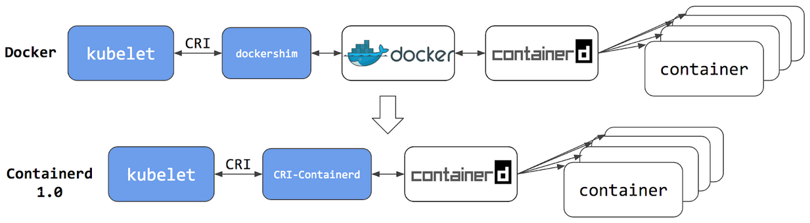
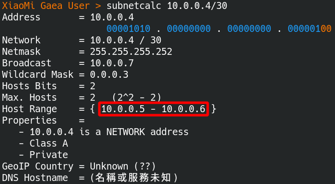
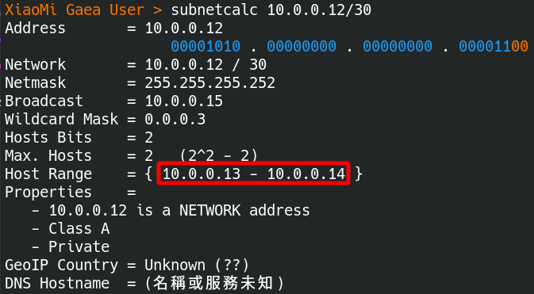

# Running Unit Tests With Containerd

> The test environment is complex for the programmer to set up.
> Fortunately, **Docker** is popular for people to learn and love as a common language for **temporarily creating test environments**.
> However, there are many alternatives for docker, such as **Containerd**, Kata Container, and gVisor.
> Most likely, there is a high probability that **Containerd** replaces Docker in **the container management ecosystem** because Containerd is **less dependent and more efficient**.
> Indeed, Containerd does not have **docker cli layer**.

## Installation

### Introduction

What is **Containerd**？

**Containerd** has been *used* for *a long time* as **a container management tool**. However, People cannot be aware of its existence because it is **a container runtime** with simplicity and does not have **docker cli layer**.

 

### Install main component

> Please refer to [the installation guide](https://containerd.io/downloads/) for specific details.

install Containerd components

```bash
# libseccomp2 is a security package used to prevent attackers bypass intended access restrictions for argument-filtered system calls.
$ sudo apt-get update
$ sudo apt-get install libseccomp2

# download containerd package. current version is 1.6.2.
$ wget https://github.com/containerd/containerd/releases/download/v1.6.2/cri-containerd-cni-1.6.2-linux-amd64.tar.gz

# cri-containerd-cni includes runc and internet components.
$ tar -tf cri-containerd-cni-1.6.2-linux-amd64.tar.gz | grep runc
usr/local/bin/containerd-shim-runc-v2
usr/local/bin/containerd-shim-runc-v1
usr/local/sbin/runc # runc is a CLI tool for running containers.

# install containerd
$ sudo tar -C / -xzf cri-containerd-cni-1.6.2-linux-amd64.tar.gz

# check the existence of systemd config.
$ tar -tf cri-containerd-cni-1.6.2-linux-amd64.tar.gz | grep containerd.service
etc/systemd/system/containerd.service # systemd config.

# start Containerd Service.
$ sudo systemctl daemon-reload # reload Systemd.
$ sudo systemctl enable --now containerd.service # start Containerd service at boot.
$ sudo systemctl start containerd.service # start Containerd service.

# check the existence of ctr cli tool.
$ tar -tf cri-containerd-cni-1.6.2-linux-amd64.tar.gz | grep ctr
usr/local/bin/ctr # ctr cli tool.

# test ctr cli tool.
$ ctr container list
# display CONTAINER    IMAGE    RUNTIME
```

### Managing plugins

set up Containerd plugins

```bash
# check the existence of cni component.
$ tar -tf cri-containerd-cni-1.6.2-linux-amd64.tar.gz | grep opt/cni
# The result is displayed as follows.
opt/cni/
opt/cni/bin/
opt/cni/bin/tuning
opt/cni/bin/vrf
opt/cni/bin/loopback
opt/cni/bin/portmap
opt/cni/bin/ptp
opt/cni/bin/ipvlan
opt/cni/bin/host-device
opt/cni/bin/macvlan
opt/cni/bin/host-local
opt/cni/bin/firewall
opt/cni/bin/bandwidth
opt/cni/bin/sbr
opt/cni/bin/vlan
opt/cni/bin/static
opt/cni/bin/bridge
opt/cni/bin/dhcp

# Generate config.toml config
$ tar -tf cri-containerd-cni-1.6.2-linux-amd64.tar.gz | grep config.toml # does not contain config file.
$ containerd config default > /etc/containerd/config.toml # create default config file.
```

### Compile cni tool

```bash
# compile cnitool
$ git clone https://github.com/containernetworking/cni.git
$ cd cni
$ go mod tidy
$ cd cnitool
$ go build .

# move cnitool to bin folder
$ mv ./cnitool /usr/local/bin
```

# Subnetwork

> - to force containers to be isolated with a small subnetwork of limited hosts numbers.
> - to use **class A** Private IP addesses, **10.0.0.0 - 10.255.255.255**.

## calculate subnetwork

There are four subnets *listed in the table below*.

| Subnetwork            | Command                   | Details                                                      |
| :-------------------- | :------------------------ | ------------------------------------------------------------ |
| The first subnetwork  | $ subnetcalc 10.0.0.0/30  | network: 10.0.0.0<br />router: 10.0.0.1<br />host: 10.0.0.2<br />broadcast: 10.0.0.3 |
| The second subnetwork | $ subnetcalc 10.0.0.4/30  | network: 10.0.0.4<br />router: 10.0.0.5<br />host: 10.0.0.6<br />broadcast: 10.0.0.7 |
| The third subnetwork  | $ subnetcalc 10.0.0.8/30  | network: 10.0.0.8<br />router: 10.0.0.9<br />host: 10.0.0.10<br />broadcast: 10.0.0.11 |
| The fourth subnetwork | $ subnetcalc 10.0.0.12/30 | network: 10.0.0.12<br />router: 10.0.0.13<br />host: 10.0.0.14<br />broadcast: 10.0.0.15 |

The Linux command, **subnetcalc**, calculates subnet quickly.

- The host IP is **10.0.0.2** in the **first** subnetwork.
  
- The host IP is **10.0.0.4** in the **second** subnetwork.
  
- The host IP is **10.0.0.8** in the **third** subnetwork.
  
- The host IP is **10.0.0.12** in the **fourth** subnetwork.
  

### Explain how to calculate subnetwork

> Use the last subnetwork,**10.10.10.12/30**, as an example to explain how to calculate the subnetwork.

- **The variable-length subnet** is **2** (32 - 30 = 2). Four IP addresses exist in this subnetwork such as **10.10.10.12 , 10.10.10.13, 10.10.10.14 and 10.10.10.15 .**

- Some details *listed in the table below*.

  | IP address | Usage               |
  | ---------- | ------------------- |
  | 10.0.0.12  | network address     |
  | 10.0.0.13  | router IP address   |
  | 10.0.0.14  | **host IP address** |
  | 10.0.0.15  | broadcast address   |

  All in all, the created container uses **the IP address 10.0.0.14** repeatedly.

### Subnetwork config files

Create subnetwork config files

````bash
# take the security privileges of root
$ sudo su -

# the subnetwork is 10.0.0.0/30
# for default test in gaea
$ cat << EOF | tee /etc/cni/net.d/gaea-default.conf
{
    "cniVersion": "0.4.0",
    "name": "gaea-default",
    "type": "bridge",
    "bridge": "cni0",
    "isDefaultGateway": true,
    "forceAddress": false,
    "ipMasq": true,
    "hairpinMode": true,
    "ipam": {
        "type": "host-local",
        "subnet": "10.0.0.0/30"
    }
}
EOF

# the subnetwork is 10.0.0.4/30
# for etcd test in gaea
$ cat << EOF | tee /etc/cni/net.d/gaea-etcd.conf
{
    "cniVersion": "0.4.0",
    "name": "gaea-etcd",
    "type": "bridge",
    "bridge": "cni1",
    "isDefaultGateway": true,
    "forceAddress": false,
    "ipMasq": true,
    "hairpinMode": true,
    "ipam": {
        "type": "host-local",
        "subnet": "10.0.0.4/30"
    }
}
EOF

# the subnetwork is 10.0.0.8/30
# for mariadb test in gaea
$ cat << EOF | tee /etc/cni/net.d/gaea-mariadb.conf
{
    "cniVersion": "0.4.0",
    "name": "gaea-mariadb",
    "type": "bridge",
    "bridge": "cni2",
    "isDefaultGateway": true,
    "forceAddress": false,
    "ipMasq": true,
    "hairpinMode": true,
    "ipam": {
        "type": "host-local",
        "subnet": "10.0.0.8/30"
    }
}
EOF
````

### Setup subnetwork for a group of containers

> Use subnetwork **10.255.255.248/29** and develop later.

Calculate the subnetwork immediately.

````bash
$ subnetcalc 10.255.255.248/29
````

### Setup subnetwork step by step

run the below commands 

```bash
# add namespaces
$ ip netns add gaea-default
$ ip netns add gaea-etcd
$ ip netns add gaea-mariadb

$ ip netns list
# The result is displayed as follows.
# gaea-default
# gaea-etcd
# gaea-mariadb
# gaea-mariadb-sakila

$ ls /var/run/netns/
# # The result is displayed as follows.
# gaea-default gaea-etcd gaea-mariadb

# add namespaces
$ export CNI_PATH=/opt/cni/bin
$ cnitool add gaea-default /var/run/netns/gaea-default
$ cnitool add gaea-etcd /var/run/netns/gaea-etcd
$ cnitool add gaea-mariadb /var/run/netns/gaea-mariadb

# test connections
$ ip a | grep cni0
# 6: cni0: <BROADCAST,MULTICAST,UP,LOWER_UP> mtu 1500 qdisc noqueue state UP group default qlen 1000
#     inet 10.0.0.0/30 brd 10.10.10.3 scope global cni0
# 7: veth8e852839@if2: <BROADCAST,MULTICAST,UP,LOWER_UP> mtu 1500 qdisc noqueue master cni0 state UP group default

$ ping -c 5 10.10.10.1
# PING 10.10.10.1 (10.10.10.1) 56(84) bytes of data.
# 64 bytes from 10.10.10.1: icmp_seq=1 ttl=64 time=0.107 ms
# 64 bytes from 10.10.10.1: icmp_seq=2 ttl=64 time=0.099 ms
# 64 bytes from 10.10.10.1: icmp_seq=3 ttl=64 time=0.099 ms
# 64 bytes from 10.10.10.1: icmp_seq=4 ttl=64 time=0.100 ms
# 64 bytes from 10.10.10.1: icmp_seq=5 ttl=64 time=0.099 ms
```

### subnetwork script

> Linux **won't keep the subnetwork configuration permanently**, so we should create a bash script to maintain it.

Append **export CNI_PATH=/opt/cni/bin** to **/etc/bash.bashrc**

```bash
# append below

# add containerd config 
export CNI_PATH=/opt/cni/bin
```

run the below commands 

```bash
#!/bin/bash

# allow firewall to forward packets
iptables -P FORWARD ACCEPT

# remove networks
cnitool del gaea-default /var/run/netns/gaea-default
cnitool del gaea-etcd /var/run/netns/gaea-etcd
cnitool del gaea-mariadb /var/run/netns/gaea-mariadb

# remove namespaces
ip netns del gaea-default
ip netns del gaea-etcd
ip netns del gaea-mariadb

# create namespaces
ip netns add gaea-default
ip netns add gaea-etcd
ip netns add gaea-mariadb

# create networks
export CNI_PATH=/opt/cni/bin
cnitool add gaea-default /var/run/netns/gaea-default
cnitool add gaea-etcd /var/run/netns/gaea-etcd
cnitool add gaea-mariadb /var/run/netns/gaea-mariadb
```


SoarTest is not in an isolated test environment and depends on many technic things, such as containers, databases, SQL, etc.
I should tear down those dependencies as much as possible.
Fewer dependencies make a more stable test.

I make an essential decision to integrate Containerd with UnitTest.
Containerd will take over docker sooner or later.
I choose Containerd to keep up with technology after evaluating it.
Rename from SoarTest to ContainerdTest.