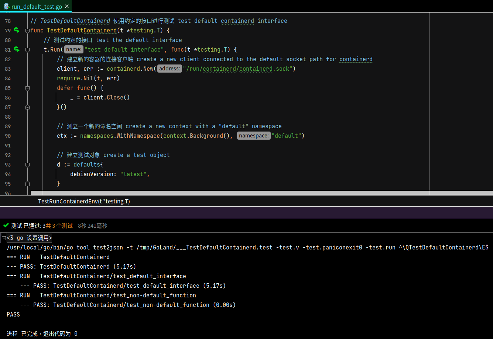

# 容器单元测试

## 说明

### 会面临的问题如下

- 有一个大问题，**数据库测试数据**要如何载入到容器内，目前偏向的作法如下
  制作一个本地的印象档，里面会有一个脚本会在启动时，自动载入测试数据到容器内，
  好处是可以减少依赖，不需要用 orm 去载入测试数据，能少用一个依赖就少用一个依赖，为了是要增加单元测试的稳定性
- docker 未来的重用性将会下降，未来将会直接操作 **containerd** ，不经由 docker 去控制，这次测试准备把 containerd 整合到单元测试内，测试包命名为 **containerdTest**

## Containerd 容器的安装

### 简介

此为 containerd 的早期版本，已经去除 docker 那一层去进行效能的提升 

### containerd 主体安装

> 参考以下网址进行安装 [containerd安装文件](https://containerd.io/downloads/)

```bash
# 先安装依赖，libseccomp2 套件将会指定 process 去呼叫特定的 system call 
$ sudo apt-get update
$ sudo apt-get install libseccomp2

# 下载 containerd 套件，目前最新版本为 1.6.2 版，
$ wget https://github.com/containerd/containerd/releases/download/v1.6.2/cri-containerd-cni-1.6.2-linux-amd64.tar.gz

# 这份压缩包含 containerd 运行时所需要的 runc 
$ tar -tf cri-containerd-cni-1.6.2-linux-amd64.tar.gz | grep runc
usr/local/bin/containerd-shim-runc-v2
usr/local/bin/containerd-shim-runc-v1
usr/local/sbin/runc # 存在

# 进行安装整个 containerd
$ sudo tar -C / -xzf cri-containerd-cni-1.6.2-linux-amd64.tar.gz

# 检查 systemd 设定档是否存在
$ tar -tf cri-containerd-cni-1.6.2-linux-amd64.tar.gz | grep containerd.service
etc/systemd/system/containerd.service # 存在

# 启动 containerd 服务
$ sudo systemctl daemon-reload # 重新載入 Systemd
$ sudo systemctl enable --now containerd.service # 开机时启动 containerd 服务
$ sudo systemctl start containerd.service # 启动 containerd 服务


# 檢查 ctr 指令是否存在
$ tar -tf cri-containerd-cni-1.6.2-linux-amd64.tar.gz | grep ctr
usr/local/bin/ctr # 存在

# 执行 ctr 指令进行简易测试
$ ctr container list
# 会显示 CONTAINER    IMAGE    RUNTIME
```

### containerd 插件設定

```bash
# 检查 cni 元件是否存在
$ tar -tf cri-containerd-cni-1.6.2-linux-amd64.tar.gz | grep opt/cni
# 会显示以下内容
opt/cni/
opt/cni/bin/
opt/cni/bin/tuning
opt/cni/bin/vrf
opt/cni/bin/loopback
opt/cni/bin/portmap
opt/cni/bin/ptp
opt/cni/bin/ipvlan
opt/cni/bin/host-device
opt/cni/bin/macvlan
opt/cni/bin/host-local
opt/cni/bin/firewall
opt/cni/bin/bandwidth
opt/cni/bin/sbr
opt/cni/bin/vlan
opt/cni/bin/static
opt/cni/bin/bridge
opt/cni/bin/dhcp

# 產生 config.toml 設定
$ tar -tf cri-containerd-cni-1.6.2-linux-amd64.tar.gz | grep config.toml # 压缩包未含设定档
$ containerd config default > /etc/containerd/config.toml # 用命令产生预设文档
```

### 编译设定工具 cnitool

```bash
# 先编译 cnitool
$ git clone https://github.com/containernetworking/cni.git
$ cd cni
$ go mod tidy
$ cd cnitool
$ go build .

# 把 cnitool 移动到 bin 目录下
$ mv ./cnitool /usr/local/bin
```

## 子网切割计算

### 计算容器子网

> 目的为保留两个容器可分配 IP，让 containerdTest 包可以快速在网路上找到容器并进行连线

规划子网为 10.10.10.8/30，只预留 2 个 bits (32 - 30) 可以变化，共有四种组合可变动的 IP，如下表

| 可供使用的 IP    | 二进制                                    | 十进制      |
| ---------------- | ----------------------------------------- | ----------- |
| 预期会用于网域   | 00001010 . 00001010 . 00001010 . 00001000 | 10.10.10.8  |
| 预期会用于桥接器 | 00001010 . 00001010 . 00001010 . 00001001 | 10.10.10.9  |
| 预期会用于容器   | 00001010 . 00001010 . 00001010 . 00001010 | 10.10.10.10 |
| 预期会用于广播   | 00001010 . 00001010 . 00001010 . 00001011 | 10.10.10.11 |

也可以用命令进行验证，可以看出只有两个 bits 可以变动，能使用的 IP 为 10.10.10.9 和 10.10.10.10

 

### 容器网路设定

| 项目              | 容器IP      | 子网计算                                                     |
| ----------------- | ----------- | ------------------------------------------------------------ |
| 预设用            | 2.2.2.2     | $ sipcalc 2.2.2.0/30<br /><br /> |
| etcd 用           | 6.6.6.6     | $ sipcalc 6.6.6.4/30<br /><br /> |
| mariadb 用        | 10.10.10.10 | $ sipcalc 10.10.10.8/30<br /><br /> |
| mariadb-sakila 用 | 14.14.14.14 | $ sipcalc 14.14.14.12/30<br /><br /> |
| 保留用            | 18.18.18.18 | $ sipcalc 18.18.18.16/30<br /><br /> |


```bash
# 以下使用 root 身份执行
$ sudo su -

# 写入网路设定档，并指定子网分割为 2.2.2.0/30
# 在 gaea 环境下，用于容器的预设环境测试
$ cat << EOF | tee /etc/cni/net.d/gaea-default.conf
{
    "cniVersion": "0.4.0",
    "name": "gaea-default",
    "type": "bridge",
    "bridge": "cni0",
    "isDefaultGateway": true,
    "forceAddress": false,
    "ipMasq": true,
    "hairpinMode": true,
    "ipam": {
        "type": "host-local",
        "subnet": "2.2.2.0/30"
    }
}
EOF

# 写入网路设定档，并指定子网分割为 6.6.6.4/30
# 在 gaea 环境下，用 etcd 容器测试
$ cat << EOF | tee /etc/cni/net.d/gaea-etcd.conf
{
    "cniVersion": "0.4.0",
    "name": "gaea-etcd",
    "type": "bridge",
    "bridge": "cni1",
    "isDefaultGateway": true,
    "forceAddress": false,
    "ipMasq": true,
    "hairpinMode": true,
    "ipam": {
        "type": "host-local",
        "subnet": "6.6.6.4/30"
    }
}
EOF

# 写入网路设定档，并指定子网分割为 14.14.14.12/30
# 在 gaea 环境下，用 mariaDB 容器测试
$ cat << EOF | tee /etc/cni/net.d/gaea-mariadb.conf
{
    "cniVersion": "0.4.0",
    "name": "gaea-mariadb",
    "type": "bridge",
    "bridge": "cni2",
    "isDefaultGateway": true,
    "forceAddress": false,
    "ipMasq": true,
    "hairpinMode": true,
    "ipam": {
        "type": "host-local",
        "subnet": "10.10.10.8/30"
    }
}
EOF

# 写入网路设定档，并指定子网分割为 18.18.18.16/30
# 在 gaea 环境下，用 mariaDB 容器测试 sakila Schema
$ cat << EOF | tee /etc/cni/net.d/gaea-mariadb-sakila.conf
{
    "cniVersion": "0.4.0",
    "name": "gaea-mariadb-sakila",
    "type": "bridge",
    "bridge": "cni3",
    "isDefaultGateway": true,
    "forceAddress": false,
    "ipMasq": true,
    "hairpinMode": true,
    "ipam": {
        "type": "host-local",
        "subnet": "14.14.14.12/30"
    }
}
EOF

# 建立网路的 namespace 进行网路隔离
$ ip netns add gaea-default
$ ip netns add gaea-etcd
$ ip netns add gaea-mariadb
$ ip netns add gaea-mariadb-sakila

$ ip netns list
# gaea-default
# gaea-etcd
# gaea-mariadb
# gaea-mariadb-sakila

$ ls /var/run/netns/
# gaea-default gaea-etcd gaea-mariadb gaea-mariadb-sakila

# 把 gaea-mariadb-sakila 加入 namespace
$ export CNI_PATH=/opt/cni/bin
$ cnitool add gaea-default /var/run/netns/gaea-default
$ cnitool add gaea-etcd /var/run/netns/gaea-etcd
$ cnitool add gaea-mariadb /var/run/netns/gaea-mariadb
$ cnitool add gaea-mariadb-sakila /var/run/netns/gaea-mariadb-sakila

# 进行连线测试
$ ip a | grep cni0
# 6: cni0: <BROADCAST,MULTICAST,UP,LOWER_UP> mtu 1500 qdisc noqueue state UP group default qlen 1000
#     inet 2.2.2.0/30 brd 2.2.2.3 scope global cni0
# 7: veth8e852839@if2: <BROADCAST,MULTICAST,UP,LOWER_UP> mtu 1500 qdisc noqueue master cni0 state UP group default

$ ping -c 5 2.2.2.1
# PING 2.2.2.1 (2.2.2.1) 56(84) bytes of data.
# 64 bytes from 2.2.2.1: icmp_seq=1 ttl=64 time=0.107 ms
# 64 bytes from 2.2.2.1: icmp_seq=2 ttl=64 time=0.099 ms
# 64 bytes from 2.2.2.1: icmp_seq=3 ttl=64 time=0.099 ms
# 64 bytes from 2.2.2.1: icmp_seq=4 ttl=64 time=0.100 ms
# 64 bytes from 2.2.2.1: icmp_seq=5 ttl=64 time=0.099 ms
```

以预设网路为例

- 在子网切割里 2.2.2.0/30，预留 4 个 IP 可以供容器自由使用，但前后网域和广播会各占一个，穚接器也会占用一个 2.2.2.1
- 最后容器可以被分配的 IP 只剩一个，为 14.14.14.14

Linux 的 namespace 并不是永远储存的，所以要在建立重新设定 namespace 的脚本

- export CNI_PATH=/opt/cni/bin 这一行写到 /etc/bash.bashrc
  
  ```bash
  # 新增以下内容
  
  # 新增 containerd 的动态网咯介面 
  export CNI_PATH=/opt/cni/bin
  ```
  
- 使用脚本去管理容器的网路
  
  ```bash
  #!/bin/bash
  
  # 先开启防火墙转发
  iptables -P FORWARD ACCEPT
  
  # 先删除 network
  cnitool del gaea-default /var/run/netns/gaea-default
  cnitool del gaea-etcd /var/run/netns/gaea-etcd
  cnitool del gaea-mariadb /var/run/netns/gaea-mariadb
  cnitool del gaea-mariadb-sakila /var/run/netns/gaea-mariadb-sakila
  
  # 先删除 namespace
  ip netns del gaea-default
  ip netns del gaea-etcd
  ip netns del gaea-mariadb
  ip netns del gaea-mariadb-sakila
  
  # 先新建 namespace
  ip netns add gaea-default
  ip netns add gaea-etcd
  ip netns add gaea-mariadb
  ip netns add gaea-mariadb-sakila
  
  # 先新建 network
  export CNI_PATH=/opt/cni/bin
  cnitool add gaea-default /var/run/netns/gaea-default
  cnitool add gaea-etcd /var/run/netns/gaea-etcd
  cnitool add gaea-mariadb /var/run/netns/gaea-mariadb
  cnitool add gaea-mariadb-sakila /var/run/netns/gaea-mariadb-sakila
  ```

## 使用 ctr 命令操作

 使用以下命令操作

```bash
# 开始建立容器 >>>>> >>>>> >>>>> >>>>> >>>>>

# 建立 namespace
$ ctr ns create default

# 下载镜像档 debian
$ ctr -n default image pull docker.io/library/debian:latest

# 检查镜像档 default
$ ctr -n default i ls
# REF TYPE DIGEST SIZE PLATFORMS LABELS 
# docker.io/library/debian:latest application/vnd.docker.distribution.manifest.list.v2+json sha256:87eefc7c15610cca61db5c0fd280911c6a737c0680d807432c0bd80cd0cca39b 52.4 MiB linux/386,linux/amd64,linux/arm/v5,linux/arm/v7,linux/arm64/v8,linux/mips64le,linux/ppc64le,linux/s390x -

# 启动容器 default
$ ctr -n default run --with-ns=network:/var/run/netns/gaea-default -d docker.io/library/debian:latest default

# 检查容器 default
$ ctr -n default container ls
# CONTAINER    IMAGE                              RUNTIME                  
# default      docker.io/library/debian:latest    io.containerd.runc.v2 

# 检查容器 default 的工作
$ ctr -n default task ls
# TASK      PID      STATUS 
# default    8371    RUNNING

# 进入容器
$ ctr -n default task exec -t --exec-id default default sh

# 开始删除容器 >>>>> >>>>> >>>>> >>>>> >>>>>

# 中止容器运行
$ ctr -n default task kill -s SIGKILL default

# 检查容器 default 的工作是否停止
$ ctr -n default task ls
# TASK      PID      STATUS    
# default    8371    STOPPED

# 删除容器 default 的工作
$ ctr -n default task rm default
# WARN[0000] task default exit with non-zero exit code 137

# 删除容器 default
$ ctr -n default container rm default
```

经由上述操作，就可以成功操作单元测试

 

## 重新打包数据库镜像

> 因为数据库容器都无法在 containerd 上正常启动，所以要进行修正，重新打包，使用以下命令重新打包镜像

先产生帐户资料文档 user.sql

```sql
CREATE USER 'xiaomi'@'2.2.2.1' IDENTIFIED BY '12345';
GRANT ALL PRIVILEGES ON my_db.* TO 'xiaomi'@'2.2.2.1';
```

编写新的 Dockerfile

```dockerfile
FROM debian:latest

# 安装数据库
RUN apt-get update
RUN apt-get install -y mariadb-server mariadb-client

# 修改數据库設定 (正规表示式为 bind-address(\s*?)=(\s*?)127\.0\.0\.1)
RUN sed -i "s/bind-address.*/bind-address=0.0.0.0/g" /etc/mysql/mariadb.conf.d/50-server.cnf

# 设定用户密码
RUN mkdir -p /home/mysql/
ADD user.sql /home/mysql/

# 进行修正
ADD mysqld_init.sh /home/mysql/
RUN chmod +x /home/mysql/mysqld_init.sh

# 启动数据库
ENTRYPOINT ["/home/mysql/mysqld_init.sh"]
```

进行容器镜像档打包

```bash
# 安装打包工具 buildah
$ apt-get install buildah

# 进行打包
$ buildah bud -t mariadb:testing .

# 查询打包结果
$ buildah images
# REPOSITORY        TAG    IMAGE ID     CREATED        SIZE
# localhost/mariadb latest e4fe0437050b 5 minutes ago  484 MB
```

把镜像载入到 containerd 内

```bash
# 安装容器工具 podman
$ apt-get install -y podman

# 保存打包档 mariadb-latest.tar
$ podman image save localhost/mariadb:testing -o mariadb-testing.tar
# WARN[0000] Error validating CNI config file /etc/cni/net.d/10-containerd-net.conflist: [plugin bridge does not support config version "1.0.0" plugin portmap does not support config version "1.0.0"]

# 检查把包结果
$ ls
# Dockerfile  mariadb-latest.tar

# 建立名称空间 mariadb 
$ ctr namespace create mariadb

# containerd 载入打包的镜像
$ ctr -n mariadb i import mariadb-latest.tar

# 检查载入容器结果
$ ctr -n mariadb i ls
# REF TYPE DIGEST SIZE PLATFORMS LABELS 
# localhost/mariadb:latest application/vnd.docker.distribution.manifest.v2+json sha256:47db1ba681c4ebcf56370ad22d9f9a5c72bc08414b7f2d54c5cd2112502b5931 461.7 MiB linux/amd64 -
```

## 上传镜像档到远端仓库

> 目前容器的远端仓库有 [docker hub](https://hub.docker.com/) 和 [qury io](https://quay.io/)，目前打算在 [docker hub](https://hub.docker.com/) 上进行测试，功能较完整的镜象档上传到 [qury io](https://quay.io/)

先把测试用的数据库镜像上传到 [docker hub](https://hub.docker.com/)

```bash
# 到容器目录之下
$ cd gaea/util/mocks/containerdTest/images/mariadb_testing

# 打包容器镜像档
$ buildah bud -t mariadb:testing .

# 上传容器镜象
$ skopeo copy docker-archive:./mariadb-testing.tar docker://docker.io/panhongrainbow/mariadb:testing --dest-creds panhongrainbow:<token>
```


## ContainerdTest 单元测试


### 运作说明


### 操作演示


之后可以登入容器内部进行测试或者是远端连线都可以

```bash
# 直接登入容器内部进行测试
$ ctr -n default task exec -t --exec-id default-server default-server sh

# 或者是远端登入进行测试
$ mysql -h 2.2.2.2 -P 3306 -u root -p
```
