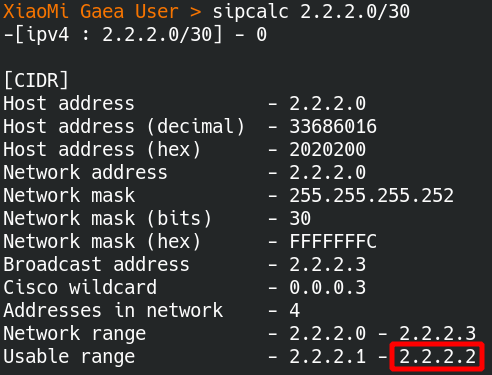
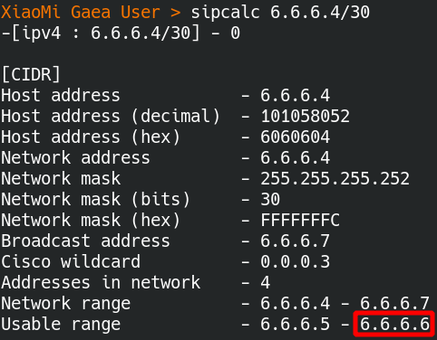
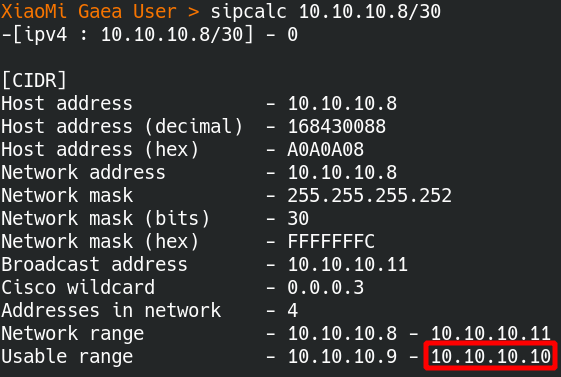
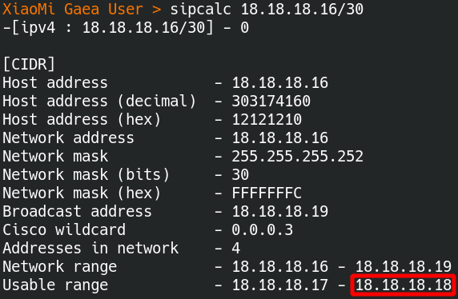

# 容器单元测试

## 说明

### 会面临的问题如下

- 有一个大问题，**数据库测试数据**要如何载入到容器内，目前偏向的作法如下
  制作一个本地的印象档，里面会有一个脚本会在启动时，自动载入测试数据到容器内，
  好处是可以减少依赖，不需要用 orm 去载入测试数据，能少用一个依赖就少用一个依赖，为了是要增加单元测试的稳定性
- docker 未来的重用性将会下降，未来将会直接操作 **containerd** ，不经由 docker 去控制，这次测试准备把 containerd 整合到单元测试内，测试包命名为 **containerdTest**

## Containerd 容器的安装

### 简介

此为 containerd 的早期版本，已经去除 docker 那一层去进行效能的提升 

### containerd 主体安装

> 参考以下网址进行安装 [containerd安装文件](https://containerd.io/downloads/)

```bash
# 先安装依赖，libseccomp2 套件将会指定 process 去呼叫特定的 system call 
$ sudo apt-get update
$ sudo apt-get install libseccomp2

# 下载 containerd 套件，目前最新版本为 1.6.2 版，
$ wget https://github.com/containerd/containerd/releases/download/v1.6.2/cri-containerd-cni-1.6.2-linux-amd64.tar.gz

# 这份压缩包含 containerd 运行时所需要的 runc 
$ tar -tf cri-containerd-cni-1.6.2-linux-amd64.tar.gz | grep runc
usr/local/bin/containerd-shim-runc-v2
usr/local/bin/containerd-shim-runc-v1
usr/local/sbin/runc # 存在

# 进行安装整个 containerd
$ sudo tar -C / -xzf cri-containerd-cni-1.6.2-linux-amd64.tar.gz

# 检查 systemd 设定档是否存在
$ tar -tf cri-containerd-cni-1.6.2-linux-amd64.tar.gz | grep containerd.service
etc/systemd/system/containerd.service # 存在

# 启动 containerd 服务
$ sudo systemctl daemon-reload # 重新載入 Systemd
$ sudo systemctl enable --now containerd.service # 开机时启动 containerd 服务
$ sudo systemctl start containerd.service # 启动 containerd 服务


# 檢查 ctr 指令是否存在
$ tar -tf cri-containerd-cni-1.6.2-linux-amd64.tar.gz | grep ctr
usr/local/bin/ctr # 存在

# 执行 ctr 指令进行简易测试
$ ctr container list
# 会显示 CONTAINER    IMAGE    RUNTIME
```

### containerd 插件設定

```bash
# 检查 cni 元件是否存在
$ tar -tf cri-containerd-cni-1.6.2-linux-amd64.tar.gz | grep opt/cni
# 会显示以下内容
opt/cni/
opt/cni/bin/
opt/cni/bin/tuning
opt/cni/bin/vrf
opt/cni/bin/loopback
opt/cni/bin/portmap
opt/cni/bin/ptp
opt/cni/bin/ipvlan
opt/cni/bin/host-device
opt/cni/bin/macvlan
opt/cni/bin/host-local
opt/cni/bin/firewall
opt/cni/bin/bandwidth
opt/cni/bin/sbr
opt/cni/bin/vlan
opt/cni/bin/static
opt/cni/bin/bridge
opt/cni/bin/dhcp

# 產生 config.toml 設定
$ tar -tf cri-containerd-cni-1.6.2-linux-amd64.tar.gz | grep config.toml # 压缩包未含设定档
$ containerd config default > /etc/containerd/config.toml # 用命令产生预设文档
```

### 编译设定工具 cnitool

```bash
# 先编译 cnitool
$ git clone https://github.com/containernetworking/cni.git
$ cd cni
$ go mod tidy
$ cd cnitool
$ go build .

# 把 cnitool 移动到 bin 目录下
$ mv ./cnitool /usr/local/bin
```

## 子网切割计算

### 计算容器子网

> 目的为保留两个容器可分配 IP，让 containerdTest 包可以快速在网路上找到容器并进行连线

规划子网为 10.10.10.8/30，只预留 2 个 bits (32 - 30) 可以变化，共有四种组合可变动的 IP，如下表

| 可供使用的 IP    | 二进制                                    | 十进制      |
| ---------------- | ----------------------------------------- | ----------- |
| 预期会用于网域   | 00001010 . 00001010 . 00001010 . 00001000 | 10.10.10.8  |
| 预期会用于桥接器 | 00001010 . 00001010 . 00001010 . 00001001 | 10.10.10.9  |
| 预期会用于容器   | 00001010 . 00001010 . 00001010 . 00001010 | 10.10.10.10 |
| 预期会用于广播   | 00001010 . 00001010 . 00001010 . 00001011 | 10.10.10.11 |

也可以用命令进行验证，可以看出只有两个 bits 可以变动，能使用的 IP 为 10.10.10.9 和 10.10.10.10

 

### 容器网路设定

| 项目       | 容器IP      | 子网计算                                                     |
| ---------- | ----------- | ------------------------------------------------------------ |
| 预设用     | 2.2.2.2     | $ sipcalc 2.2.2.0/30<br /><br /> |
| etcd 用    | 6.6.6.6     | $ sipcalc 6.6.6.4/30<br /><br /> |
| mariadb 用 | 10.10.10.10 | $ sipcalc 10.10.10.8/30<br /><br /> |
| 保留       | 14.14.14.14 | $ sipcalc 14.14.14.12/30<br /><br /> |
| 保留       | 18.18.18.18 | $ sipcalc 18.18.18.16/30<br /><br /> |


```bash
# 以下使用 root 身份执行
$ sudo su -

# 写入网路设定档，并指定子网分割为 2.2.2.0/30
# 在 gaea 环境下，用于容器的环境测试
$ cat << EOF | tee /etc/cni/net.d/gaea-default.conf
{
    "cniVersion": "0.4.0",
    "name": "gaea-default",
    "type": "bridge",
    "bridge": "cni0",
    "isDefaultGateway": true,
    "forceAddress": false,
    "ipMasq": true,
    "hairpinMode": true,
    "ipam": {
        "type": "host-local",
        "subnet": "2.2.2.0/30"
    }
}
EOF

# 写入网路设定档，并指定子网分割为 6.6.6.4/30
# 在 gaea 环境下，用 etcd 容器测试
$ cat << EOF | tee /etc/cni/net.d/gaea-etcd.conf
{
    "cniVersion": "0.4.0",
    "name": "gaea-etcd",
    "type": "bridge",
    "bridge": "cni1",
    "isDefaultGateway": true,
    "forceAddress": false,
    "ipMasq": true,
    "hairpinMode": true,
    "ipam": {
        "type": "host-local",
        "subnet": "6.6.6.4/30"
    }
}
EOF

# 写入网路设定档，并指定子网分割为 10.10.10.8/30
# 在 gaea 环境下，用 mariaDB 容器测试 sakila Schema
$ cat << EOF | tee /etc/cni/net.d/gaea-mariadb-sakila.conf
{
    "cniVersion": "0.4.0",
    "name": "gaea-mariadb-sakila",
    "type": "bridge",
    "bridge": "cni2",
    "isDefaultGateway": true,
    "forceAddress": false,
    "ipMasq": true,
    "hairpinMode": true,
    "ipam": {
        "type": "host-local",
        "subnet": "10.10.10.8/30"
    }
}
EOF

# 建立网路的 namespace 进行网路隔离
$ ip netns add gaea-default
$ ip netns add gaea-etcd
$ ip netns add gaea-mariadb-sakila

$ ip netns list
gaea-mariadb-sakila
gaea-etcd
gaea-default

$ ls /var/run/netns/
gaea-default  gaea-etcd  gaea-mariadb-sakila

# 把 gaea-mariadb-sakila 加入 namespace
$ export CNI_PATH=/opt/cni/bin
$ cnitool add gaea-default /var/run/netns/gaea-default
$ cnitool add gaea-etcd /var/run/netns/gaea-etcd
$ cnitool add gaea-mariadb-sakila /var/run/netns/gaea-mariadb-sakila

# 进行连线测试
$ ip a | grep cni2
# 6: cni2: <BROADCAST,MULTICAST,UP,LOWER_UP> mtu 1500 qdisc noqueue state UP group default qlen 1000
#     inet 10.10.10.9/30 brd 10.10.10.11 scope global cni0
# 7: veth8e852839@if2: <BROADCAST,MULTICAST,UP,LOWER_UP> mtu 1500 qdisc noqueue master cni0 state UP group default

$ ping -c 5 10.10.10.9
# PING 10.10.10.9 (10.10.10.9) 56(84) bytes of data.
# 64 bytes from 10.10.10.9: icmp_seq=1 ttl=64 time=0.107 ms
# 64 bytes from 10.10.10.9: icmp_seq=2 ttl=64 time=0.099 ms
# 64 bytes from 10.10.10.9: icmp_seq=3 ttl=64 time=0.099 ms
# 64 bytes from 10.10.10.9: icmp_seq=4 ttl=64 time=0.100 ms
# 64 bytes from 10.10.10.9: icmp_seq=5 ttl=64 time=0.099 ms
```

以 mariaDB 数据库网路为例

- 在子网切割里 10.10.10.8/30，预留 4 个 IP 可以供容器自由使用，但前后网域和广播会各占一个，穚接器也会占用一个 10.10.10.9
- 最后容器可以被分配的 IP 只剩一个，为 10.10.10.10

Linux 的 namespace 并不是永远储存的，所以要在 cronjob 上设定，使开机时可以重新建立 namespace

- export CNI_PATH=/opt/cni/bin 这一行写到 /etc/bash.bashrc
  ```bash
  # 新增以下内容
  
  # 新增 containerd 的动态网咯介面 
  export CNI_PATH=/opt/cni/bin
  ```

- 在 crontab 内新增以下内容
  ```bash
  # 使用 root 身份
  $ sudo su -
  
  # 执行 crontab 并新增以下内容
  $ crontab -e
  
  # 新增 containerd 的动态网咯介面
  @reboot ip netns add gaea-mariadb-sakila
  @reboot cnitool add gaea-mariadb-sakila /var/run/netns/gaea-mariadb-sakila
  ```

## ContainerdTest 单元测试


### 运作说明


### 操作演示


## 未整理的资料

```bash

ctr task kill -s SIGKILL debian

ctr task del debian

ctr container del debian

ctr image del docker.io/library/debian:buster
ctr image del docker.io/library/redis:alpine3.13


ctr image pull docker.io/library/redis:alpine3.13

ctr run --with-ns=network:/var/run/netns/gaea-mariadb-sakila -d docker.io/library/redis:alpine3.13 debian

ctr task exec -t --exec-id debian debian sh


ctr image pull docker.io/library/debian:buster

ctr run --with-ns=network:/var/run/netns/gaea-default -d docker.io/library/debian:buster debian

ctr task exec -t --exec-id debian debian sh
```


=== RUN   TestRunMariadb
&{1.0.2-dev 0xc0003f6000 0xc00025a510  [{/proc proc proc [nosuid noexec nodev]} {/dev tmpfs tmpfs [nosuid strictatime mode=755 size=65536k]} {/dev/pts devpts devpts [nosuid noexec newinstance ptmxmode=0666 mode=0620 gid=5]} {/dev/shm tmpfs shm [nosuid noexec nodev mode=1777 size=65536k]} {/dev/mqueue mqueue mqueue [nosuid noexec nodev]} {/sys sysfs sysfs [nosuid noexec nodev ro]} {/run tmpfs tmpfs [nosuid strictatime mode=755 size=65536k]}] <nil> map[] 0xc0003f60f0 <nil> <nil> <nil>}
1:C 07 Apr 2022 09:57:59.684 # oO0OoO0OoO0Oo Redis is starting oO0OoO0OoO0Oo
1:C 07 Apr 2022 09:57:59.684 # Redis version=6.2.6, bits=64, commit=00000000, modified=0, pid=1, just started
1:C 07 Apr 2022 09:57:59.684 # Warning: no config file specified, using the default config. In order to specify a config file use redis-server /path/to/redis.conf
1:M 07 Apr 2022 09:57:59.684 # You requested maxclients of 10000 requiring at least 10032 max file descriptors.
1:M 07 Apr 2022 09:57:59.684 # Server can't set maximum open files to 10032 because of OS error: Operation not permitted.
1:M 07 Apr 2022 09:57:59.684 # Current maximum open files is 1024. maxclients has been reduced to 992 to compensate for low ulimit. If you need higher maxclients increase 'ulimit -n'.
1:M 07 Apr 2022 09:57:59.684 * monotonic clock: POSIX clock_gettime
1:M 07 Apr 2022 09:57:59.685 * Running mode=standalone, port=6379.
1:M 07 Apr 2022 09:57:59.685 # Server initialized
1:M 07 Apr 2022 09:57:59.685 # WARNING overcommit_memory is set to 0! Background save may fail under low memory condition. To fix this issue add 'vm.overcommit_memory = 1' to /etc/sysctl.conf and then reboot or run the command 'sysctl vm.overcommit_memory=1' for this to take effect.
1:M 07 Apr 2022 09:57:59.685 * Ready to accept connections