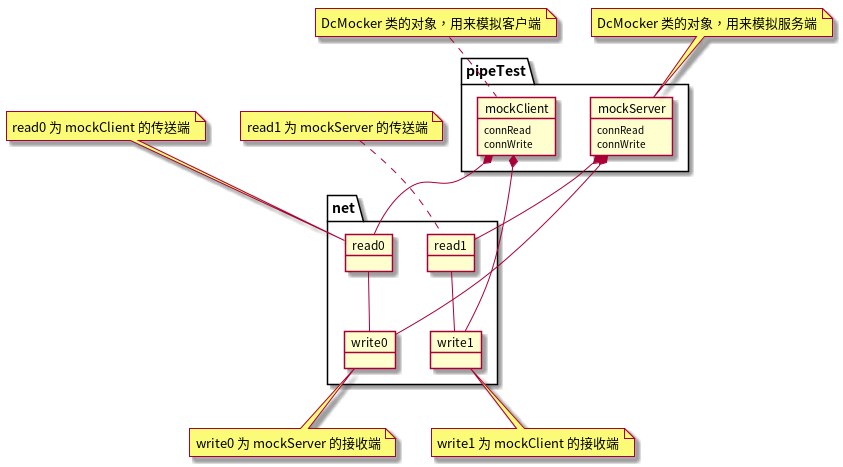
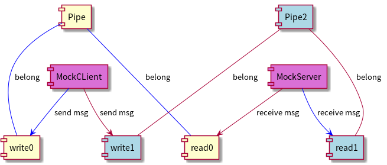
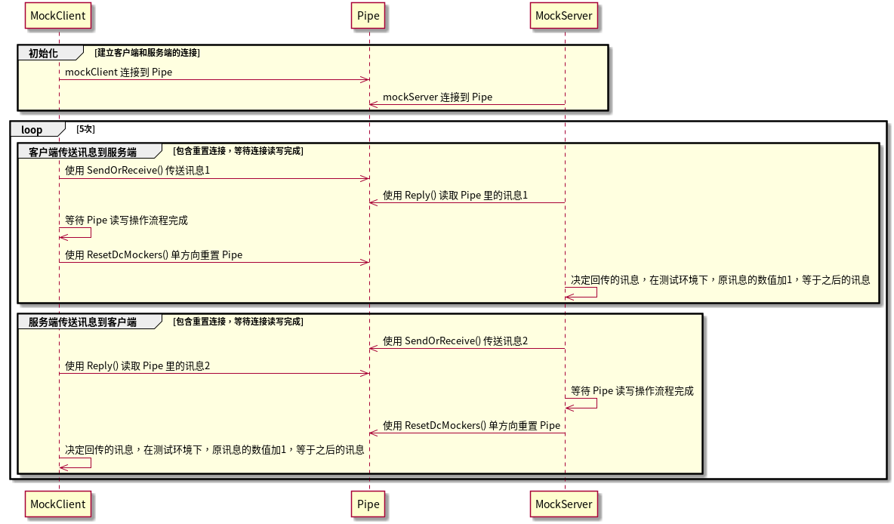
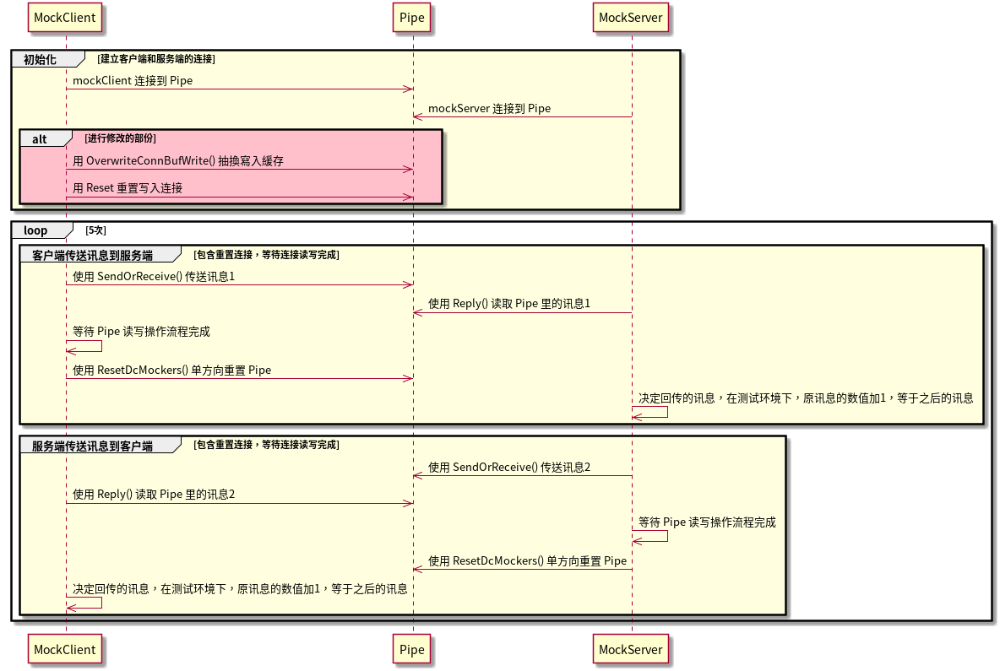

# 使用 PipeTest 去进行连接测试

> PipeTest 会创建一连串连接的来回发送和接收，要被测试的函数只要中途进行截取部份连接后，就可以继续进行之后的测试

## PipeTest 测试简介

> 以下会说明 PipeTest 测试的 1 类 2 对象 3 时序 和 4 连接重置等说明

### PipeTest 主要的类 DcMocker

类 DcMocker 为仿真连接用的对象，由连接 net.Conn 、缓存连接 bufio.Reader and bufio.Writer、读写完成等待 sync.WaitGroup 和 测试控制 testing.T，如下类图所示


代码位于 Gaea/util/mocks/pipeTest/pipeTest.go，内容如下

```go
// DcMocker 用来模拟数据库服务器的读取和回应的对象
type DcMocker struct {
	t         *testing.T      // 单元测试对象
	bufReader *bufio.Reader   // 服务器的读取 (实现缓存)
	bufWriter *bufio.Writer   // 服务器的写入 (实现缓存)
	connRead  net.Conn        // pipe 的读取连线 (接收端)
	connWrite net.Conn        // pipe 的写入连线 (传送端)
	wg        *sync.WaitGroup // 在测试流程的操作边界等待
	replyFunc ReplyFuncType   // 设定相对应的回应函数
	err       error           // 错误
}
```

### 类 DcMocker 函数列表

> - 代码位于 Gaea/util/mocks/pipeTest/pipeTest.go
> - 以下内容可以使用以下命令去产生
>
> ```bash
> $ cd Gaea/util/mocks/pipeTest
> $ go doc -all
> # 之后会显示所有函数的内容
> ```

```go
func NewDcMocker(t *testing.T, connRead, connWrite net.Conn, reply ReplyFuncType) *DcMocker
```

​    NewDcMocker 产生新的直连 dc 模拟对象 

```go
func (dcM *DcMocker) GetBufReader() *bufio.Reader 
```

   GetBufReader 为获得直连 dc 模拟对象的缓存读取 

```go
func (dcM *DcMocker) GetBufWriter() *bufio.Writer 
```

   GetBufWriter 为获得直连 dc 模拟对象的缓存写入 

```go
func (dcM *DcMocker) GetConnRead() net.Conn 
```


   GetConnRead 为获得直连 dc 模拟对象的读取连线 

```go
func (dcM *DcMocker) GetConnWrite() net.Conn 
```


   GetConnWrite 为获得直连 dc 模拟对象的写入连线 

```go
func (dcM *DcMocker) OverwriteConnBufRead(connRead net.Conn, bufReader *bufio.Reader) error 
```


   OverwriteConnBufRead 为临时覆写取代直连 dc 模拟对象的 读取连线 connRead 或者是 缓存读取 bufReader

```go
func (dcM *DcMocker) OverwriteConnBufWrite(connWrite net.Conn, bufWriter *bufio.Writer) error 
```


   OverwriteConnBufWrite 为临时覆写取代直连 dc 模拟对象的 写入连线 connWrite 或者是 缓存写入 bufWriter 

```go
func (dcM *DcMocker) Reply(otherSide *DcMocker) (msg []uint8)
```


   Reply 为直连 dc 用来模拟 dc 回应数据，大部份接连 SendOrReceive 函数后执行

```go
func (dcM *DcMocker) ResetDcMockers(otherSide *DcMocker) error 
```


   ResetDcMockers 为重置单一连线方向的直连 dc 模拟对象，重置单一连线方向的方式后面在说明

```go
func (dcM *DcMocker) SendOrReceive(data []uint8) *DcMocker 
```

   SendOrReceive 为直连 dc 用来模拟接收或传入讯息，

   比如客户端""传送"讯息到服务端、客户端再"接收"服务端的回传讯息

```go
func (dcM *DcMocker) WaitAndReset(otherSide *DcMocker) error 
```


   WaitAndReset 为直连 dc 用来等待在 Pipe 的整个数据读写操作完成 

```go
type ReplyFuncType func([]uint8) []uint8 
```


   ReplyFuncType 回应函数的型态，测试时，当客户端或服务端接收到讯息时，可以利用此函数去创建回传讯息

### PipeTest 对象图

NewDcServerClient 函数会先使用产生 4 个连接 net.Conn，分别为 read0、write0、read1 和 write1，

其中 read0 和 write0 相通，read1 和 write1 相通，

所以

#### 状况一 mockClient 至 mockServer

当 mockClient 在 write1 写入要发送的数据，之后 mockServer 就可以在 read1 读取到接收的数据

#### 状况二 mockServer 至 mockClient

当 mockServer 在 write0 写入要发送的数据，之后 mockClient 就可以在 read0 读取到接收的数据



### 单一连线方向重置

当 Pipe 被写入 EOF 消息后，就会停止读取后面更多的数据，这时就要把 Pipe 进行重置，以方便后续使用

#### 状况一 mockClient 至 mockServer

当 mockClient 发送的数据时，会经由 write1、Pipe2 和 read1，最后发送到 mockServer

这时 Pipe2 的 read1 和 write1 都被使用过，之后如果还要再被使用，就要进行重置，是为单一连线方向重置

#### 状况二 mockServer 至 mockClient

当 mockServer 发送的数据时，会经由 write0、Pipe 和 read0，最后发送到 mockClient

这时 Pipe 的 read0 和 write0 都被使用过，之后如果还要再被使用，就要进行重置，是为另一个单一连线方向重置



## PipeTest 测试的操作

> 以下提供多个例子，关于使用 PipeTest 进行连接测试，例子一 为来回连接五次的测试，是用来验证整个 PipeTest 运作是否正确，是为测试的验证，其余的就为实际操作例子

### 例子一 使用来回五次连续进行验证

- 当 MockClient 和 MockServer 一连接到 Pipe 时，就可以进行后续测试
- 一个循环为先 1客户端发送消息到服务端 再来 2 服务端发送消息到客户端，连续循环 5 次
- 消息经过 reply() 函数，新消息的数值为原始消息加1，观察消息传递消息的数值是否有正常添加，就可以验证整个测试流程
- 当等待整个 Pipe 读取和写入完成时，消息就传递到对方，对方就能进行接收和读取动作



代码位于 Gaea/util/mocks/pipeTest/pipeTest_test.go，内容如下

```go
// TestPipeTestWorkable 为使用直连函数去测试数据库的连线流程，以下测试不使用 MariaDB 的服务器，只是单纯的单元测试
func TestPipeTestWorkable(t *testing.T) {
	t.Run("此为 DC 测试的验证测试，主要是用来确认整个测试流程没有问题", func(t *testing.T) {
		// 开始模拟对象
		mockClient, mockServer := NewDcServerClient(t, TestReplyFunc) // 产生 Client 和 mockServer 模拟对象

		// 产生一开始的讯息和预期讯息
		msg0 := []uint8{0}  // 起始传送讯息
		correct := uint8(0) // 预期的正确讯息

		// 产生一连串的接收和回应的操作
		for i := 0; i < 5; i++ {
			msg1 := mockClient.SendOrReceive(msg0).Reply(mockServer) // 接收和回应
			correct++                                                // 每经过一个接收和回应的操作时，回应讯息会加1
			require.Equal(t, msg1[0], correct)
			msg0 = mockServer.SendOrReceive(msg1).Reply(mockClient) // 接收和回应
			correct++                                               // 每经过一个接收和回应的操作时，回应讯息会加1
			require.Equal(t, msg0[0], correct)
		}
	})
}
```

### 例子二 临时函数介入

- 整个测试流程不变，但是在中途要被测试的函数临时接入 Pipe，就可以仿真对方发送过来的消息，再仿真进行回应


代码位于 Gaea/backend/direct_connection_test.go，内容如下

```go
// TestDirectConnWithoutDB 为测试数据库的后端连线流程，以下测试不使用 MariaDB 的服务器，只是单纯的单元测试
func TestDirectConnWithoutDB(t *testing.T) {
	// 开始正式测试
	t.Run("测试数据库后端连线的初始交握", func(t *testing.T) {
		// 开始模拟
		mockGaea, mockMariaDB := pipeTest.NewDcServerClient(t, pipeTest.TestReplyFunc) // 产生 Gaea 和 mockServer 模拟对象
		mockGaea.SendOrReceive(mysqlInitHandShakeResponse)                             // 模拟数据库开始交握

		// 产生 Mysql dc 直连对象 (用以下内容取代 reply() 函数 !)
		var dc DirectConnection
		var mysqlConn = mysql.NewConn(mockMariaDB.GetConnRead())
		dc.conn = mysqlConn
		err := dc.readInitialHandshake()
		require.Equal(t, err, nil)

		// 等待和确认资料已经写入 pipe 并单方向重置模拟对象
		err = mockGaea.WaitAndReset(mockMariaDB)
		require.Equal(t, err, nil)
        
		// 计算后的检查
		require.Equal(t, dc.capability, uint32(2181036030))                                                                   // 检查功能标志 capability
		require.Equal(t, dc.conn.ConnectionID, uint32(16))                                                                    // 检查连线编号 connection id
		require.Equal(t, dc.salt, []uint8{81, 64, 43, 85, 76, 90, 97, 91, 34, 53, 36, 85, 93, 86, 117, 105, 49, 87, 65, 125}) // 检查 Salt
		require.Equal(t, dc.status, mysql.ServerStatusAutocommit)                                                             // 检查服务器状态
	})
}
```

### 例子三 测试函数抽换缓存

当 mockClient 和 mockServer 接通 Pipe 时，立刻使用 OverwriteBufConn 函数抽换缓存写入，并 Reset 写入连接，之后的仿真过程不变



代码位于 Gaea/mysql/conn_test.go，内容如下

```go
// TestMysqlConnWithoutDB 为用来测试数据库一开始连线的详细流程，以下测试不使用 MariaDB 的服务器，只是单纯的单元测试
func TestMysqlConnWithoutDB(t *testing.T) {
	// 函数测试开始
	t.Run("MariaDB 抽换缓存测试", func(t *testing.T) {
		// 开始模拟
		mockClient, mockServer := pipeTest.NewDcServerClient(t, pipeTest.TestReplyFunc) // 产生 Gaea 和 mockServer 模拟对象

		// 针对这次测试进行临时修改
		err := mockClient.OverwriteConnBufWrite(nil, writersPool.Get().(*bufio.Writer))
		mockClient.GetBufWriter().Reset(mockClient.GetConnWrite())
		require.Equal(t, err, nil)

		// 产生一开始的讯息和预期讯息
		msg0 := []uint8{0}  // 起始传送讯息
		correct := uint8(0) // 预期的正确讯息

		// 开始进行讯息操作

		// 写入部份
		mockClient.SendOrReceive(msg0) // 模拟客户端传送讯息
		require.Equal(t, msg0[0], correct)

		// 读取部份
		msg1 := mockClient.Reply(mockServer) // 模拟服务端接收讯息
		correct++
		require.Equal(t, msg1[0], correct)
	})
}
```

