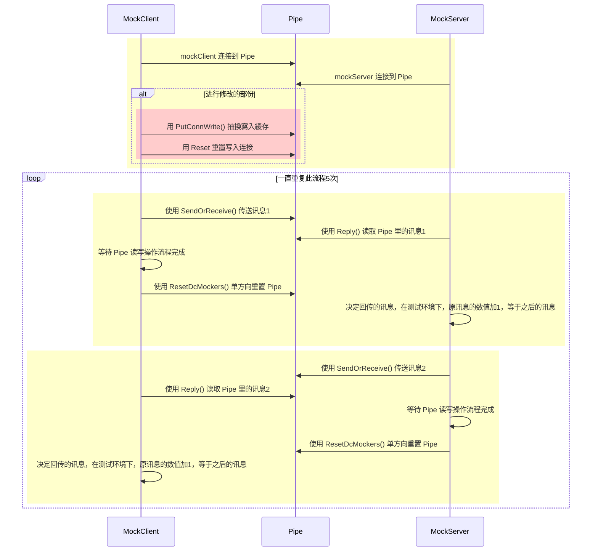

# Pipe 测试函数抽换缓存时序图

```mermaid
sequenceDiagram
    participant MockClient
    participant Pipe
    participant MockServer
    rect rgb(255, 255, 204)
        MockClient->>Pipe: mockClient 连接到 Pipe
        MockServer->>Pipe: mockServer 连接到 Pipe
        alt 进行修改的部份
            rect rgb(255, 204, 204)
                MockClient->>Pipe: 用 PutConnWrite() 抽換寫入緩存
                MockClient->>Pipe: 用 Reset 重置写入连接
            end
        end
    end
    loop 一直重复此流程5次
        rect rgb(255, 255, 204)
            MockClient->>Pipe: 使用 SendOrReceive() 传送讯息1
            MockServer->>Pipe: 使用 Reply() 读取 Pipe 里的讯息1
            MockClient->>MockClient: 等待 Pipe 读写操作流程完成
            MockClient->>Pipe: 使用 ResetDcMockers() 单方向重置 Pipe
            MockServer->>MockServer: 决定回传的讯息，在测试环境下，原讯息的数值加1，等于之后的讯息
        end
        rect rgb(255, 255, 204)
            MockServer->>Pipe: 使用 SendOrReceive() 传送讯息2
            MockClient->>Pipe: 使用 Reply() 读取 Pipe 里的讯息2
            MockServer->>MockServer: 等待 Pipe 读写操作流程完成
            MockServer->>Pipe: 使用 ResetDcMockers() 单方向重置 Pipe
            MockClient->>MockClient: 决定回传的讯息，在测试环境下，原讯息的数值加1，等于之后的讯息
        end
    end
```

